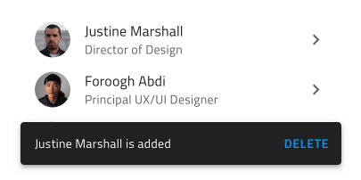
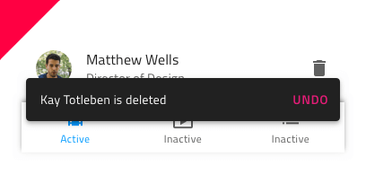

# Snackbar (スナックバー)

Snackbar コンポーネント シンボルは、短い通知の表示やリストの記録の追加または削除など最近の操作の表示するためのオプションを提供します。オプションは、元に戻すなどのシンプルな追加操作をトリガーします。Snackbar は、[Ignite UI for Angular Snackbar コンポーネント](https://jp.infragistics.com/products/ignite-ui-angular/angular/components/snackbar.html)と視覚的に同じものです。

## Snackbar デモ

## スタイル設定

Snackbar にはスタイルの柔軟性があり、メッセージのテキストの色、操作ボタン、背景色を変更できます。

## 使用方法

Snackbar は、その他のコンテンツの一番上に表示されるため、アプリケーションのメイン ナビゲーション上には配置しないでください。メッセージとコントラストがある操作ボタンを強調するためのスタイルを選択し、最新のボタンのみ表示して列に複数の Snackbars を積み重ねないようにします。

| 良い例                              | 悪い例                             |
| ------------------------------- | --------------------------------- |
|  |  |
|  |  |
|  |  |

コミュニティに参加して新しいアイデアをご提案ください。

