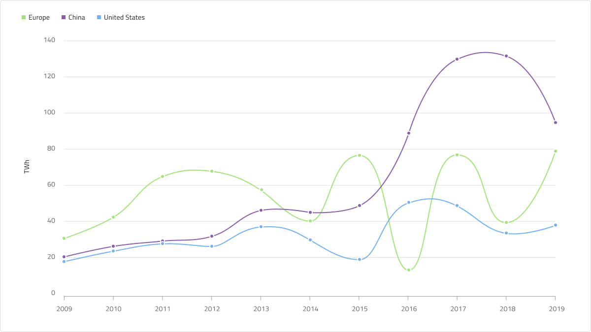
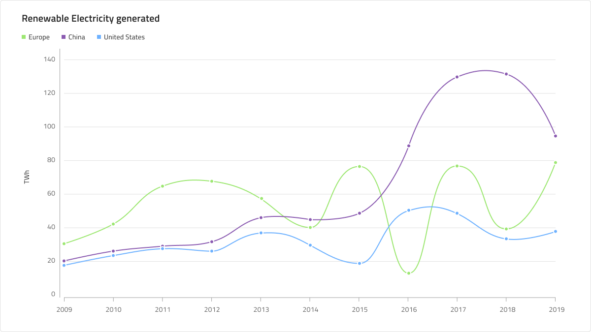

# Spline Chart (スプライン チャート)

 Spline Chart は、カテゴリ折れ線グラフの一種で、一定期間にわたる 複数の線分で接続されたポイントで表される連続データ値を示します。トレンドの表示や比較分析によく使用されます。Y 軸 (左側のラベル) は数値を示し、X 軸 (下側のラベル) は時系列または比較カテゴリを示します。比較する 1 つ以上のデータセットを含めることができます。これはチャートで複数の線として描画されます。Spline Chart は、データ ポイントを接続する線がデータの表示を改善するためのスプライン補間とスムージング機能を持つこと以外のすべての面で [Line Chart](line-chart.md) と同じです。Spline Chart は、[Ignite UI for Angular Spline Chart コンポーネント](https://jp.infragistics.com/products/ignite-ui-angular/angular/components/charts/types/spline-chart.html)と視覚的に同じものです。

## Spline Chart のデモ

Spline Chart には、Title、Legend、および Chart Area があり、Idle と Hover 状態のいずれかを選択できます。また、Spline と Area の 2 つのチャート タイプをサポートし、多数の Series Amount 構成を使用して、それに応じて Legend を調整できます。

## タイトル

Spline Chart のタイトルは、必要に応じて変更または非表示にできます。Figma では、`Title` ブール値プロパティをオフに切り替えることでタイトルを非表示にすることができます。自動レイアウト機能のおかげで、チャートのレイアウトはそれに応じて自動的に調整されます。

## Legend (凡例)

Spline Chart には、その中のシリーズの数とそれらが何を表すかを示す Legend が付属しています。Figma の Legend は自動レイアウトを使用して構築されています。つまり、レイヤー パネルからシリーズ項目を表示 / 非表示にすることができ、それに応じてコンテンツが自動的に調整されます。`Legend` ブール値プロパティをオフにすると、完全に非表示にすることもできます。凡例項目の形状も Series の `Icon Type` プロパティで設定でき、Square、Circle、または Line に設定できます。

## Chart Type (チャート タイプ)

The Chart Type allows switching between **Spline** and **Area** from the `Area Fill` boolean property.後者は、X 軸とスプラインの間の領域がシリーズの色で塗りつぶされています。Area チャートは、変化の大きさと時間の経過に伴う傾向を表すために使用されます。

## 状態

Spline Chart には、Idle と Hover の 2 つの状態があります。Figma では、レイヤー パネルからネストされた Chart Type コンポーネントを選択し、プロパティ パネルから `Hover Tooltip` ブール値プロパティのオン/オフを切り替えることで、2 つの状態を切り替えることができます。Hover 状態では、データ ポイントにホバーすると、このポイントでのシリーズの値に関する情報を提供するツールチップが表示されます。

## Y 軸

Spline Chart の Y 軸は、タイトル、ラベル、および軸自体で構成されます。Title と Labels は構成可能であり、ラベルを非表示にするには、Figma のレイヤー パネルからラベルを非表示にします。デフォルトでは、Y 軸は非表示です。表示するには、レイヤー パネルに移動し、Y 軸の線を見つけて表示します。すべての要素を一度に非表示にする場合は、レイヤー パネルからネストされた Y 軸コンポーネントを非表示にします。

## Gridlines (グリッド線)

Spline Chart には Gridlines が組み込まれているため、データ ポイントを Y 軸の値まで視覚的にトレースするのが簡単になります。Figma では、ネストされた Chart Type コンポーネントを選択し、プロパティ パネルからブール値プロパティ `Gridlines` のオン/オフを切り替えることで、それらを表示/非表示にすることができます。

## Series Amount (シリーズ量)

Spline Chart はチャート領域に描画するシリーズの数を **1**、**2**、または **3** (デフォルト) から選択することができます。これは Area タイプにも当てはまります。レイヤー パネルでネストされた Chart Type コンポーネントを選択し、シリーズとシリーズ マーカー (例: `Series 3` と `Series 3 Markers`) のブール値プロパティをオン/オフに切り替えることで、必要な数のシリーズを表示/非表示にすることができます。また、レイヤー パネルからシリーズを表示/非表示にして、凡例でシリーズを適切に調整する必要があります。

## スタイル設定

何よりもまず、Spline Chart を使用すると、シリーズの色を変更できます。データ視覚化のパレットからニュアンス series.1、series.2 などから series.10 までの色のみを使用することをお勧めします。縦軸と横軸の色、グリッド線、チャート領域の背景色と境界線の色を変更することもできます。タイトル、ラベル、注釈値なども、**Indigo.Design システム**で使用可能なテキスト スタイルを介してカスタマイズできます。

## 使用方法

連続データセットがあり、一定期間の変化量を確認する場合は、Spline Chart を使用します。カテゴリの変更を時間で表す場合は、常に横軸に設定する必要があります。データ比較を正確に行い、時系列データを左から右に並べ替えるために、常に Y 軸を 0 から開始します。適切なアスペクト比を使用して、劇的な傾斜の低下を最小限に抑えます。チャートに複数のシリーズがある場合は、区別できるように異なる色を使用する必要があります。凡例を使用してそれらが表すものを示すことは、ベスト プラクティスと見なされます。

| 良い例                                                                                             | 悪い例                                                                                              |
| ---------------------------------------------------------------------------------------------- | -------------------------------------------------------------------------------------------------- |
|  |  | 

## その他のリソース

関連トピック:

- [Line Chart](line-chart.md)
- [Step Chart](step-chart.md)
- [Column Chart](column-chart.md)
- [Pie Chart](pie-chart.md)
- [Skeleton Charts](skeleton-charts.md)

コミュニティに参加して新しいアイデアをご提案ください。
