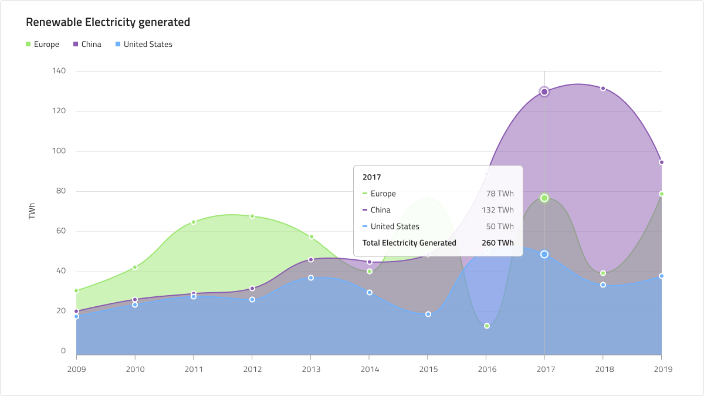
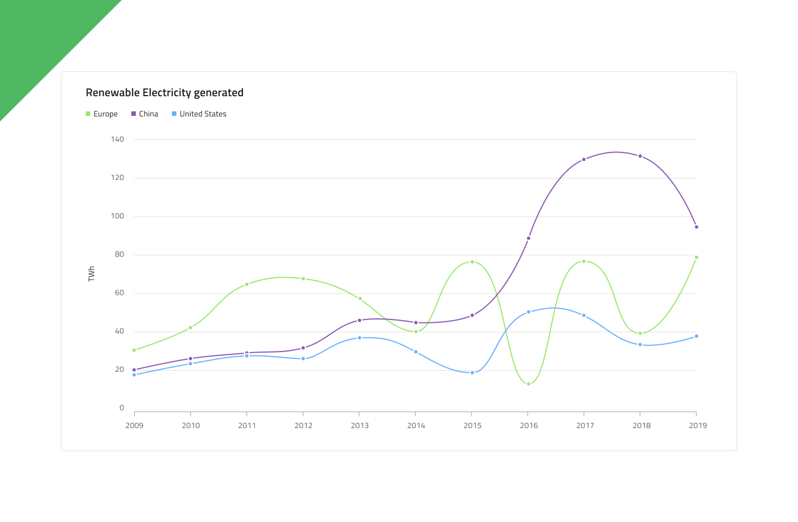

# Spline Chart (スプライン チャート)

 Spline Chart は、カテゴリ折れ線グラフの一種で、一定期間にわたる 複数の線分で接続されたポイントで表される連続データ値を示します。トレンドの表示や比較分析によく使用されます。Y 軸 (左側のラベル) は数値を示し、X 軸 (下側のラベル) は時系列または比較カテゴリを示します。比較する 1 つ以上のデータセットを含めることができます。これはチャートで複数の線として描画されます。Spline Chart は、データ ポイントを接続する線がデータの表示を改善するためのスプライン補間とスムージング機能を持つこと以外のすべての面で Line Chart と同じです。

## Spline Chart のデモ

Spline Chart には、Title、Legend、および Chart Area があり、Idle と Hover 状態のいずれかを選択できます。また、Spline と Area の 2 つのチャート タイプをサポートし、多数の Series Amount 構成を使用して、それに応じて Legend を調整できます。

## タイトル

Spline Chart のタイトルは、必要に応じて変更または非表示にできます。Sketch では、スマート レイアウトは ~No Symbol に設定してタイトルを非表示にしたときにチャートを調整します。Adobe XD では、タイトル レイヤーを削除することで同じことができます。Stack はそれに応じてレイアウトを更新します。

## Legend (凡例)

Spline Chart には、その中のシリーズの数とそれらが何を表すかを示す Legend が付属しています。Legend は、Sketch のスマート レイアウトを使用して構築されており、不要な項目のオーバーライドを ~No Symbol に設定することで、シリーズ項目の正確な量を含むように調整できます。Adobe XD では、Stack を使用して凡例項目レイヤーを削除できます。Legend の項目の形状も、rectangle (四角形)、line (線)、および dot (点) の組み込みサポートを使用して構成できます。

## Chart Type (チャート タイプ)

Chart Type では、Spline と Area を切り替えることができます。後者は、X 軸とスプラインの間の領域がシリーズの色で塗りつぶされています。Area チャートは、変化の大きさと時間の経過に伴う傾向を表すために使用されます。

## 状態

Spline Chart には、Idle と Hover の 2 つの状態があります。Sketch ではこれを `Symbol Overrides` で実現していますが、Adobe XD では `Component States` パラダイムを使用して簡単に状態を切り替えることができます。Hover 状態では、データ ポイントにホバーすると、このポイントでのシリーズの値に関する情報を提供するツールチップが表示されます。

## Y 軸

Spline Chart の Y 軸は、Title、Labels、および軸自体で構成されます。Title と Labels は構成可能であり、ラベルを非表示にするには、Sketch でオーバーライドを ~No Symbol に設定するか、Adobe XD でレイヤーを削除します。軸線の色を `Transparent` に設定してすべての要素を非表示にするには、Sketch で Y 軸のオーバーライドを ~No Symbol に変更するか、Adobe XD でレイヤーを削除します。

## Gridlines (グリッド線)

Spline Chart には Gridlines が組み込まれているため、データ ポイントを Y 軸の値まで視覚的にトレースするのが簡単になります。それらを非表示にするには、色を `Transparent` に設定するだけです。

## Series Amount (シリーズ量)

Spline Chart は Chart Area に描画するシリーズの数を １ つ、２ つ、または **３ つ** から選択することができます。これは Area タイプにも当てはまります。

## スタイル設定

何よりもまず、Spline Chart を使用すると、シリーズの色を変更できます。データ視覚化のパレットからニュアンス series.1、series.2 などから series.10 までの色のみを使用することをお勧めします。縦軸と横軸の色、グリッド線、チャート領域の背景色と境界線の色を変更することもできます。タイトル、ラベル、注釈値なども、**Indigo.Design システム**で使用可能なテキスト スタイルを介してカスタマイズできます。

## 使用方法

連続データセットがあり、一定期間の変化量を確認する場合は、Spline Chart を使用します。カテゴリの変更を時間で表す場合は、常に横軸に設定する必要があります。データ比較を正確に行い、時系列データを左から右に並べ替えるために、常に Y 軸を 0 から開始します。適切なアスペクト比を使用して、劇的な傾斜の低下を最小限に抑えます。チャートに複数のシリーズがある場合は、区別できるように異なる色を使用する必要があります。凡例を使用してそれらが表すものを示すことは、ベスト プラクティスと見なされます。

| 良い例                                                                                             | 悪い例                                                                                              |
| ---------------------------------------------------------------------------------------------- | -------------------------------------------------------------------------------------------------- |
|  |  | 

## その他のリソース

関連トピック:

- [Line Chart](line-chart.md)
- [Step Line Chart](step-line-chart.md)
- [Column Chart](column-chart.md)
- [Skeleton Charts](skeleton-charts.md)

コミュニティに参加して新しいアイデアをご提案ください。
