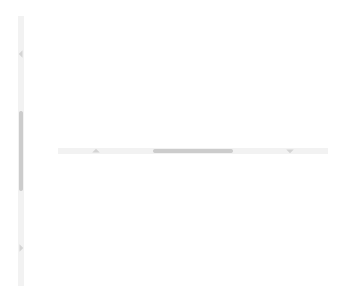
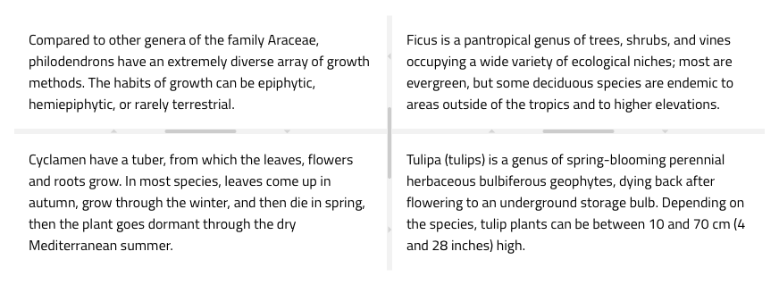
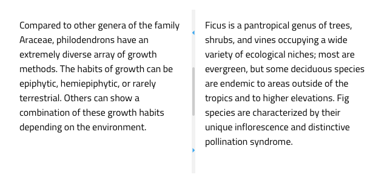

# Splitter (スプリッター)

Splitter コンポーネントを使用して、垂直または水平に配置されたペインに分割された動的レイアウトを作成します。ペインはスプリッター バーで区切られているため、ドラッグしてサイズを変更したり、展開/縮小することができます。Splitter は、[Ignite UI for Angular Splitter コンポーネント](https://jp.infragistics.com/products/ignite-ui-angular/angular/components/splitter.html)と視覚的に同じです。

## Splitter のデモ

## 方向

Splitter は、**Vertical (垂直方向)** と Horizontal (水平方向) の 2 つの方向をサポートします。垂直スプリッターはペインを水平方向に分割するために使用され、水平スプリッターはペインを垂直方向に分割するために使用されます。

## ネストされたペイン

Splitter は、少なくとも 1 つのバーと 2 つのペインで構成されます。ペインはプレースホルダーであり、スプリッター バーはそれらの間にあり、ハンドルをドラッグしてサイズを変更したり、バーの矢印アイコンをクリックして展開/縮小できます。スプリッター コンポーネントをネストして、以下に示すような方法でより複雑なレイアウトを作成できます。

## スタイル設定

Splitter は、アイコンの色を変更することでスタイルを設定できます。

  

## その他のリソース

関連トピック:

- [Icon](icon.md)
  

  
コミュニティに参加して新しいアイデアをご提案ください。
