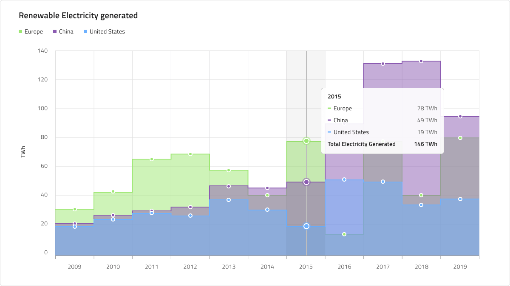

# Step Chart (ステップ チャート)

Step Chart は、カテゴリ チャートのグループに属し、連続的な垂直線と水平線で接続されたポイントのコレクションを使用して描画され、階段状のチャートを形成します。値は Y 軸に表示され、X 軸 (下部のラベル) は時系列または比較カテゴリを示します。Step シリーズは、一定期間の変化量を強調したり、複数の項目を比較したりします。Step Chart は、ステップ線の下の領域が塗りつぶされていないことを除いて、すべての点で Step Area Chart と同じです。Step Chart は、不規則な間隔で発生する変更を表示する場合に役立ちます。比較する 1 つ以上のデータセットを含めることができます。これはチャートで複数の線として描画されます。Step Chart は、[Ignite UI for Angular Step Chart コンポーネント](https://jp.infragistics.com/products/ignite-ui-angular/angular/components/charts/types/step-chart.html)と視覚的に同じものです。

## Step Chart のデモ

Step Chart には、Title (タイトル)、Legend (凡例)、および Chart Area (チャート領域) があり、Idle (アイドル状態) と Hover (ホバー状態) の 2 つの状態から選択できます。また、2 つのチャート タイプ (多数のシリーズ量構成の Line と Area) をサポートし、それに応じて Legend を調整できます。

## Title (タイトル)

Step Chart のタイトルは、必要に応じて変更または非表示にできます。Figma では、`Title` ブール値プロパティをオフに切り替えることでタイトルを非表示にすることができます。自動レイアウト機能のおかげで、チャートのレイアウトはそれに応じて自動的に調整されます。Sketch では、スマート レイアウトは ~No Symbol に設定してタイトルを非表示にしたときにチャートを調整します。Adobe XD では、タイトル レイヤーを削除することで同じことができます。Stack はそれに応じてレイアウトを更新します。

## Legend (凡例)

Step Chart には、その中のシリーズの数とそれらが何を表すかを示す Legend が付属しています。Figma の凡例は自動レイアウトを使用して構築されています。つまり、レイヤー パネルからシリーズ アイテムの表示/非表示を切り替えることができ、それに応じてコンテンツが自動的に調整されます。`Legend` ブール値プロパティをオフにすると、完全に非表示にすることもできます。Sketch では、スマート レイアウトを使用して構築されており、不要な項目のオーバーライドを ~No Symbol に設定することで、シリーズ項目の正確な量を含むように調整できます。Adobe XD では、Stack を使用して凡例項目レイヤーを削除できます。Legend の項目の形状も、rectangle (四角形)、line (線)、および dot (点) の組み込みサポートを使用して構成できます。

## Chart Type (チャート タイプ)

Chart Type では、Line と Area を切り替えることができます。後者は、X 軸と Step Line の間の領域がシリーズの色で塗りつぶされています。Area チャートは、変化の大きさと時間の経過に伴う傾向を表すために使用されます。

## State (状態)

Step Chart には、Idle (アイドル状態) と Hover (ホバー状態) の 2 つの状態があります。Figma では、ネストされたチャート タイプ コンポーネントを選択すると、プロパティ パネルからブール演算 「Hover Tooltip」 を使用して 2 つを切り替えることができます。一方、Sketch では、これは `Symbol Overrides` を使用して実現されます。Adobe XD では ン `Component States` パラダイムを使用して簡単に状態を切り替えることができます。Hover 状態では、データ ポイントにホバーすると、このポイントでのシリーズの値に関する情報を提供するツールチップが表示されます。

## Y 軸

Step Chart の Y 軸は、Title (タイトル)、Labels (ラベル)、および軸自体で構成されます。Title と Labels は構成可能であり、ラベルを非表示にするには、Figma のレイヤー パネルからラベルを非表示にするか、Sketch でそのオーバーライドを ~No Symbol に設定するだけです。Adobe XD では、レイヤーを削除することでこれを実現できます。デフォルトでは、Y 軸は Figma と Adobe XD では非表示になり、Sketch では `Transparent` に設定されます。Figma と Adobe XD で表示するには、レイヤー パネルに移動し、Y 軸レイヤーを右クリックして [Show/Hide] を選択します。Sketch でも、Y 軸に別のレイヤー スタイルを選択することで、同じことを実現できます。すべての要素を一度に非表示にしたい場合は、Figma のレイヤー パネルからネストされた Y 軸コンポーネントを非表示にするか、Sketch で Y 軸のオーバーライドを ~No Symbol に変更するか、Adobe XD でそのレイヤーを削除します。

## Gridlines (グリッド線)

Step Chart には 縦と横の Gridlines が組み込まれているため、データ ポイントをXとY軸で視覚的にトレースすることができます。どちらも個別に設定可能で、Figma でいずれかまたは両方を非表示にするには、レイヤー パネルからネストされたChart Type コンポーネントを選択し、「Vertical Gridlines」 と 「Horizontal Gridlines」 と呼ばれるプロパティのいずれかまたは両方をオン/オフする必要があります。Sketch と Adobe XD では、グリッド線の色を `Transparent` に設定することでこれを実現できます。

## シリーズ量

Step Chart はチャート領域に描画するシリーズの数を 1、2、または **3** から選択することができます。これは Area タイプにも当てはまります。

## スタイル設定

何よりもまず、Step Chart を使用すると、シリーズの色を変更できます。データ視覚化のパレットからニュアンス series.1、series.2 などから series.10 までの色のみを使用することをお勧めします。縦軸と横軸の色、グリッド線、チャート領域の背景色と境界線の色を変更することもできます。タイトル、ラベル、注釈値なども、**Indigo.Design システム**で使用可能なテキスト スタイルを介してカスタマイズできます。

## 使用方法

連続データセットがあり、一定期間の変化量を確認する場合は、Step Chart を使用します。カテゴリの変更を時間で表す場合は、常に横軸に設定する必要があります。データ比較を正確に行い、時系列データを左から右に並べ替えるために、常に Y 軸を 0 から開始します。適切なアスペクト比を使用して、劇的な傾斜の低下を最小限に抑えます。チャートに複数のシリーズがある場合は、区別できるように異なる色を使用する必要があります。凡例を使用してそれらが表すものを示すことは、ベスト プラクティスと見なされます。

| 良い例                                                                                             | 悪い例                                                                                              |
| ---------------------------------------------------------------------------------------------- | -------------------------------------------------------------------------------------------------- |
|  |  | 

## その他のリソース

関連トピック:

- [Line Chart](line-chart.md)
- [Spline Chart](spline-chart.md)
- [Column Chart](column-chart.md)
- [Pie Chart](pie-chart.md)
- [Skeleton Charts](skeleton-charts.md)

コミュニティに参加して新しいアイデアをご提案ください。