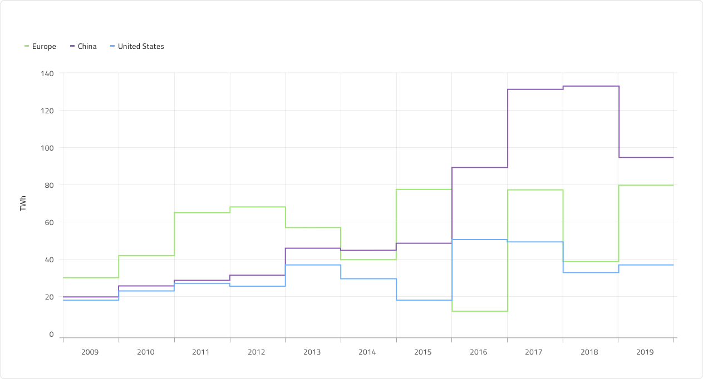

# Step Line Chart (ステップ折れ線チャート)

Step Line Chart は、カテゴリ チャートのグループに属し、連続的な垂直線と水平線で接続されたポイントのコレクションを使用して描画され、階段状のチャートを形成します。値は Y 軸に表示され、X 軸 (下部のラベル) は時系列または比較カテゴリを示します。Step Line シリーズは、一定期間の変化量を強調したり、複数の項目を比較したりします。Step Line Chart は、ステップ線の下の領域が塗りつぶされていないことを除いて、すべての点で Step Area Chart と同じです。Step Line Chart は、不規則な間隔で発生する変更を表示する場合に役立ちます。比較する 1 つ以上のデータセットを含めることができます。これはチャートで複数の線として描画されます。

## Step Line Chart のデモ

Step Line Chart には、Title、Legend、および Chart Area があり、Idle と Hover の 2 つの状態から選択できます。また、2 つのチャート タイプ (多数の Series Amount 構成の Line と Area) をサポートし、それに応じて凡例を調整できます。

## タイトル

Step Line Chart のタイトルは、必要に応じて変更または非表示にできます。Sketch では、スマート レイアウトは ~No Symbol に設定してタイトルを非表示にしたときにチャートを調整します。Adobe XD では、タイトル レイヤーを削除することで同じことができます。Stack はそれに応じてレイアウトを更新します。

## Legend (凡例)

Step Line Chart には、その中のシリーズの数とそれらが何を表すかを示す Legend が付属しています。egend は、Sketch のスマート レイアウトを使用して構築されており、不要な項目のオーバーライドを ~No Symbol に設定することで、シリーズ項目の正確な量を含むように調整できます。Adobe XD では、Stack を使用して凡例項目レイヤーを削除できます。Legend の項目の形状も、rectangle (四角形)、line (線)、および dot (点) の組み込みサポートを使用して構成できます。

## Chart Type (チャート タイプ)

Chart Type では、Line と Area を切り替えることができます。後者は、X 軸と Step Line の間の領域がシリーズの色で塗りつぶされています。Area チャートは、変化の大きさと時間の経過に伴う傾向を表すために使用されます。

## 状態

Step Line Chart には、Idle と Hover の 2 つの状態があります。Sketch ではこれを `Symbol Overrides` で実現していますが、Adobe XD では `Component States` パラダイムを使用して簡単に状態を切り替えることができます。Hover 状態では、データ ポイントにホバーすると、このポイントでのシリーズの値に関する情報を提供するツールチップが表示されます。

## Y 軸

Step Line Chart の Y 軸は、Title、Labels、および軸自体で構成されます。Title と Labels は構成可能であり、ラベルを非表示にするには、Sketch でオーバーライドを ~No Symbol に設定するか、Adobe XD でレイヤーを削除します。軸線の色を `Transparent` に設定してすべての要素を非表示にするには、Sketch で Y 軸のオーバーライドを ~No Symbol に変更するか、Adobe XD でレイヤーを削除します。

## Gridlines (グリッド線)

Step Line Chart には 縦と横の Gridlines が組み込まれているため、データ ポイントを X と Y 軸で視覚的にトレースすることができます。どちらも個別に構成可能で、いずれかまたは両方を非表示にするには、色を `Transparent` に設定するだけです。

## Series Amount (シリーズ量)

Step Line Chart には、Chart Area に描画される 1 つ、2 つ、および **3** つのシリーズの選択が付属しています。これは Area タイプにも当てはまります。

## スタイル設定

何よりもまず、Step Line Chart を使用すると、シリーズの色を変更できます。データ視覚化のパレットからニュアンス series.1、series.2 などから series.10 までの色のみを使用することをお勧めします。縦軸と横軸の色、グリッド線、チャート領域の背景色と境界線の色を変更することもできます。タイトル、ラベル、注釈値なども、**Indigo.Design システム**で使用可能なテキスト スタイルを介してカスタマイズできます。

## 使用方法

連続データセットがあり、一定期間の変化量を確認する場合は、Step Line Chart を使用します。カテゴリの変更を時間で表す場合は、常に横軸に設定する必要があります。データ比較を正確に行い、時系列データを左から右に並べ替えるために、常に Y 軸を 0 から開始します。適切なアスペクト比を使用して、劇的な傾斜の低下を最小限に抑えます。チャートに複数のシリーズがある場合は、区別できるように異なる色を使用する必要があります。凡例を使用してそれらが表すものを示すことは、ベスト プラクティスと見なされます。

| 良い例                                                                                             | 悪い例                                                                                              |
| ---------------------------------------------------------------------------------------------- | -------------------------------------------------------------------------------------------------- |
|  |  | 

## その他のリソース

関連トピック:

- [Line Chart](line-chart.md)
- [Spline Chart](spline-chart.md)
- [Column Chart](column-chart.md)
- [Skeleton Charts](skeleton-charts.md)

コミュニティに参加して新しいアイデアをご提案ください。
