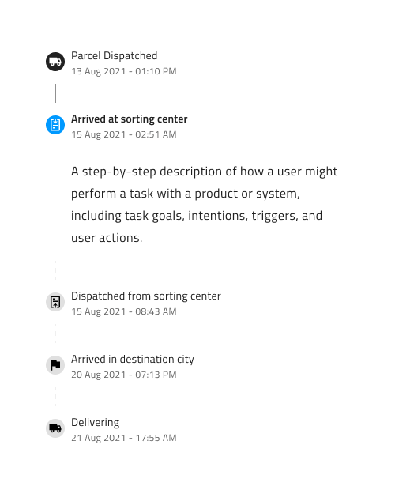
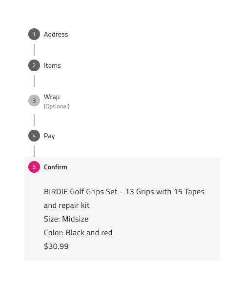
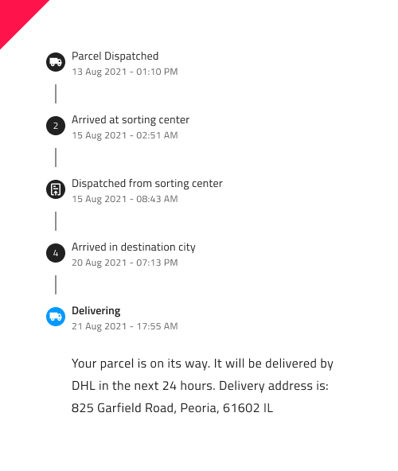

# Stepper 

Stepper コンポーネントは、プロセスまたはワークフローを段階的に表示するために使用できる便利な UI 要素であり、ユーザーはプロセスのどこにいて、どのステップが残っているかを簡単に理解できます。Stepper は通常、ステップ番号が付けられた水平または垂直のバーで構成され、現在のステップは強調表示され、完了したステップは塗りつぶされて表示されます。Stepper は、eコマース Web サイトのチェックアウト プロセスから Web アプリケーションの複数ステップ フォームまで、幅広いアプリケーションに使用できます。Stepper は、[Ignite UI for Angular Stepper コンポーネント](https://jp.infragistics.com/products/ignite-ui-angular/angular/components/stepper.html)と視覚的に同じものです。

## Stepper のデモ

## タイプ

Stepper コンポーネントは、Linear (リニア) と Non Linear (非リニア) の 2 つのタイプをサポートしています。Figma では、プロパティ パネルから `Type` プロパティを使用して切り替えることができます。Linear タイプは、ユーザーが、オプションではない前のステップを完了せずに次のステップに進むのを防ぐために使用されます。

## 方向

Stepper コンポーネントには、Horizontal (水平方向) と Vertical (垂直方向) の 2 つの方向があります。Figma では、プロパティ パネルから `Orientation` プロパティの値を変更することで、この 2 つを切り替えることができます。

## 構造 

Stepper コンポーネントは、多数のネストされた Step および Progress Line コンポーネントで構成されます。構造上、水平 Stepper と垂直 Stepper の大きな違いが 1 つあります。垂直 Stepper の現在のステップのコンテンツはステップの見出しのすぐ下に配置されますが、水平 Stepper のコンテンツはすべてのステップの下に配置されます。

## ステップ

各ステップは、Indicator (インジケーター) と Information (情報) で構成されます。インジケーターは Number (数値) または Icon (アイコン) のいずれかになります。これは、Figma の右側のプロパティ パネルの `Type` プロパティを使用して切り替えることができます。また、それぞれの `Information` または `Indicator` ブール値プロパティを有効または無効にすることで、Indicator (インジケーター)のみ、または Information (情報) のみを表示するように選択することもできます。さらに、ネストされた Step コンポーネント内の `Subtitle` ブール値プロパティを切り替えることで、Subtitle を表示または非表示にすることができます。

また、あらゆるユース ケース シナリオをカバーできるよう、いくつかの Step 状態を提供します。以下が含まれます: Complete (完了)、Incomplete (未完了)、Disabled (無効)、Invalid (無効状態)、Active (アクティブ) です。これらは右側のプロパティ パネルの `State` プロパティから切り替えることができます。Step 状態に加えて、ブール値プロパティのオン/オフを切り替えることでステップをオプションまたは必須として指定できる `Optional Step` プロパティがあります。この `Optional Step` プロパティは、提供されたすべての状態でアクセスでき、各 Step 内のネストされたオプションとして表示されます。

また、Hover と Focused という 2 つの追加状態も提供します。これらは、ブール値プロパティ `Hover` と `Focused` をオン/オフに切り替えることで使用できます。

また、Active (アクティブ) と Inactive (非アクティブ) の 2 つのタイプの Progress Line も提供しています。これらは、ネストされた Progress Line コンポーネントを選択した後、プロパティ パネルから `State` プロパティを使用して切り替えできます。

## コンテンツ

上記のように、Step が `Active` 状態に設定されると、垂直 Stepper ではアクティブな Step のヘッダーの下に、水平 Stepper ではすべての Step の下に **Content** というフレームが表示されます。デフォルトでは、Content には単純なテキスト レイヤーが付属しており、アクティブなステップに関する情報を追加できます。カスタマイズしたい場合は、コンポーネントを右クリックして `Detach instance` を選択して、コンポーネントをデタッチする必要があります。水平 Stepper の `Content` ブール値プロパティを使用するか、ネストされた Step コンポーネントに移動して、垂直 Stepper のブール値プロパティ `Content` をオフにすることで、完全に非表示にすることもできます。

## スタイル設定 

Stepper には、インジケーター、テキスト、進行状況線の色のさまざまなオプション、およびさまざまな状態の外観のカスタマイズを通じて、柔軟なスタイル設定が可能です。

## 使用方法 

Linear Stepper を使用する場合、前のステップが完了するまで次のステップに進めないことをユーザーに明確に伝えるために、未完了のステップを `Disabled` 状態に設定し、進行状況線も `Inactive` に設定してください。インジケーターとアイコン、およびインジケーターと数字を組み合わせることは避けてください。ユーザーがプロセス内のどの位置にいるのかについて適切なフィードバックを提供できるように、アクティブなステップを目立つようにしておきます。

| 良い例                                                                                 | 悪い例                                                                                  |
| ---------------------------------------------------------------------------------- | -------------------------------------------------------------------------------------- |
|  |  |
|  |  |
|  |  |

## その他のリソース

関連トピック:

- [Icon](../components/icon.md)
  

コミュニティに参加して新しいアイデアをご提案ください。
