---
title: Switch - デザイン システム コンポーネント
_description: Switch コンポーネント シンボルは、ユーザーが選択にマークできる機能を提供します。
_keywords: デザイン システム, Sketch, Ignite UI for Angular, コンポーネント, UI ライブラリ, ウィジェット
_language: ja
---

## Switch

Switch コンポーネント シンボルは、ユーザーが設定一覧でオン/オフするための構成です。Switch は、[Ignite UI for Angular Switch コンポーネント](https://jp.infragistics.com/products/ignite-ui-angular/angular/components/switch.html)と視覚的に同じものです。

### Switch デモ

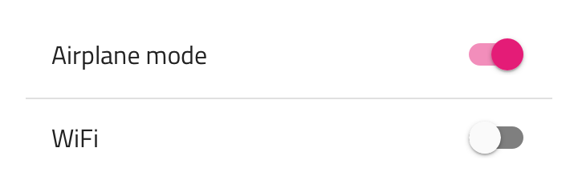

### テーマ

Switch は、明暗バリアントで分かりやすく、背景に明暗のコントラストを付けてスタイル設定できます。


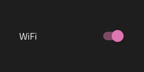

### ラベルの使用

Switch はラベルなしで使用できます。ラベルを非表示にするためにテキスト値を空/スペース文字にしてコンポーネントの幅を小さくします(38px など)。


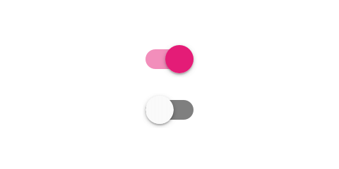

### 状態

Switch は、オン/オフと選択状態があり、追加のバリアントとしてインタラクション無効の状態があります。

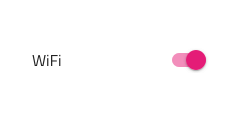
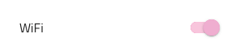
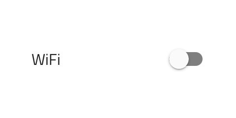
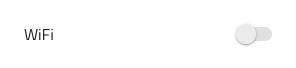

### スタイル設定

Switch は、つまみとトラック色を制御でき柔軟なスタイル設定が可能です。固定アルファ値がトラックに適用されて半透明になります。

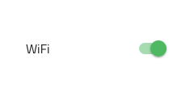

## 使用方法

Switch は、設定リストで状態を制御するオプションを説明するラベルの右に表示されます。画面の左端の近くに配置しないようにします。必須の場合は代わりに Checkbox を使用します。Switch つまみとトラックに同じまたは同様の色を使用します。

| 良い例                                                                         | 悪い例                                                                             |
| ------------------------------------------------------------------------------ | ---------------------------------------------------------------------------------- |
| 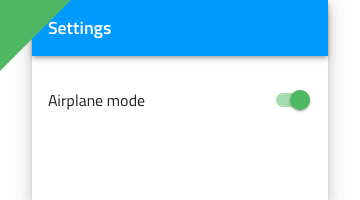 |  |
| 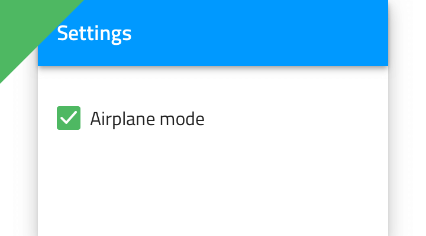 | 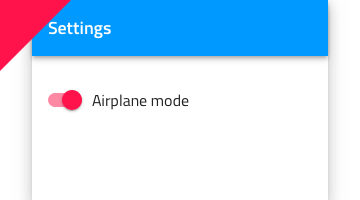 |
| 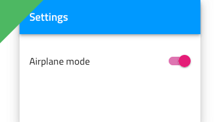 | 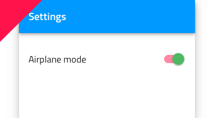 |

## コードの生成

Switch の色を指定した場合、Switch HTML 要素は div でラップされます。これはネスト コンポーネント (他のコンポーネント内のコンポーネント) をスタイル設定する際にブラウザーによって要求されます。

> [!WARNING]
> デザインの Switch のインスタンスで `Detach from Symbol` をトリガーすると、ほとんどの場合で Switch のためのコード生成機能が失われます。

### データ バインディング

データ バインディングは波括弧構文によって指定されます。例: {isAdmin}。テキスト フィールド (`🕹️DataProperty` および `🕹️DataSource` 以外) も文字列補間構文をサポートします。例: 管理者: {isAdmin}。データ バインディングはネストまたはネストなしが可能です。ターゲット プロパティがネストされたプロパティの場合、ネストされたプロパティ チェーンを含みますがモデル オブジェクト名は含みません。実例:

#### ネストなし

```typescript
Customer {
  imageName: String;
}
```

DataProperty: `{imageName}`

#### ネストあり

```typescript
Profile {
  imageName: String;
}

Customer {
  profile: Profile;
}
```

DataProperty: `{profile.imageName}`

### データ プロパティ

`🕹️DataProperty` 値は [Angular Reactive Forms](https://angular.io/guide/reactive-forms) を使用してスイッチの checked プロパティへの 2-way データ バインディングを設定するために使用されます。`🕹️DataProperty` はオプションです。`🕹️DataProperty` はコード生成で提供されるモデル オブジェクト名で指定されたデータ オブジェクトでプロパティ名です。

モデル オブジェクト名および `🕹️DataProperty` が提供される場合、Reactive Forms フォームを作成するためにフォーム ビルダー コードで TypeScript `ngOnInit` メソッドが生成されます。
`🕹️DataProperty` はスイッチ コントロールの formControlName プロパティを設定します。

### 状態

State プロパティが off または無効に設定した場合、コントロールは描画されません。

### ラベルのスタイル

Text Style が None の場合、コントロールのラベル テキストは描画されません。ラベル スタイルは、Switch の配置とテキスト色の制御に使用します。

### テキスト

Text プロパティにテキスト、バインディング、または両方を含むことができます。例:

- 設定
- {settingsLabel}
- 重要な {labelText}

### つまみ

Thumb が None の場合、コントロールは描画されません。スイッチの丸つまみ部分の色を設定するプロパティ。

### トラック

Track が None の場合、コントロールは描画されません。スイッチのトラック部分の色を設定するプロパティ。

## その他のリソース

関連トピック:

- [Lists Pattern](../patterns/lists.md)
  <div class="divider--half"></div>

コミュニティに参加して新しいアイデアをご提案ください。

- [Indigo Design **GitHub** (英語)](https://github.com/IgniteUI/design-system-docfx)
