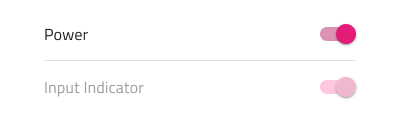
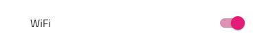
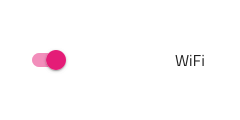

---
title: Switch - デザイン システム コンポーネント
_description: Switch コンポーネント シンボルは、ユーザーが選択にマークできる機能を提供します。
_keywords: デザイン システム, デザイン システム UX, UI キット, Sketch, Ignite UI for Angular, Sketch to Angular, Angular, Angular デザイン システム, Sketch からコードをエクスポート, Angular 用のデザイン キット, Sketch HTML, Sketch to HTML, Sketch UI キット
_language: ja
---

# Switch (スイッチ)

Switch コンポーネント シンボルは、ユーザーが設定一覧でオン/オフするための構成です。Switch は、[Ignite UI for Angular Switch コンポーネント](https://jp.infragistics.com/products/ignite-ui-angular/angular/components/switch.html)と視覚的に同じものです。

## Switch のデモ

## 操作状態

Switch は、有効または無効の状態で挿入できます。

## レイアウト テンプレート

Sketch で Switch は、Switch 要素の前後に Switch ラベルが配置されるラベル位置のバリアントをサポートします。Adobe XD では、Stacks を使用して、スイッチのビジュアルの左または右にドラッグするだけで、デザイン時にラベルとスイッチの位置を変更できるようにしています。

## 状態

Switch は**オン**とオフの選択状態を提供します。Sketch ではこれを `Symbol Overrides` で実現していますが、Adobe XD では `Component States` パラダイムを使用して簡単に状態を切り替えることができます。

## スタイル設定

Switch には、つまみとトラックの色の利用可能なオプション、およびラベルのテキストの色の変更によるスタイリングの柔軟性があります。トラックのアルファ値は、使用されている色に関係なく半透明の外観を実現するように固定されており、Indigo.Design ライブラリの 🧩 Components ページまたはアートボードにある `Symbol Master` を介してのみグローバルに調整できます。

## 使用方法

Switch つまみとトラックに同じまたは同様の色を使用します。

| 良い例                                                                         | 悪い例                                                                             |
| ------------------------------------------------------------------------------ | ---------------------------------------------------------------------------------- |
|  |  |

## その他のリソース

関連トピック:

- [Lists パターン](../patterns/lists.md)
  

コミュニティに参加して新しいアイデアをご提案ください。
