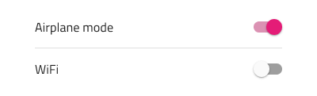
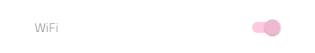
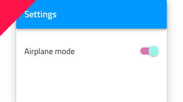

## Switch

Switch コンポーネント シンボルは、ユーザーが設定一覧でオン/オフするための構成です。Switch は、[Ignite UI for Angular Switch コンポーネント](https://jp.infragistics.com/products/ignite-ui-angular/angular/components/switch.html)と視覚的に同じものです。

### Switch デモ

### テーマ

Switch は、明暗バリアントで分かりやすく、背景に明暗のコントラストを付けてスタイル設定できます。

### ラベルの使用

Switch はラベルなしで使用できます。ラベルを非表示にするためにテキスト値を空/スペース文字にしてコンポーネントの幅を小さくします(38px など)。

### 状態

Switch は、オン/オフと選択状態があり、追加のバリアントとしてインタラクション無効の状態があります。

### スタイル設定

Switch は、つまみとトラック色を制御でき柔軟なスタイル設定が可能です。固定アルファ値がトラックに適用されて半透明になります。

## 使用方法

Switch は、設定リストで状態を制御するオプションを説明するラベルの右に表示されます。画面の左端の近くに配置しないようにします。必須の場合は代わりに Checkbox を使用します。Switch つまみとトラックに同じまたは同様の色を使用します。

| いい例                            | 悪い例                           |
| ----------------------------- | ------------------------------- |
|  |  |
|  |  |
|  |  |

## その他のリソース

関連トピック:

- [Lists](lists.md)
  

コミュニティに参加して新しいアイデアをご提案ください。

- [Indigo Design **GitHub** (英語)](https://github.com/IgniteUI/design-system-docfx)
