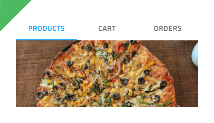

## Tabs

Tabs コンポーネント シンボルは、同じ情報を異なるビューに体系化や同様または関連のあるデータセット間の切り替えが可能です。Tab は、[Ignite UI for Angular Tabs コンポーネント](https://jp.infragistics.com/products/ignite-ui-angular/angular/components/tabs.html)と視覚的に同じものです。

### Tabs デモ

### サイズ

バーに配置されたタブは、高さのあるテキストを使用したアイコン、または短いテキストまたはアイコンを含みますが同時に両方を含むことはありません。

### レスポンシブ

Tab は**固定**が可能で幅を変更して水平スペースを埋めることができます。フルードにも対応しており、通常より多くのコンテンツが収まり、スクロールボタンでより多くのタブを表示、スクロールできます。

### 合計

多くのケースで Tabs に 2 項目 ～ 4 項目が必要になります。4 項目以上必要な場合、ビューでタブのみ表示するフルード モードを検討します。

### タイプ

短い Tabs は、各タブの項目を説明する**テキスト**とアイコンのコンテンツをサポートします。

### スタイル設定

Tabs は、テキストやアイコンの色、現在の選択をマークするインジケーターの色、アクティブ/インアクティブな背景色の変更が可能な基本的なスタイル設定が可能です。

## 使用方法

Tab は情報の体系化に適しいますが、ワークフローのデザインやロジカルなシーケンスに基づいた操作には向いていません (チェックアウト プロセスや構成ウィザード) 。短い Tabs は、同じバーでテキスト タブとアイコンタブは組み合わすことはできません。2 つのコンテンツ モードのうち 1 つを選択してバーの常にすべての項目を使用します。

| いい例                          | 悪い例                         |
| --------------------------- | ----------------------------- |
|  |  |
|  |  |

## その他のリソース

関連トピック:

- [Details](details.md)
  

コミュニティに参加して新しいアイデアをご提案ください。

- [Indigo Design **GitHub** (英語)](https://github.com/IgniteUI/design-system-docfx)
