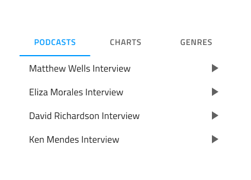
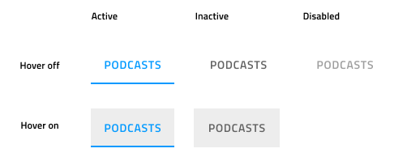

# Tabs (タブ)

Tabs コンポーネントは、同じ情報を異なるビューに体系化、同様または関連のあるデータセット間の切り替えが可能です。Tabs は、[Ignite UI for Angular Tabs コンポーネント](https://jp.infragistics.com/products/ignite-ui-angular/angular/components/tabs.html)と視覚的に同じものです。

## Tabs のデモ

## サイズ

Tabs には 2 つのサイズがあります。Short はデフォルトでテキストのみを表示し、オプションでプレフィックス アイコンとサフィックス アイコンを表示できます。Tall はさらに、テキストの上に 3 つ目のアイコンを追加できます。Figma では、右側のプロパティ パネルの `Type` プロパティから 2 つのサイズを切り替えることができます。

## レスポンシブ

Tabs は、幅を調整することで使用可能な水平方向のスペースを埋めるために Content Fit にすることも、スクロール ボタンを使用して多数のタブ項目をナビゲートすることで固定することもできます。これにより、同じ合計スペースで他のモードで通常可能なコンテンツよりも多くのコンテンツを入れることができます。Figma では、右側のプロパティ パネルの `Content` プロパティから 2 つのモードを切り替えることができます。

## Tabs の量

ほとんどのケースでは、Tabs に 2 つ ~ 5 つ の項目を含める必要があります。Figma で項目を削除するには、ネストされた Tab 項目 コンポーネントをレイヤー パネルから非表示にするだけで、追加された自動レイアウトによってコンテンツが適切に調整されます。ユースケースで 5 つ以上のタブが必要な場合、上記で説明した Fixed モードを検討してください。

## 短いバー コンテンツ

Short Bar にはデフォルトでテキスト コンテンツが含まれます。Figma では、ネストされたタブ項目をすべて選択し、プロパティ パネルからブール値プロパティ `Label`、`Prefix Icon`、`Suffix Icon` をオン/オフすることで、ラベルと 2 つのアイコンを表示/非表示にすることができます。

## タブ項目の状態

タブ項目は、Active (アクティブ)、Inactive (非アクティブ)、Active & Hover (アクティブおよびホバー)、Inactive & Hover (非アクティブおよびホバー)、Disabled (無効) の状態をサポートします。Figma では、プロパティ パネルの `State` プロパティと `Hover` ブール値プロパティを使用して、これらの状態を切り替えることができます。Tabs には、常に 1 つのアクティブなタブと、任意の数の非アクティブおよび無効なタブがあります。

## スタイル設定

Tabs は、テキストとアイコンの色、現在の選択をマークするインジケーターの色、およびアクティブ/インアクティブな背景色に使用できるオプションを通じて、基本的なスタイルの柔軟性を提供します。

## 使用方法

Tabs は情報の体系化に適してますが、ワークフローのデザインやロジカル シーケンスに基づいた操作には向いていません (チェックアウト プロセスや構成ウィザード)。短い Tabs を使用してアイコン タブとテキスト タブを同じメニューで組み合わせることはできません。2 つのコンテンツ モードのうち 1 つを選択し、バーのすべての項目に継続して使用します。

| 良い例                                                                         |悪い例                                                                          |
| -------------------------------------------------------------------------- | ------------------------------------------------------------------------------ |
| | |
| | |

## その他のリソース

関連トピック:

- [Details](../patterns/details.md)
  

コミュニティに参加して新しいアイデアをご提案ください。
