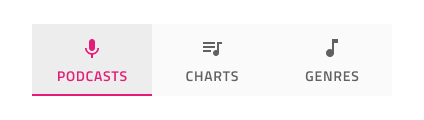

# Tabs (タブ)

Tabs コンポーネントは、同じ情報を異なるビューに体系化、同様または関連のあるデータセット間の切り替えが可能です。Tabs は、[Ignite UI for Angular Tabs コンポーネント](https://jp.infragistics.com/products/ignite-ui-angular/angular/components/tabs.html)と視覚的に同じものです。

## Tabs のデモ

## サイズ

Tabs には 2 つのサイズがあります: 高さのあるテキストを使用したアイコン、または短いテキストやアイコンを含みますが、同時に両方を含むことはないサイズです。

## レスポンシブ

Tabs は、幅を調整することで使用可能な水平方向のスペースを埋めるために Content Fit にすることも、スクロール ボタンを使用して多数のタブ項目をナビゲートすることで固定することもできます。これにより、同じ合計スペースで他のモードで通常可能なコンテンツよりも多くのコンテンツを入れることができます。

## Tabs の量

多くのケースで Tabs に 2 つ ～ 5 つのタブが必要になります。タブ項目を ~No Symbol に設定して削除できます。さらにタブが必要な場合は、流動モードを検討し、表示されているタブのみを表すことをお勧めします。

## 短いバー コンテンツ

短いバーにはデフォルトでテキスト コンテンツが付属しており、代わりにアイコンを表示する場合は、Material Icon を `🔣 Icon` オーバーライドに割り当て、バーのすべてのタブで `🏷️ Label` を ~No Symbol に設定する必要があります。

## タブ項目の状態

タブ項目は、Active、Inactive、および Disabled の状態をサポートします。Tabs には、常に 1 つの Active のタブと、任意の数の Inactive および Disabled のタブがあります。

## スタイル設定

Tabs は、テキストとアイコンの色、現在の選択をマークするインジケーターの色、およびアクティブ/インアクティブな背景色に使用できるオプションを通じて、基本的なスタイルの柔軟性を提供します。

## 使用方法

Tabs は情報の体系化に適してますが、ワークフローのデザインやロジカル シーケンスに基づいた操作には向いていません (チェックアウト プロセスや構成ウィザード)。短い Tabs を使用してアイコン タブとテキスト タブを同じメニューで組み合わせることはできません。2 つのコンテンツ モードのうち 1 つを選択し、バーのすべての項目に継続して使用します。

| 良い例                                                                         |悪い例                                                                          |
| -------------------------------------------------------------------------- | ------------------------------------------------------------------------------ |
| | |
| | |

## その他のリソース

関連トピック:

- [Details](../patterns/details.md)
  

コミュニティに参加して新しいアイデアをご提案ください。
