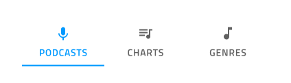
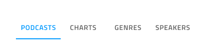

## Tabs

Tabs コンポーネントは、同じ情報を異なるビューに体系化、同様または関連のあるデータセット間の切り替えが可能です。Tab は、[Ignite UI for Angular Tabs コンポーネント](https://jp.infragistics.com/products/ignite-ui-angular/angular/components/tabs.html)と視覚的に同じものです。

### Tabs デモ


### サイズ

バーに配置されたタブは、高さのあるテキストを使用したアイコン、または短いテキストやアイコンを含みますが同時に両方、含むことはありません。




### レスポンシブ

Tab を**固定**し、多数のタブでスクロール ボタンが提供される空いている水平スペースを幅またはフルードを使用して埋めることができます。この機能jは、他のモードで使用可能なスペースに入れた場合よりも多くのコンテンツを入れることができます。


### 量

多くのケースで Tabs に 2 つ ～ 4 つのタブが必要になります。4 つ以上必要な場合、ビューでタブのみ表示するフルード モードを検討します。




### タイプ

短い Tabs は、各タブの項目を説明する**テキスト**とアイコンのコンテンツをサポートします。


### スタイル設定

Tabs は、テキストやアイコンの色、現在の選択をマークするインジケーターの色、アクティブ/インアクティブな背景色の変更が可能な基本的なスタイル設定が可能です。


## 使用方法

Tab は情報の体系化に適してますが、ワークフローのデザインやロジカル シーケンスに基づいた操作には向いていません (チェックアウト プロセスや構成ウィザード)。短い Tab を使用してアイコン タブとテキスト タブを同じメニューで組み合わせることはできません。2 つのコンテンツ モードのうち 1 つを選択し、バーのすべての項目に継続して使用します。

| 良い例                                                                         |悪い例                                                                          |
| -------------------------------------------------------------------------- | ------------------------------------------------------------------------------ |
| | |
| | |

## コードの生成

Sketch の制限によって Tab コンポーネントの特定のタブとコンテンツを関連付けすることはできません。Tab コンポーネントを含む Artboard 全体の生成はお勧めしません。代わりに Tab コンポーネントを生成してから個々のタブ コンテンツをそれぞれの Angular コンポーネントに生成してください。タブ コンテンツをそれぞれ Angular コンポーネントに生成後、Tab コンポーネントで各タブ内で生成したタブ コンテンツに手動で参照できます。


> [!WARNING]
> デザインの Tab インスタンスで `Detach from Symbol` をトリガーした場合、ほとんどの場合でツールチップのコード生成が機能しなくなります。

```html
<igx-tabs>
    <igx-tabs-group>
        <!-- Manually add this component reference -->
        <app-tab1></app-tab1>
    </igx-tabs-group>
    <igx-tabs-group>
        <!-- Manually add this component reference -->
        <app-tab2></app-tab2>
    </igx-tabs-group>
</igx-tabs>
```

> [!Note]
> Tab コンテンツは height: 100% で描画されないため、ページ全体は埋まりません。コンテンツに必要なスペースのみ使用します。

このセクションは、重要なオーバーライドとコード生成について説明します。

### Event プロパティ

`Event` プロパティはコンポーネント TypeScript のメソッドを作成するために使用し、HTML に onTabItemSelected シグネチャを追加します。波括弧構文 `{onEventName}` を使用してイベントを指定する必要があります。

### レスポンシブ

Responsive プロパティが提供された場合、タブのサイズ モードを決定します。None に設定される場合、タブは描画しません。

### タブの量

Tabs Amount は描画するタブ数を決定します。None に設定される場合、タブは描画しません。

### タイプ

Type プロパティが提供された場合、タブがアイコンまたはテキストを描画するかどうかを決定します。短いタブのみに使用されます。すべてのタブの Type を None に設定した場合、タブ コントロールを描画しません。

### テキスト

Text プロパティには、テキスト、[テキストのバインド](../codegen/data-binding.md)、またはその両方を含むことができます。例:

- 設定
- {settingsLabel}
- 重要な {labelText}

## その他のリソース

関連トピック:

- [Details](../patterns/details.md)
- [Data Binding](../codegen/data-binding.md)
  <div class="divider--half"></div>

コミュニティに参加して新しいアイデアをご提案ください。


