---
title: Text - デザイン システム コンポーネント
_description: Text コンポーネント システムは、非インタラクティブなタイトルや段落テキストを表示します。
_keywords: デザイン システム, Sketch, コンポーネント, UI Library, ウィジェット
_language: ja
---

## Text

Text コンポーネント シンボルは、ニュースやブログ ポストなどインタラクティブでない段落文字列のタイトル コンテンツを表示します。

### Text デモ

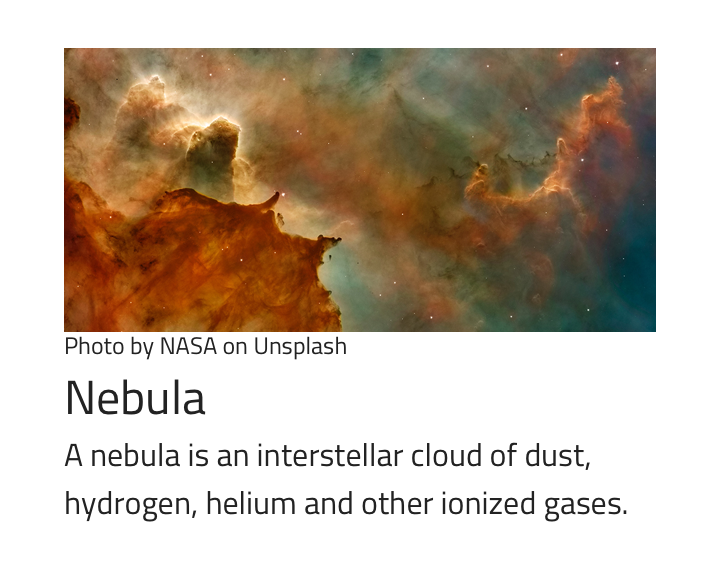

### Title と Paragraph

Text には、Titles と Paragraphs のためのバリアントがあります。

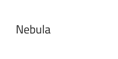


### タイトル サイズ

テキスト タイトルは、最小 H6 から最大 H1 の 6 つのプリセット サイズがあります。

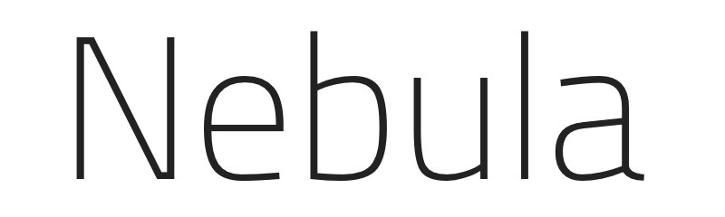
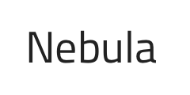
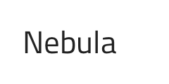
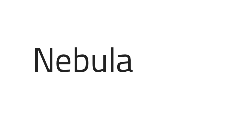
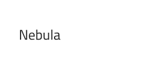
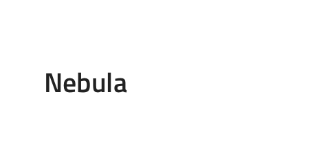

### 段落サイズ

テキスト段落には、ラージ **Body 1**、スモール Body 2、画像やタイトルの注釈に使用する極小キャプションがあります。

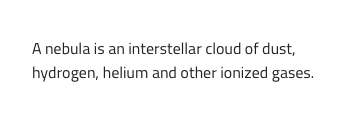
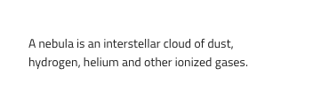
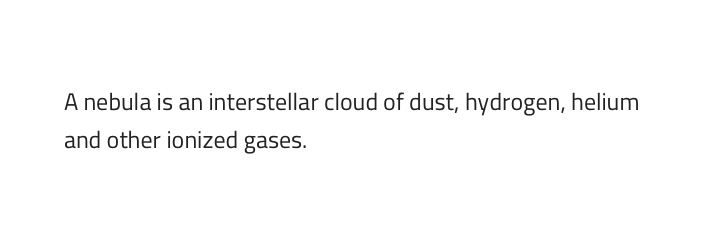

### スタイル設定

Titles と Paragraphs は、Styling ライブラリの Typography 部分で使用できるテキスト ウェイトや色プリセットのみから選択できます。

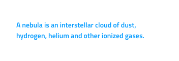

## 使用方法

Hyperlink を複数同時に使用する場合は、Hyperlink を目立つように Paragraph テキスト色を選択します。同じ色や似たような色を使用せずに全体的なデザインの色を統一します。1行注釈のみの段落キャプション サイズを使用し、複数行に及ぶより長い文字列に極小フォントサイズなどは使用しないようにします。

| いい例                          | 悪い例                         |
| --------------------------- | ----------------------------- |
|  |  |
|  |  |

## コードの生成

Title または Paragraph に色やフォントを指定した場合、タイトルまたは段落要素に適用される CSS クラスに直接適用されます。

> [!WARNING]
> デザインの Title または Paragraph Text のインスタンスで`シンボルからデタッチ`をトリガーすると、ほとんどの場合で Title または Paragraph Text のためのコード生成機能が失われる結果となります。

### データ バインディング

データ バインディングは波括弧構文によって指定されます。例: {isAdmin}。テキスト フィールド (`🕹️DataProperty` および `🕹️DataSource` 以外) も文字列補間構文をサポートします。例: 管理者: {isAdmin}。データ バインディングはネストまたはネストなしが可能です。ターゲット プロパティがネストされたプロパティの場合、ネストされたプロパティ チェーンを含みますがモデル オブジェクト名は含みません。実例:

#### ネストなし

```PseudoCode
Customer {
    imageName: String;
}

DataProperty: {imageName}
```

#### ネストあり

```PseudoCode
Profile {
    imageName: String;
}

Customer {
    profile: Profile;
}

DataProperty: {profile.imageName}
```

### テキスト

Text プロパティにテキスト、バインディング、または両方を含むことができます。例:

- 設定
- {settingsLabel}
- 重要な {labelText}

## その他のリソース

コミュニティに参加して新しいアイデアをご提案ください。

- [Indigo Design **GitHub** (英語)](https://github.com/IgniteUI/design-system-docfx)
