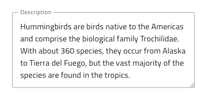
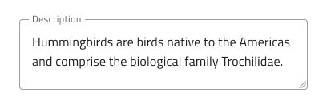
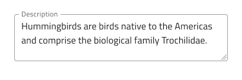
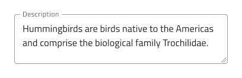
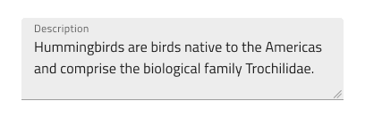
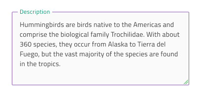
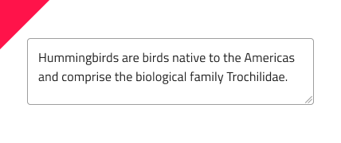

# Text Area (テキスト領域)

Text Area コンポーネントを使用して、ユーザーが複数行に表示される長いテキスト データを入力して編集できるようにします。Text Area を使用すると、ユーザーはドラッグ インジケーターによって領域のサイズを水平方向および垂直方向に変更できます。ユーザーは、[Ignite UI for Angular Input Group コンポーネント](https://jp.infragistics.com/products/ignite-ui-angular/angular/components/input_group.html)をテキストとして装飾することで、Text Area コンポーネントを作成できます。

## Text Area のデモ

## サイズ

Text Area のサイズは 3 つあります。

- Large (大)
- Medium (中)
- Small (小)

| Large | Medium | Small |
| ------- | ------- | ------- |
|  |  |  |

## タイプ
Figma では border スタイルと box スタイルの 2 つのタイプが選択できます。

| Border | Box|
| ------- | ------- |
|  |  |

## インタラクション状態

Figma では border タイプと box タイプの Text Area を Disabled 状態に設定できます。

 

## 状態

Text Area コンポーネントは 5 つの Enabled 状態 (**Idle**、**Idle & Hover**、**Filled**、**Filled & Hover**、**Focused**) をサポートします。柔軟性が向上したことにより、Hi-Fi プロトタイプへシームレスにフローする動的なインタラクション デザインの作成が可能です。Figma では、右側のプロパティ パネルの `State` プロパティを使用して状態を切り替えることができます。

経験豊富なデザイナーは、ユーザー入力を制限して無効な状態を防止するために、検証スタイルを使用します。検証スタイルは、Text Area で Success、Warning、Error を表示する洗練されたデザインを提供します。

 

Figma では、右側のプロパティ パネルの `State` プロパティから状態を簡単に切り替えることができます。

## スタイル設定

Text Area には、Background、Border、および Text の色によるスタイル設定の柔軟性があります。検証スタイルを変更するには、Indigo.Design ライブラリのそれぞれの色スタイルを更新することをお勧めします。

## 使用方法

Text Area を使用するときは、常にラベルを付ける必要があります。ラベルのないテキスト領域は不明瞭に表示されます。

| 良い例                                                                           | 悪い例                                                                            |
| ---------------------------------------------------------------------------- | -------------------------------------------------------------------------------- |
|  |  |

## その他のリソース

関連トピック:

- [Input](input.md)
  

コミュニティに参加して新しいアイデアをご提案ください。
