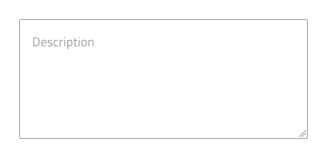
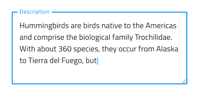
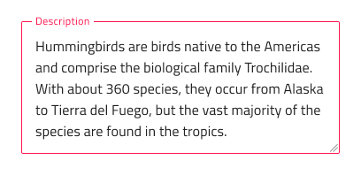

# Text Area (テキスト領域)

Text Area コンポーネントを使用して、ユーザーが複数行に表示される長いテキスト データを入力して編集できるようにします。Text Area を使用すると、ユーザーはドラッグ インジケーターによって領域のサイズを水平方向および垂直方向に変更できます。ユーザーは、[Ignite UI for Angular Input Group コンポーネント](https://jp.infragistics.com/products/ignite-ui-angular/angular/components/input_group.html) をテキストとして装飾することで、Text Area コンポーネントを作成できます。  

## Text Area のデモ

## 操作状態

Text Area は、有効または無効の状態で挿入できます。

## バリアント

Text Area は、明暗バリアント (デフォルトは**暗い**) で分かりやすく、背景に明暗のコントラストを付けてスタイル設定できます。

## 状態

ユーザーが Text Area とインタラクティブに操作する際にさまざまな状態を経由します。コンテンツの代わりにプレースホルダーがある**アイドル状態**、ユーザーが入力中のフォーカス状態、ユーザーがコンテンツの追加を完了して次に進むときの塗りつぶし状態。柔軟性が向上したことにより、Hi-Fi プロトタイプへシームレスにフローする動的なインタラクション デザインの作成が可能です。

`idle`

`focused`

`filled`

経験豊富なデザイナーは、ユーザー入力を制限して無効な状態を防止するために、検証スタイルを使用します。検証スタイルは、Text Area で成功、警告、エラーを表示する洗練されたデザインを提供します。

Sketch では状態と検証状態を `Symbol Overrides` で実現していますが、Adobe XD では `Component States` パラダイムを使用して簡単に状態を切り替えることができます。

## サイズ変更

Text Area を使用すると、ユーザーは、新しい制約に合わせてテキストを自動的に調整しながら、右下隅にあるドラッグ インジケーターによって領域のサイズを水平方向および垂直方向に変更できます。

## スタイル設定

Text Area には、背景、ドラッグ インジケーター、境界線、およびテキストの色によるスタイル設定の柔軟性があります。検証スタイルを変更するには、Indigo.Design ライブラリのそれぞれの色変数を更新することをお勧めします。

## 使用方法

Text Area を使用するときは、常にラベルを付ける必要があります。ラベルのないテキスト領域は不明瞭に表示されます。

| 良い例                                                                           | 悪い例                                                                            |
| ---------------------------------------------------------------------------- | -------------------------------------------------------------------------------- |
|  |  |

## その他のリソース

関連トピック:

- [Input](input.md)
  

コミュニティに参加して新しいアイデアをご提案ください。
