---
title: Time Picker - デザイン システム コンポーネント
_description: Time Picker コンポーネント シンボルは、時間選択に必要なメカニズムを提供する時間のビジュアル表現として使用します。
_keywords: デザイン システム, Sketch, Ignite UI for Angular, コンポーネント, UI ライブラリ, ウィジェット
_language: ja
---

## Time Picker

Time Picker コンポーネント シンボルは、日付の時間部分 (時と分) を視覚的に表し、統一した選択手段を提供します。Time Picker は、さまざまなフォームで使用されるこのタイプのフィールドの日付を選択して設定する場合に適しています。Time Picker は、[Ignite UI for Angular Time Picker コンポーネント](https://jp.infragistics.com/products/ignite-ui-angular/angular/components/time_picker.html)と視覚的に同じものです。

### Time Picker デモ

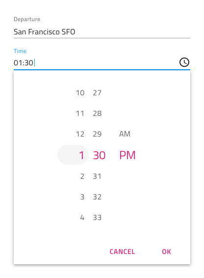

### レイアウト

Time Picker は、水平/垂直の方向の時間選択モードをサポートします。

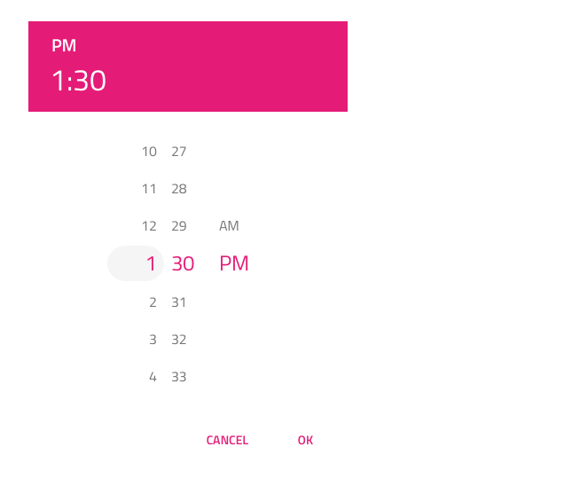
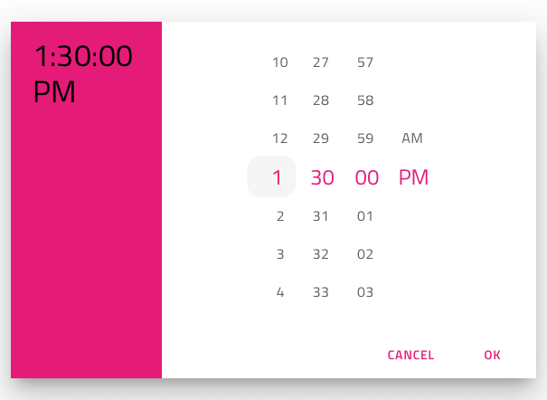

### ボタン

Time Picker の 2 つのボタンは、時間を元の時間に戻す選択のキャンセル、変更を保存するための選択の確認に使用します。Overrides で両方を none に設定してボタンレスのレイアウトを実現できます。

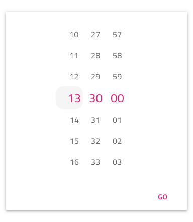
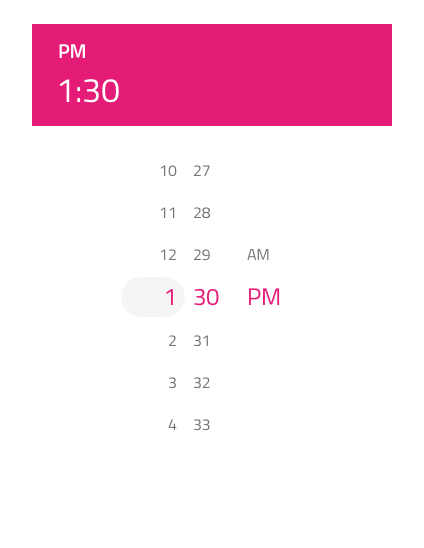

### コンテンツ

Time Picker は、2 種類のコンテンツ モードで 12 時間と 24 時間をサポートします。時間と分の部分の他に 12 時間コンテンツ モードで AM と PM を選択できます。

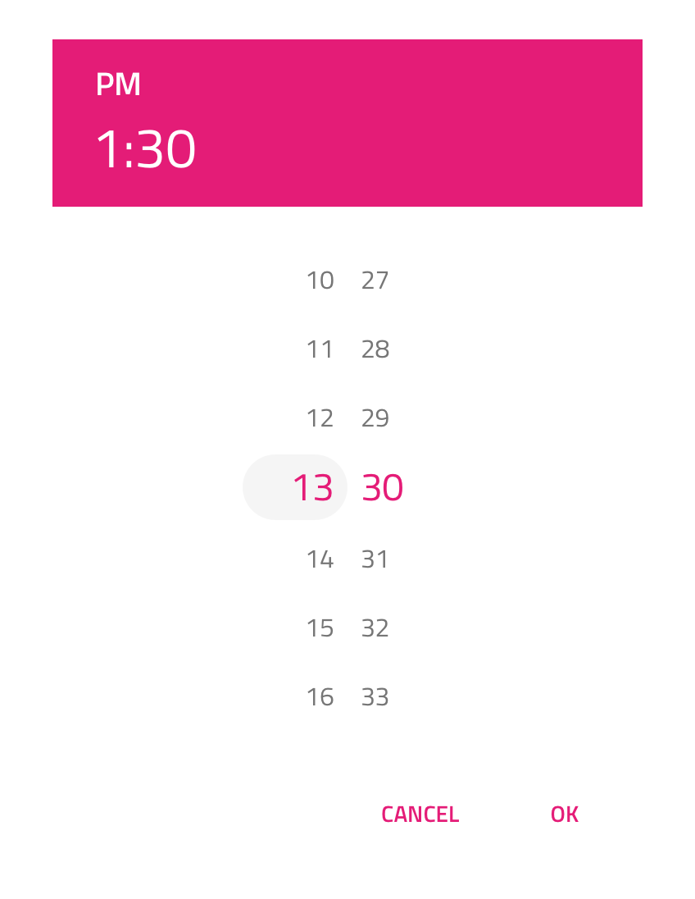

### スタイル設定

Time Picker は、さまざまなオーバーライドでヘッダー背景、タイトル色、選択した時間、分、AM/PM のテキストの色の制御などスタイル設定に柔軟性があります。Cancel と OK のボタンは、Flat Buttons で状況に応じたスタイル設定が可能です。

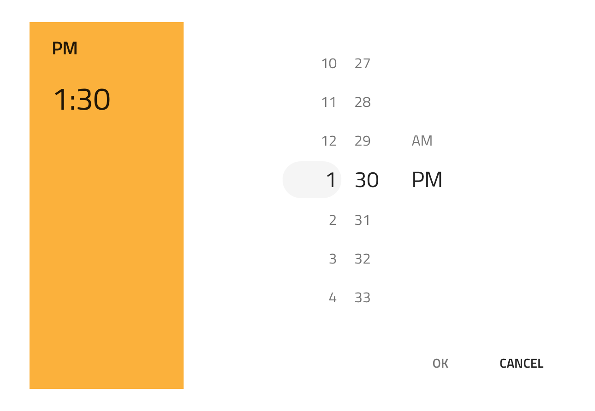

## 使用方法

水平と垂直の時間選択をダイアログで表示し、ダイアログ以外の UI は暗くなります。

| いい例                                | 悪い例                               |
| --------------------------------- | ----------------------------------- |
| 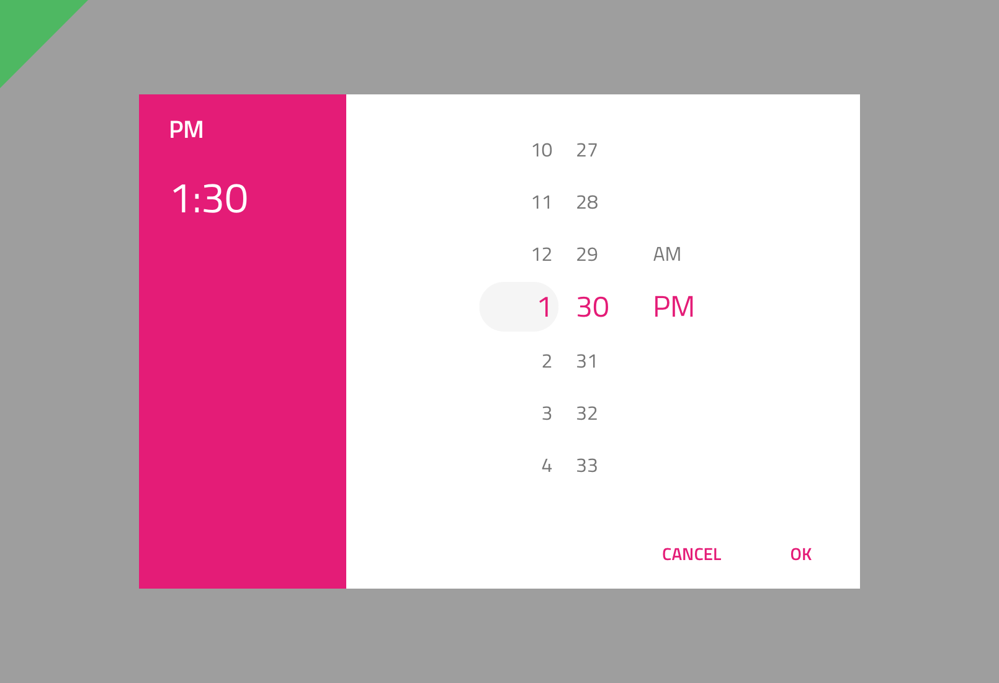 | 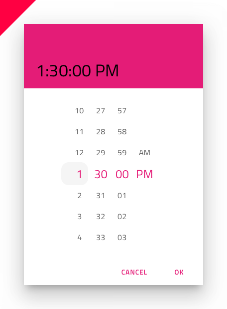 |
| 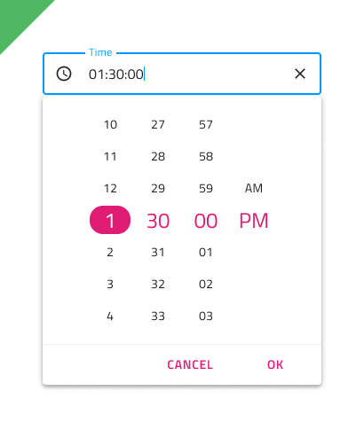 | 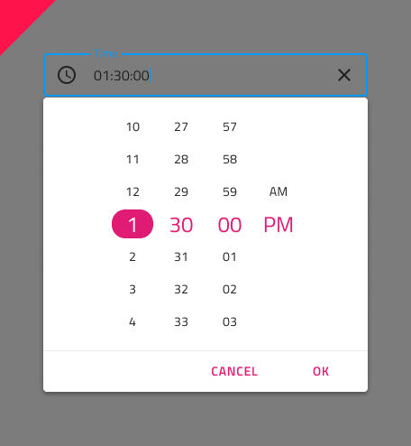 |

## その他のリソース

関連トピック:

- [Calendar](calendar.md)
- [Form Pattern](forms.md)
  

コミュニティに参加して新しいアイデアをご提案ください。

- [Indigo Design **GitHub** (英語)](https://github.com/IgniteUI/design-system-docfx)
