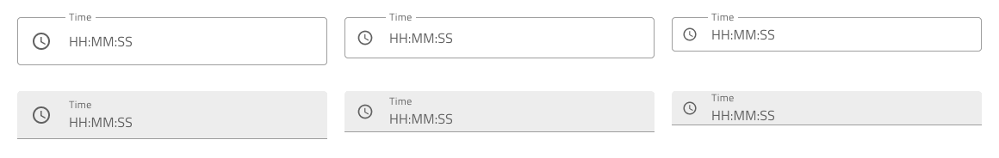

## Time Picker (タイム ピッカー)

Time Picker コンポーネントを使用して、日付の時間部分 (時、分、秒) を視覚的に表し、フォームに表示することおよびドロップダウンまたはダイアログから選択することのための適切な手段を提供します。Time Picker は、[Ignite UI for Angular Time Picker コンポーネント](https://jp.infragistics.com/products/ignite-ui-angular/angular/components/time_picker.html)と視覚的に同じものです。

## デモ

## タイプ

Figma ではプロパティ パネルの `Type` プロパティで dialog または dropdown の Time Picker を選択できます。

## サイズ

すべての Time Picker タイプは、次の 3 つのサイズで利用できます。

- Large (大)
- Medium (中)
- Small (小)

## Time Picker の入力

Time Picker Input は Enabled と Disabled のインタラクション状態をサポートし、Dialog と Dropdown のバリエーションもユーザー操作に応じて表示されます。

## Time Picker Input タイプ

Figma では、ユーザーは 2 つのタイプの Time  Picker Input を選択できます。1 つは無地の背景上でより構造的に見える border スタイル、もう 1 つは鮮やかな画像の上に配置した際に内容の可読性を高めるのに最適な box スタイルです。

## Time Picker Input サイズ

すべての Time Picker 入力タイプには、Time Picker コンポーネントの対応するサイズに合わせて 3 つのサイズがあります。

- Large (大)
- Medium (中)
- Small (小)

## Time Picker Input 状態

Time Picker の入力は 7 つのインタラクション状態 (**Idle**、**Idle & Hover**、**Idle & Disabled**、**Filled**、**Filled & Hover**、**Filled & Disabled**、**Focused**) と、3 つのバリデーション状態 (**Success**、**Warn**、**Error**) をサポートします。

## レイアウト

Time Picker は、水平および垂直方向の Dialog レイアウトおよび Drop-down レイアウトをサポートしており、さまざまなシャドウを表示して互いに区別しやすくすることで、さまざまな時間の選択モードを容易にします。Dialog レイアウトにはヘッダーが付属していることに注意してください。ブール値の `Header` プロパティをオフにすることで Figma でヘッダーを非表示にすることができ、追加された自動レイアウトのおかげでレイアウトはそれに応じて自動的に調整されます。

         

## コンテンツ

Time Picker は、2 種類のコンテンツ モードで 12 時間と 24 時間をサポートします。12 時間コンテンツ モードでは、時、分、秒の他に、AM と PM を選択できます。

## ボタン

Time Picker の 2 つのボタンは、時間を元の時間に戻す選択のキャンセルおよび変更を保存するための選択の確認にそれぞれ使用します。

Button Area はテンプレート化できるため、必要に応じてボタンを簡単に非表示にできます。Figma では、レイヤー パネルからインスタンスを非表示にすることでボタンを非表示にしたり、`Action Buttons` ブール値プロパティを使用してボタン全体を非表示にしたりすることができます。Figma でボタンを追加するには、まずコンポーネント インスタンスをデタッチしてから、必要な変更を適用する必要があります。

## スタイル設定

Time Picker は、ヘッダー背景、タイトル色、選択した時・分・秒、AM/PM のテキストの色など、スタイル設定に柔軟性があります。Cancel と OK のボタンは、[Flat Buttons](button.md) で状況に応じたスタイル設定が可能です。

## 使用方法

Time Picker を Dialog として表示する場合は、UI の残りの部分を暗くするレイヤーを追加し、Dropdown として表示する場合は、Dropdown 構成の Time Picker 入力のすぐ下に配置します。

| 良い例                                                                                     |悪い例                                                                                      |
| -------------------------------------------------------------------------------------- | ------------------------------------------------------------------------------------------ |
|  |  |
|  |  |

## その他のリソース

関連トピック:

- [Calendar](calendar.md)
- [Date Picker](date-picker.md)
- [Input](input.md)
- [Form パターン](../patterns/form.md)
  

コミュニティに参加して新しいアイデアをご提案ください。
