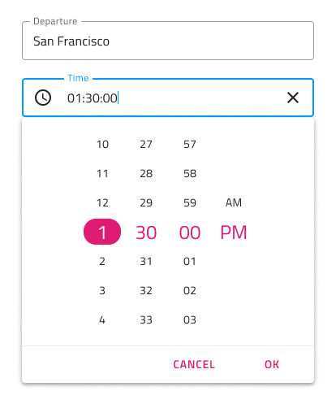

## Time Picker

Time Picker コンポーネント シンボルは、日付の時間部分 (時と分) を視覚的に表し、統一した選択手段を提供します。Time Picker は、さまざまなフォームで使用されるこのタイプのフィールドの日付を選択して設定する場合に適しています。Time Picker は、[Ignite UI for Angular Time Picker コンポーネント](https://jp.infragistics.com/products/ignite-ui-angular/angular/components/time_picker.html)と視覚的に同じものです。

### Time Picker デモ

### レイアウト

Time Picker は、水平/垂直の方向の時間選択モードをサポートします。

### ボタン

Time Picker の 2 つのボタンは、時間を元の時間に戻す選択のキャンセル、変更を保存するための選択の確認に使用します。Overrides で両方を none に設定してボタンレスのレイアウトを実現できます。

### コンテンツ

Time Picker は、2 種類のコンテンツ モードで 12 時間と 24 時間をサポートします。時間と分の部分の他に 12 時間コンテンツ モードで AM と PM を選択できます。

### スタイル設定

Time Picker は、さまざまなオーバーライドでヘッダー背景、タイトル色、選択した時間、分、AM/PM のテキストの色の制御などスタイル設定に柔軟性があります。Cancel と OK のボタンは、Flat Buttons で状況に応じたスタイル設定が可能です。

## 使用方法

水平と垂直の時間選択をダイアログで表示し、ダイアログ以外の UI は暗くなります。

| いい例                                | 悪い例                               |
| --------------------------------- | ----------------------------------- |
|  |  |
|  |  |

## その他のリソース

関連トピック:

- [Calendar](calendar.md)
- [Form Pattern](forms.md)
  

コミュニティに参加して新しいアイデアをご提案ください。

- [Indigo Design **GitHub** (英語)](https://github.com/IgniteUI/design-system-docfx)
