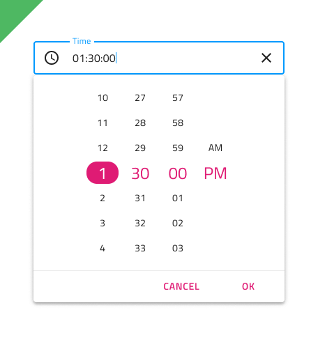

## Time Picker (タイム ピッカー)

Time Picker コンポーネントを使用して、日付の時間部分 (時、分、秒) を視覚的に表し、フォームに表示することおよびドロップダウンまたはダイアログから選択することのための適切な手段を提供します。Time Picker は、[Ignite UI for Angular Time Picker コンポーネント](https://jp.infragistics.com/products/ignite-ui-angular/angular/components/time_picker.html)と視覚的に同じものです。

## Time Picker のデモ

## Time Picker の入力

フォームに Time Picker 入力を挿入して、日付の時間部分のみを選択するためのフィールドを示すことができます。Enabled および Disabled のインアクティブ状態、およびユーザーの操作時に表示される Dialog と Drop-down のバリアントをサポートします。

## Picker レイアウト

Time Picker は、水平および垂直方向の Dialog レイアウトおよび Drop-down レイアウトをサポートしており、さまざまなシャドウを表示して互いに区別しやすくすることで、さまざまな時間の選択モードを容易にします。Dialog レイアウトには Header があり、Sketch でオーバーライドを ~No Symbol に設定して非表示にできます。スマート レイアウトを使用すると、すべてがそれに応じて調整されます。Adobe XD では、ヘッダー レイヤーを削除する必要があり、Stack を使用してレイアウトが調整されます。

         

## コンテンツ

Time Picker は、2 種類のコンテンツ モードで 12 時間と 24 時間をサポートします。12 時間コンテンツ モードでは、時、分、秒の他に、AM と PM を選択できます。

## ボタン

Time Picker の 2 つのボタンは、時間を元の時間に戻す選択のキャンセルおよび変更を保存するための選択の確認にそれぞれ使用します。

Button area はテンプレート化できるため、必要に応じてボタンを簡単に非表示にできます。Figma では、ボタンのインスタンスをレイヤー パネルから非表示にすることで、単純にボタンを非表示にすることができます。同様に、Sketch では、ボタンのオーバーライドを ~No Symbol に設定して非表示にすることができます。 Adobe XD では、不要なボタンをまとめて削除できます。Sketch や Figma とは異なり、Adobe XD ではボタンを追加できます。カスタム アクションの場合は、[Libraries] パネルの Button area にボタンを追加できます。Button の削除または追加に関係なく、適用された Stack はレイアウトを自動的に調整します。Figma と Sketch でこれを実現するには、まずコンポーネント インスタンスをデタッチしてから、必要な変更を適用する必要があります。

## スタイル設定

Time Picker は、ヘッダー背景、タイトル色、選択した時・分・秒、AM/PM のテキストの色など、スタイル設定に柔軟性があります。Cancel と OK のボタンは、[Flat Buttons](button.md) で状況に応じたスタイル設定が可能です。

## 使用方法

Time Picker を Dialog として表示する場合は、UI の残りの部分を暗くするレイヤーを追加し、Drop-down として表示する場合は、Drop-down 構成の Time Picker 入力のすぐ下に配置します。Dialog として表示されている場合は、Time Picker のすべてのボタンを非表示にしないでください。肯定的なアクションがないと、コンポーネントの使いやすさが損なわれます。

| 良い例                                                                                     |悪い例                                                                                      |
| -------------------------------------------------------------------------------------- | ------------------------------------------------------------------------------------------ |
|  |  |
|  |  |
|  |  |

## その他のリソース

関連トピック:

- [Calendar](calendar.md)
- [Date Picker](date-picker.md)
- [Input](input.md)
- [Form パターン](../patterns/form.md)
  

コミュニティに参加して新しいアイデアをご提案ください。
