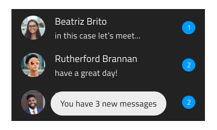

## Toast

Toast コンポーネント シンボルは、非インタラクティブでユーザーが破棄できない短い情報メッセージや通知を表示します。Toast は、定義した時間間隔の後に自動的に非表示になります。Toast は、[Ignite UI for Angular Toast コンポーネント](https://jp.infragistics.com/products/ignite-ui-angular/angular/components/toast.html)と視覚的に同じものです。

### Toast デモ


### 位置

Toast は、情報に関連するコンテンツの上、下、中央に相対的に配置します。


### スタイル設定

Toast は、スタイル設定に制限があり背景とメッセージ テキスト色のみ制御します。ただし、white と grays.900 のどちらかを選択することをお勧めします。メッセージ テキストは背景とのコントラストがより高い方を使用します。



## 使用方法

Toast は、常に水平に配置する必要があり、その他の配置はしないようにします。Toast のスタイルは、特徴のある背景色や白や濃い灰色のメッセージ テキストは使用しないようにします。

| いい例                          | 悪い例                          |
| ---------------------------- | ------------------------------ |
|  |  |
|  |  |

## コードの生成

Toast の色やフォントを指定した場合、Toast HTML 要素は div でラップされます。ブラウザーによってネスト コンポーネント (他のコンポーネント内のコンポーネント) のスタイル設定が要求されます。

> [!WARNING]
> デザインの Toast のインスタンスで`シンボルからデタッチ`をトリガーすると、ほとんどの場合で Toast のためのコード生成機能が失われます。

### Text/Data プロパティ バインディング

Message に Text プロパティがあります。ネストまたはネストなしのデータ項目にバインドできます。プロパティがネストされたプロパティの場合、ネストされたプロパティ チェーンを含みますがモデル オブジェクト名は含みません。例:

#### 例: ネストなし

```PseudoCode
Customer {
messageText: string;
}

Text: { messageText }
```

#### 例: ネストあり

```PseudoCode
Profile {
messageText: number;
}

Customer {
profile: Profile;
}

Text: {profile. messageText }
```

## その他のリソース

コミュニティに参加して新しいアイデアをご提案ください。

- [Indigo Design **GitHub** (英語)](https://github.com/IgniteUI/design-system-docfx)
