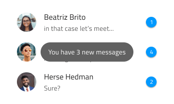
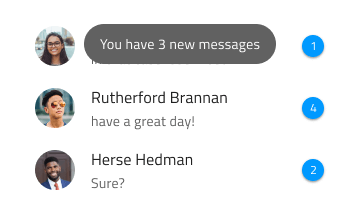
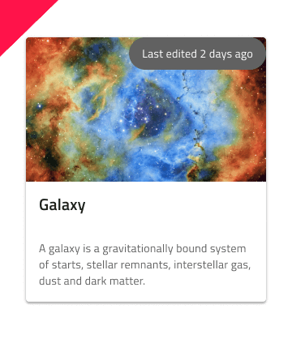

## Toast

Toast コンポーネント シンボルは、非インタラクティブでユーザーが破棄できない短い情報メッセージや通知を表示します。Toast は、定義した時間間隔の後に自動的に非表示になります。Toast は、[Ignite UI for Angular Toast コンポーネント](https://jp.infragistics.com/products/ignite-ui-angular/angular/components/toast.html)と視覚的に同じものです。

### Toast デモ


### 位置

Toast は、情報に関連するコンテンツの上、下、中央に相対的に配置します。





### スタイル設定

Toast は、スタイル設定に制限があり背景とメッセージ テキスト色のみ制御します。ただし、white と grays.900 のどちらかを選択することをお勧めします。メッセージ テキストは背景とのコントラストがより高い方を使用します。


## 使用方法

Toast は、常に水平に配置する必要があり、その他の配置はしないようにします。Toast のスタイルは、特徴のある背景色や白や濃い灰色のメッセージ テキストは使用しないようにします。

| 良い例                          | 悪い例                          |
| ---------------------------- | ------------------------------ |
|  |  |
|  |  |

## コードの生成

Toast の色を指定した場合、Toast HTML 要素は div でラップされます。ブラウザーによってネスト コンポーネント (他のコンポーネント内のコンポーネント) のスタイル設定が要求されます。

> [!WARNING]
> デザインの Toast のインスタンスで`シンボルからデタッチ`をトリガーすると、ほとんどの場合で Toast のためのコード生成機能が失われます。

### データ バインディング

データ バインディングは波括弧構文によって指定されます。例: {isAdmin}。テキスト フィールド (`🕹️DataProperty` および `🕹️DataSource` 以外) も文字列補間構文をサポートします。例: 管理者: {isAdmin}。データ バインディングはネストまたはネストなしが可能です。ターゲット プロパティがネストされたプロパティの場合、ネストされたプロパティ チェーンを含みますがモデル オブジェクト名は含みません。実例:

#### ネストなし

```typescript
Customer {
  imageName: String;
}
```
DataProperty: `{imageName}`

#### ネストあり

```typescript
Profile {
  imageName: String;
}

Customer {
  profile: Profile;
}
```
DataProperty: `{profile.imageName}`

### データ プロパティ

`🕹️DataProperty` 値は Toast のテキスト プロパティへのデータ バインディングを設定するために使用されます。`🕹️DataProperty` はオプションです。`🕹️DataProperty` は、生成要求で提供されるモデル オブジェクト名で指定されたデータ オブジェクトのプロパティ名です。この値は Text プロパティをオーバーライドします。

### テキスト

Text プロパティにテキスト、バインディング、または両方を含むことができます。例:

- 設定
- {settingsLabel}
- 重要な {labelText}

## その他のリソース

コミュニティに参加して新しいアイデアをご提案ください。

- [Indigo Design **GitHub** (英語)](https://github.com/IgniteUI/design-system-docfx)
