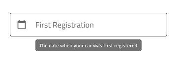
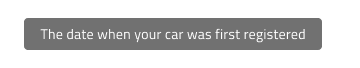
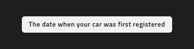
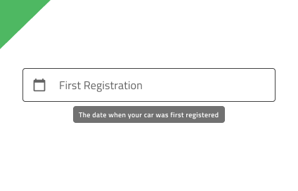
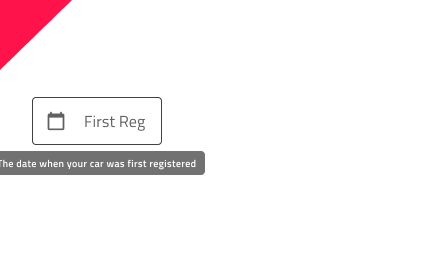

## ツールチップ

Tooltip コンポーネントを使用して追加情報を表示し、ユーザーインターフェイスの他のコンポーネントについて説明するテキストを一時的にします。ユーザーインタラクションによって表示可能となり、特定の時間経過後またはユーザーインタラクションによって非表示になります。ツールチップは、[Ignite UI for Angular Tooltip コンポーネント](https://jp.infragistics.com/products/ignite-ui-angular/angular/components/tooltip.html) と視覚的に同じものです。

### ツールチップ デモ

### タイプ

ツールチップは、デスクトップとモバイルで使用時に適切なサイズで提供されます。

### バリアント

Tooltip の **dark** バリアントは、より明るい色のインターフェイスの下の使用が適しています。**light** バリアントはより暗い色のインターフェイスの上の使用が適しています。

### スタイル設定

Tooltip には、背景色の制御をオーバライドすることにより柔軟にスタイル設定ができる機能があります。

## 使用方法

要素にツールチップを表示する際の位置は大変重要です。ほとんどの場合、要素は相互的な関連によって配置されます。例外として配置によってツールチップの一部が切れる場合があり、ツールチップ全体が表示されるよう配置します。

| 良い例                                                                               |悪い例                                                                                |
| -------------------------------------------------------------------------------- | ------------------------------------------------------------------------------------ |
| | |
| | |

## コードの生成

> [!WARNING]
> デザインの ツールチップ のインスタンスで `Detach from Symbol` をトリガーすると、ほとんどの場合でツールチップのコード生成が機能しなくなります。

## その他のリソース

コミュニティに参加して新しいアイデアをご提案ください。

- [Indigo Design **GitHub** (英語)](https://github.com/IgniteUI/design-system-docfx)
