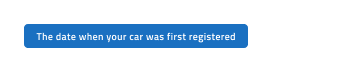

# Tooltip (ツールチップ)

Tooltip コンポーネントを使用して追加情報を表示し、ユーザーインターフェイスの他のコンポーネントについて説明するテキストを一時的にします。ユーザーインタラクションによって表示可能となり、特定の時間経過後またはユーザーインタラクションによって非表示になります。Tooltip は、[Ignite UI for Angular Tooltip コンポーネント](https://jp.infragistics.com/products/ignite-ui-angular/angular/components/tooltip.html)と視覚的に同じものです。

## Tooltip のデモ

## スタイル設定

Tooltip には、背景色とメッセージ テキスト スタイルで使用できるオプションによるスタイル設定の柔軟性があります。ただし、背景との最適なコントラストとツールヒント メッセージの読みやすさを維持するために、事前定義された色を使用することをお勧めします。

## 使用方法

特定の要素に対して Tooltip を表示する場合、適切な位置の選択が重要です。Tooltip は説明対象の要素の近くに表示されるべきであり、インターフェイスを妨げたりユーザーの注意をそらしたりしてはなりません。その位置は最大限の視認性を確保し、画面内に完全に収まる必要があります。デフォルトでは Tooltip は要素のすぐ下の中央に表示されますが、その位置では Tooltip の一部が画面外に出てしまう場合、Tooltip 全体が表示されるように位置を調整する必要があります。
Tooltip は重要な情報を伝える目的で使用するべきではありません。

| 良い例                                                                               |悪い例                                                                                |
| -------------------------------------------------------------------------------- | ------------------------------------------------------------------------------------ |
|  |  |
|  |  |
|  |  |

## その他のリソース

コミュニティに参加して新しいアイデアをご提案ください。
