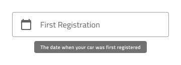
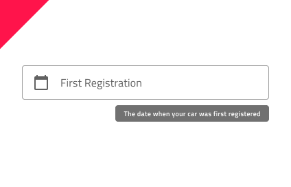

# Tooltip (ツールチップ)

Tooltip コンポーネントを使用して追加情報を表示し、ユーザーインターフェイスの他のコンポーネントについて説明するテキストを一時的にします。ユーザーインタラクションによって表示可能となり、特定の時間経過後またはユーザーインタラクションによって非表示になります。Tooltip は、[Ignite UI for Angular Tooltip コンポーネント](https://jp.infragistics.com/products/ignite-ui-angular/angular/components/tooltip.html)と視覚的に同じものです。

## Tooltip のデモ

## タイプ

Tooltip は、デスクトップとモバイルで使用時に適切なサイズで提供されます。

## スタイル設定

Tooltip には、背景色とメッセージ テキスト スタイルで使用できるオプションによるスタイル設定の柔軟性があります。ただし、背景との最適なコントラストとツールヒント メッセージの読みやすさを維持するために、事前定義された色を使用することをお勧めします。

## 使用方法

要素に Tooltip を表示する際の位置は大変重要です。ほとんどの場合、要素は相互的な関連によって配置されます。例外として配置によって Tooltip の一部が切れる場合があり、Tooltip 全体が表示されるよう配置します。

| 良い例                                                                               |悪い例                                                                                |
| -------------------------------------------------------------------------------- | ------------------------------------------------------------------------------------ |
| | |
| | |

## その他のリソース

コミュニティに参加して新しいアイデアをご提案ください。
