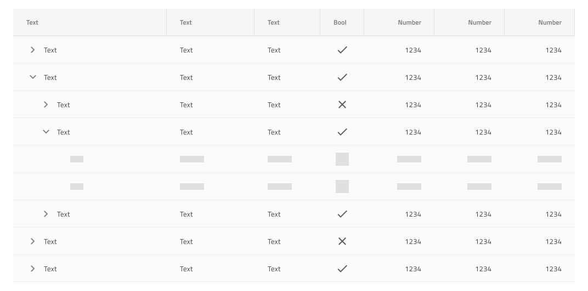

# Skeleton Tree Grid (スケレトン ツリー グリッド)

Skeleton Tree Grid を使用して、標準の情報と同じタイプの情報をレイアウトしますが、現時点でデータが存在しない場合のアプリケーションの状態も示します。 たとえば、データがリモート データ ソースから読み込まれる際、接続が不足しているか、時間がかかる場合などです。Skeleton Tree Grid は、既知のレイアウトの [Tree Grid](tree-grid.md) を視覚的に表したものですが、表示するデータはありません。

## Skeleton Tree Grid のデモ

## セル タイプ

Skeleton Tree Grid は、Header (ヘッダー)、Body (本文)、Summary (集計) の 3 種類のスケルトン セルを拡張し、標準の [Tree Grid](tree-grid.md) として 1 つの追加の TreeColumn セルを追加します。

## セル 表示密度

Skeleton Tree Grid の TreeColumn セルは、標準の [Tree Grid](tree-grid.md) と同じ 3 つの表示密度バリアント (comfortable、cosy、compact) をサポートします。

## Cell の深さ

Skeleton Tree Grid の TreeColumn セルは、データ階層のレベルについて、標準の [Tree Grid](tree-grid.md) と同じ視覚的表示をサポートします。 これは、Root Level (ルート レベル)、Child Level (子レベル)、または Grandchild Level (孫レベル) です。

## Grid タイプ

Skeleton Tree Grid は、3 つの表示密度をサポートし、データの読み込み状態に関してそれぞれのバリエーションを提供します: TreeGrid がデータを読み込むとき、拡張されたルート レベルの行がない場合に表示される Initial と、ルート レベルが展開され、その子のデータの読み込みを開始すると表示される Expand。

## 使用方法

ツリー グリッドを作成するときは、同じ階層レベル内で標準セルとスケルトン セルを組み合わせないでください。データは、特定のレベルのすべての行とセルに存在するか、いずれにも存在しません。標準セルとスケルトン セルの組み合わせは、上記で説明したプリセットなど、非常に限られたユース ケースのセットでのみ適切です。

| 良い例                                                                                                | 悪い例                                                                                                 |
| ------------------------------------------------------------------------------------------------- | ----------------------------------------------------------------------------------------------------- |
|  |  |

## その他のリソース

関連トピック:

- [Tree Grid](tree-grid.md)
  

コミュニティに参加して新しいアイデアをご提案ください。
