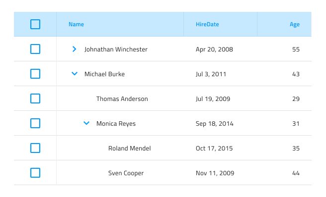
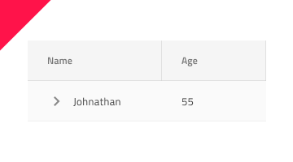

# Tree Grid (ツリー グリッド)

Tree Grid コンポーネントを使用して、ユーザーがタブ レイアウトで表示される大量の階層なデータをブラウズおよびインタラクティブに操作できるようにしす。[Grid](grid.md) で利用可能な機能もサポートします。Tree Grid は、[Ignite UI for Angular Tree Grid コンポーネント](https://jp.infragistics.com/products/ignite-ui-angular/angular/components/treegrid/tree_grid.html)と視覚的に同じものです。

## Tree Grid のデモ

## Figma で Tree Grid を使用

グリッドと同様に、ツリー グリッドは基本的に、階層データをフラットな表形式のレイアウトで表示する列と行のリピーターです。Figma では、`Grid/Tree Grid` コンポーネントをフレームにドラッグすることで簡単に使用できます。より多くの列と行を持つ Tree Grid を設計するには、コンテキスト メニューの下部にある `Detach Instance` オプションを選択して、コンポーネントをデタッチする必要があります。レイヤー パネルには、以下が表示されます。

| レイヤー                        | 使用                                                                                                                                                  |
| ---------------------------- | ---------------------------------------------------------------------------------------------------------------------------------------------------- |
| 🚫 componentVersion &nbsp; | 禁止されたアイコンで開始する特定のロックされたレイヤー。このレイヤーはコード生成に必要なため、削除または変更しないでください。 |
| 🚫 metadata | 禁止されたアイコンで開始する特定のロックされたレイヤー。このレイヤーはコード生成に必要なため、削除または変更しないでください |
| Column 1                       | Header コンポーネントに関連するすべての要素を含みます。                                                                                                                |
| ...                            | Column 1 と Column 7 の間の列。                                            |
| Column 7                       | Header コンポーネントに関連するすべての要素を含みます。                                                                                                                |

デタッチ後、既存の列を複製することにより、Tree Grid 内の列の数を増やすことができます。本文セルの数を増やすには、最初に特定の列に対して `Detach instance` オプションを使用する必要があります。そうすると、以下が表示されます:

| レイヤー                        | 使用                                                                                                                                                  |
| ---------------------------- | ---------------------------------------------------------------------------------------------------------------------------------------------------- |
| 🚫 metadata | 禁止されたアイコンで開始する特定のロックされたレイヤー。このレイヤーはコード生成に必要なため、削除または変更しないでください。 |
| Header                      | Header コンポーネントに関連するすべての要素を含みます。                                                                                                              |
| Body Cell 1                       | 特定の本体セルを含みます。                                                                                                                   |
| ...                               | Body Cell 1 と Body Cell 9 の間の列 9                                      |
| Body Cell 9                       | 特定の本体セルを含みます。                                                                                                                   |

次に、列内に既に存在する本体セルのいずれかを複製できます。

列またはセルの数を増減した後、Tree Grid コンポーネントのサイズを手動で調整する必要があります。

## セル タイプ

Tree Grid は、3 種類の通常のグリッド セル Header、Body および Summary を、階層を整理するために使用される TreeColumn Cell で拡張します。これは常にすべての行の最初の Body Cell として使用され、行を折りたたむ/展開するための定義済みのアイコンとアクションが付属しています。

通常の Header、Body、Summary セルをさまざまなタイプのデータに使用し、さまざまな Tree Grid 機能を有効にするように構成する方法を理解するには、[Grid](grid.md) トピックを参照してください。

## セル サイズ

TreeColumn セルは、Tree Grid の 3 つのサイズ バリアント (Large、Medium、Small) をサポートします。

## Cell の深さ

Tree Grid の TreeColumn セルは、`Level` プロパティ を介してデータ階層のレベルを視覚的に示します。これは、Root Level (ルート レベル)、Child Level (子レベル)、または Grandchild Level (孫レベル) に設定できます。Figma では、Column 1 から Cell を選択し、レイヤー パネルでそのセル内の Level ベース コンポーネントに移動すると、`Level` プロパティを使用してそれらを切り替えることができます。

## スタイル設定

Tree Grid には、使用可能なさまざまな状態の各セル テキスト、アイコン、背景色に使用できるオプション、および右と下の境界線を非表示にすることにより、スタイルの柔軟性があります。

## 使用方法

Grid と同様に、Tree Grid の最も重要な点は、Header および Body セル内のデータの配置です。テキストは常に左揃えにして変数空スペースを右に残し、数値は常に右揃えにして変数空スペースを左に残します。

| 良い例                                                                                                | 悪い例                                                                                                 |
| ------------------------------------------------------------------------------------------------- | ----------------------------------------------------------------------------------------------------- |
|  |  |

## その他のリソース

関連トピック:

- [Grid](grid.md)
- [Grid ツールバー](grid-toolbar.md)
- [Grid エクスポート](grid-export.md)
- [Grid グループ化](grid-grouping.md)
- [Grid 列ピン固定](grid-column-pinning.md)
- [Grid 列非表示](grid-column-hiding.md)
- [Grid 列移動](grid-column-moving.md)
- [Grid 列サイズ変更](grid-column-resizing.md)
- [Grid ソート](grid-sorting.md)
- [Grid 行フィルター](grid-row-filter.md)
- [Grid Excel スタイル フィルター](grid-excel-style-filter.md)
- [Grid 行選択](grid-row-selection.md)
- [Grid 編集](grid-editing.md)
- [Grid サイズ](grid-sizes.md)
- [Grid ページング](grid-paging.md)
- [Grid 集計](grid-summaries.md)
- [Hierarchical Grid](hierarchical-grid.md)
- [Skeleton Tree Grid](tree-grid-skeleton.md)
  

コミュニティに参加して新しいアイデアをご提案ください。
