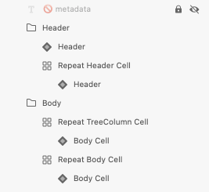

# Tree Grid (ツリー グリッド)

Tree Grid コンポーネントを使用して、ユーザーがタブ形式で表示される大量の階層なデータをブラウズおよびインタラクティブに操作できるようにしす。[Grid](grid.md) で利用可能な機能もサポートします。Tree Grid は、[Ignite UI for Angular ツリー グリッド コンポーネント](https://jp.infragistics.com/products/ignite-ui-angular/angular/components/treegrid/tree_grid.html)と視覚的に同じものです。

## Tree Grid のデモ

## Using the Tree Grid in Sketch

Grid と同様に、Tree Grid は、基本的にフラット、表形式で階層データを表示する列と行のリピーターです。したがって、最も簡単な使用方法は、`Tree Grid/Comfortable` をアートボードにドラッグして一番上を右クリックし、コンテキスト メニューの下にあるシ `Detach from Symbol` オプションを選択します。新しく表示されるグループの下のレイヤー パネルには以下があります。

| レイヤー                        | 使用                                                                                                                                                  |
| ---------------------------- | ---------------------------------------------------------------------------------------------------------------------------------------------------- |
| 🚫 metadata | 禁止されたアイコンで開始する特定のロックされたレイヤー。このレイヤーはコード生成に必要なため、削除または変更しないでください |
| Header                       | ヘッダーのすべてのセルを取得します                                                                                                              |
| Body                         | 本体のすべてのセルを含みます                                                                                                                |

デタッチ後、既存のデータ行の 1 つを複製し、デザインに表示したいレコード (数に制限がない) および多数のヘッダーを必要なだけ追加してデータのすべてのディメンションを表示できます。

## Using the Tree Grid in Adobe XD

In Adobe XD, after you choose one of the three [preset display density tree grid components](grid-display-density.md) and drag it to your artboard, you will notice in the layers panel that we use `Repeat Grid` for both the Header and the Body to speed configuration up. Unlike in Sketch in Adobe XD destroying the symbol is not necessary. You should see the following in your layers panel:

| Layer                        | Use                                                                                                                                                  |
| ---------------------------- | ---------------------------------------------------------------------------------------------------------------------------------------------------- |
| 🚫 metadata | A special locked layer starting with a prohibited icon. This layer is required by the code generation and you should avoid deleting or modifying it. |
| Header                       | Contains all header cells: the one relating to the TreeColumn body cells and the rest grouped in a Repeat Grid                                                                                                                 |
| Body                         | Contains all body cells: the TreeColumn cells grouped in a Repeat Grid and the rest grouped in another Repeat Grid                                                                                                                  |

When you select a Repeat Grid layer, you may alter the number of the repeated cells you need. Just drag the green handles at the right or bottom edge to show all the dimensions of your data and insert as many visible records as you want to show in your design. To change a particular cell type or column width, you have to select the Repeat Grid layer and click `Ungroup Grid` in the right panel. This will allow you to work the cells separately to achieve the desired design.

## セル タイプ

Tree Grid は、3種類の通常のグリッド セル Header、Body および Summary を、階層を整理するために使用される TreeColumn Cell で拡張します。これは常にすべての行の最初の Body Cell として使用され、行を折りたたむ/展開するための定義済みのアイコンとアクションが付属しています。

通常の Header、Body、Summary セルをさまざまなタイプのデータに使用し、さまざまな Tree Grid 機能を有効にするように構成する方法を理解するには、[Grid](grid.md) トピックを参照してください。

## セル表示密度

TreeColumn セルは、Tree Grid の 3 つの表示密度バリアント (comfortable、cosy、compact) をサポートします。

## Cell の深さ

Tree Grid の TreeColumn セルは、`Level` オーバーライドを介してデータ階層のレベルを視覚的に示します。これは、**Root Level**、Child Level、または Grandchild Level に設定できます。

## スタイル設定

Tree Grid には、使用可能なさまざまな状態の各セル テキスト、アイコン、背景色に使用できるオプション、および右と下の境界線を非表示にすることにより、スタイルの柔軟性があります。

## 使用方法

Grid と同様に、Tree Grid の最も重要な点は、Header および Body セル内のデータの配置です。テキストは常に左揃えにして変数空スペースを右に残し、数値は常に右揃えにして変数空スペースを左に残します。

| 良い例                                                                                                | 悪い例                                                                                                 |
| ------------------------------------------------------------------------------------------------- | ----------------------------------------------------------------------------------------------------- |
|  |  |

## その他のリソース

関連トピック:

- [Grid](grid.md)
- [Grid ツールバー](grid-toolbar.md)
- [Grid エクスポート](grid-export.md)
- [Grid グループ化](grid-grouping.md)
- [Grid 列ピン固定](grid-column-pinning.md)
- [Grid 列非表示](grid-column-hiding.md)
- [Grid 列移動](grid-column-moving.md)
- [Grid 列サイズ変更](grid-column-resizing.md)
- [Grid 並べ替え](grid-sorting.md)
- [Grid 行フィルター](grid-row-filter.md)
- [Grid Excel スタイル フィルター](grid-excel-style-filter.md)
- [Grid 行選択](grid-row-selection.md)
- [Grid 編集](grid-editing.md)
- [Grid 表示密度](grid-display-density.md)
- [Grid ページング](grid-paging.md)
- [Grid 集計](grid-summaries.md)
- [Hierarchical Grid](hierarchical-grid.md)
- [Skeleton Tree Grid](tree-grid-skeleton.md)
  

コミュニティに参加して新しいアイデアをご提案ください。
