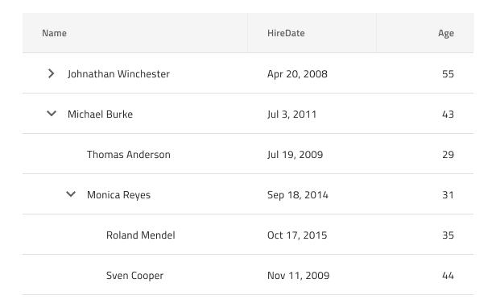
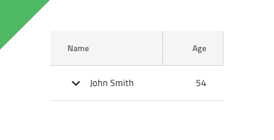
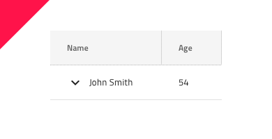

# Tree Grid (ツリー グリッド)

ツリー グリッド コンポーネントを使用して、ユーザーがタブ形式で表示される大量の階層なデータをブラウズおよびインタラクティブに操作できるようにしす。[Grid](grid.md) で利用可能な機能もサポートします。ツリー グリッドは、[Ignite UI for Angular ツリー グリッド コンポーネント](https://jp.infragistics.com/products/ignite-ui-angular/angular/components/treegrid/tree_grid.html)と視覚的に同じものです。

## ツリー グリッドのデモ

## Detach from Symbol (シンボルからデタッチ)

グリッドと同様に、ツリー グリッドは、基本的にフラット、表形式で階層データを表示する列と行のリピーターです。したがって、最も簡単な使用方法は、`Tree Grid/Comfortable` をアートボードにドラッグして一番上を右クリックし、コンテキスト メニューの下にあるシ `Detach from Symbol` オプションを選択します。新しく表示されるグループの下のレイヤー パネルには以下があります。

| レイヤー                        | 使用                                                                                                                                                  |
| ---------------------------- | ---------------------------------------------------------------------------------------------------------------------------------------------------- |
| 🚫 igx-tree-grid/comfortable | 禁止されたアイコンで開始する特定のロックされたレイヤー。このレイヤーはコード生成に必要なため、削除または変更しないでください |
| Header                       | ヘッダーのすべてのセルを取得します                                                                                                              |
| Body                         | 本体のすべてのセルを含みます                                                                                                                |
| 🕹️DataSource                 | コード生成エンジンによって使用され、グリッドにバインドされるデータ ソースの参照                                            |
| 🕹️PrimaryKey                 | 一部のグリッド機能で必要であり、コード生成エンジンで使用されるレコードの主キーを持つ列の参照      |
| 🕹️ChildKey                   | ツリー グリッド内のデータの階層を確立するために使用されるレコードの子キーを持つ列の参照                            |

デタッチ後、既存の各グリッド内にすでに作成したデータの最初の行を複製し、デザインに表示したいレコード (数に制限がない) および多数のヘッダーを必要なだけ追加してデータのすべてのディメンションを表示できます。

## セル タイプ

ツリー グリッドは、3種類の通常のグリッド セル Header (ヘッダー)、Body (本体) および Summary (集計) を、階層を整理するために使用される Tree Column Cell (ツリー 列セル) で拡張します。これは常にすべての行の最初の本体/ セルとして使用され、行を折りたたむ/展開するための定義済みのアイコンとアクションが付属しています。

通常の Header、Body 、Summary セルをさまざまなタイプのデータに使用し、さまざまなツリー グリッド機能を有効にするように構成する方法を理解するには、[Grid](grid.md) トピックを参照してください。

## Tree Column Cell の深さ

Tree Column Cell は、`Depth` のオーバーライドでデータ階層のレベルを視覚的に示します。これは、**Level1**、Level2、または Level3 に設定できます。

## スタイル設定

ツリー グリッド は、さまざま状態の各セル テキスト、アイコン、背景色のスタイル設定や水平および垂直の境界線の非表示など柔軟に変更できます。

## 使用方法

グリッドと同様に、ツリー グリッドの最も重要な点は、ヘッダーおよび本体セル内のデータの配置です。テキストは常に左揃えにして変数空スペースを右に残し、数値は常に右揃えにして変数空スペースを左に残します。

| 良い例                                                                                                | 悪い例                                                                                                 |
| ------------------------------------------------------------------------------------------------- | ----------------------------------------------------------------------------------------------------- |
|  |  |

## コードの生成

このセクションは、オーバーライドとコード生成にどのような影響があるかについて説明します。

> [!WARNING]
> ツリー グリッドを使用するためにデタッチ シンボルに設定する**必要**があります。

> [!NOTE]
> ツリー グリッドの高さはデフォルトで `100％` に設定されています。

### データ ソース プロパティ

提供された場合、 `🕹️DataSource` 値はグリッドのデータ ソースを構成するために使用されます。各列名がオブジェクトのプロパティであるオブジェクトの配列に設定する必要があります。

### プライマリ キー

提供された場合、 `🕹️PrimaryKey` 値は グリッドの `primaryKey` プロパティを設定するために使用されます。このプロパティの値は、一意の値を含むデータ ソース内のプロパティ名にする必要があります。このプロパティは、グリッドで[行編集バナー](https://jp.infragistics.com/products/ignite-ui-angular/angular/components/grid/row_editing.html)を使用する場合に特に重要です。

### 子キー

`🕹️ChildKey` は、ツリー グリッドで 2 つの目的を果たします。`🕹️DataSource` と `🕹️ChildKey` のみが設定されている場合、ツリー グリッドは `🕹️ChildKey` がデータ ソースの各オブジェクト内の子データの配列を指していると予期します。説明については、[Angular ツリー グリッド](https://jp.infragistics.com/products/ignite-ui-angular/angular/components/treegrid/tree_grid.html#子コレクション) を参照してください。

`🕹️DataSource`、 `🕹️PrimaryKey` および `🕹️ChildKey` がすべて設定されている場合、ツリー グリッドはデータが若干異なるように設定されることを予期します。詳細については、[こちら](https://jp.infragistics.com/products/ignite-ui-angular/angular/components/treegrid/tree_grid.html#プライマリと外部キー) をご覧ください。つまり、この設定では、`🕹️ChildKey` は `foreignKey` であり、`🕹️PrimaryKey` は `primaryKey` です。
使用する構成は、データの構造に依存します。

### ヘッダー

提供された場合、ヘッダーは描画する列数を決定します。ヘッダーを下にある本体 (セル) と一致させるために列を作成します。一致する本体が見つからない場合、列はヘッダーの情報に基づいて作成されます。一致が見つかった場合、情報がヘッダーから取得され、次に本体/セルから取得されます。

ヘッダーには、いくつかのサイズ変更オプションがあります。Sketch で各ヘッダー セルを左右にピン固定すると、HTML で列 (パーセント幅) が生成されます。これにより、グリッドのサイズに応じて列を拡大または縮小できます。あるいは、ヘッダー セルの幅を固定すると、そのサイズの固定列を生成します。

#### タイプ

設定された場合、列の型 (string、number、Boolean) を決定するために使用されます。

#### テキスト

ヘッダーの Text プロパティにテキスト、[テキストのバインディング](../codegen/data-binding.md)、または両方を含むことができます。例:

- 設定
- {settingsLabel}
- 重要な {labelText}

#### Feature Left および Feature Right

これらのオーバーライドは、個々の列で有効にする機能を制御します。

- None (デフォルト)
- フィルタリング ([Excel スタイル フィルタリング](https://jp.infragistics.com/products/ignite-ui-angular/angular/components/hierarchicalgrid/excel_style_filtering.html))
- ピン固定
- 並べ替え

#### Column Moving (列移動)

このオーバーライドは、ユーザーが列を移動できるかどうかを決定します。

#### Column Resizing (列サイズ変更)

このオーバーライドは、ユーザーが列のサイズを変更できるかどうかを決定します。

#### Column Hiding (列非表示)

このオーバーライドは、列が非表示かどうかを決定します。

### Body/Cell (本体/セル)

提供された場合、本体 (セル) は描画する列の数を決定します。ヘッダーを本体 (セル) と一致させようとします。一致するヘッダーが見つからない場合、列は本体/セルの情報に基づいて作成されます。一致が見つかった場合、情報がヘッダーから取得され、次に本体/セルから取得されます。

#### データ プロパティ

提供された場合、`🕹️DataProperty` は列のフィールドを構成するために使用されます。列のフィールドは  `🕹️DataSource` のフィールドに相対します。

#### タイプ

設定された場合、列の型 (string、number、Boolean) を決定するために使用されます。

## その他のリソース

関連トピック:

- [Grid](grid.md)
- [Grid ツールバー](grid-toolbar.md)
- [Grid エクスポート](grid-export.md)
- [Grid グループ化](grid-grouping.md)
- [Grid 列ピン固定](grid-column-pinning.md)
- [Grid 列非表示](grid-column-hiding.md)
- [Grid 列移動](grid-column-moving.md)
- [Grid 列サイズ変更](grid-column-resizing.md)
- [Grid 並べ替え](grid-sorting.md)
- [Grid 行フィルター](grid-row-filter.md)
- [Grid Excel スタイル フィルター](grid-excel-style-filter.md)
- [Grid 行選択](grid-row-selection.md)
- [Grid 編集](grid-editing.md)
- [Grid 表示密度](grid-display-density.md)
- [Grid ページング](grid-paging.md)
- [Grid 集計](grid-summaries.md)
- [Hierarchical Grid](hierarchical-grid.md)
- [データ バインディング](../codegen/data-binding.md)
  

コミュニティに参加して新しいアイデアをご提案ください。
