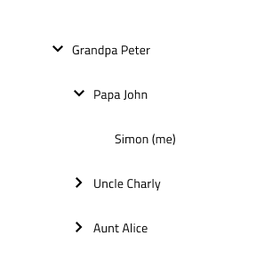

## Tree (ツリー)
ツリー コンポーネント は、カテゴリ間の階層関係を視覚的に表現するために使用され、リスト構造で表示されます。
Tree コンポーネントは、[Ignite UI for Angular Tree コンポーネント](https://www.infragistics.com/products/ignite-ui-angular/angular/components/tree.html)と視覚的に同一です。

## Tree のデモ

## Tree のサイズ

Tree コンポーネントには 3 つのサイズがあります: Large、Medium、Small。Figma では、プロパティ パネルの 「Size」 プロパティを調整することで、これらのサイズを切り替えることができます。Sketch では、シンボルを挿入する前に表示密度を選択します。

## Tree の種類

次の 2 種類の Tree コンポーネントをサポートしています。Basic (基本) と展開アイコンの後にチェックボックス コンポーネントがある　Checkbox (チェックボックス) です。Figma では、プロパティ パネルから 「Checkbox」 ブール値プロパティを使用して 2 つのタイプを切り替えることができますが、Sketch では、表示密度を選択した後、シンボルを挿入する前にタイプを選択する必要があります。

## Tree Node (ツリー ノード) 構造

Tree コンポーネントは、ツリー ノードと呼ばれる多数のネストされたコンポーネントから構築されます。各ノードは展開アイコンとテキストで構成されます。チェックボックス種類を選択した場合は、展開アイコンの後にチェックボックス コンポーネントも表示されます。 

各ノードのテキストは、通常のテキストからハイパーリンク テキストに切り替えることができます。Figma では、プロパティ パネルの 「Hyperlink」 ブール値プロパティを使用して 3 つを切り替えることができますが、Sketch ではこれは `Symbol Overrides` で実現されます。

また、展開アイコンの 2 つの状態 (縮小または展開した状態) もサポートされています。Figma では、プロパティ パネルの 「Expanded」 ブール値プロパティを使用して 3 つを切り替えることができますが、Sketch ではこれは `Symbol Overrides` で実現されます。

## Tree Node (ツリー ノード) レベル

ノード間の階層関係を表すために、ツリー ノードは　Root、Child、Grandchild　の 3 つのレベル種類をサポートします。Figma では、プロパティ パネルの 「Level」 プロパティを使用して別のレベルに切り替えることができますが、Sketch ではこれは `Symbol Overrides`　を使用して実現されます。 

## Tree Node (ツリー ノード) 状態

Tree Node には、Idle (アイドル) と Disabled (無効) の 2 つの主要な状態があり、追加の操作状態も利用できます。Figma では、プロパティ パネルで Active (アクティブ)、Hover (ホバー)、Focused (フォーカス済み) のプロパティを切り替えて、これらの状態を調整できます。Sketch では、`Symbol Overrides` を使用して同様のカスタマイズを実現します。さらに、Figma では、プロパティ値パネルで Selected (選択済み) および Indeterminate (不確定) ブール値プロパティを切り替えることで、 Checkbox の状態を制御できます。

## Tree のプリセット

基本的な Tree コンポーネントに加えて、Active (アクティブ)、Cascading Selection (カスケード選択)、Multiple Selection (複数選択) の 3 つのツリー プリセットから選択することもできます。これらにより、デザインの構築がより簡単かつ迅速になります。Figma では、これらは個別のコンポーネントであり、ツリー コンポーネントと同じページに配置されており、[アセット] パネルまたは [リソース] パネルから挿入できます。Sketch では、これらは Tree フォルダーの下の 「Presets」 という別のグループにあります。

## スタイル設定

Tree には、Expand Icon (展開アイコン)、Checkbox (チェックボックス)、Text (テキスト) の色、および Tree Node のさまざまな状態で使用される色に使用できるオプションにより、スタイルの柔軟性が備わっています。

## 使用方法

展開されたツリー ノードの Expand Icon 状態が 「Expanded」 に設定されていることを確認します。カスケード選択を表示する場合は、部分的な選択を反映するために、親ノードの Checkbox の状態を 「Indeterminate」 に切り替えます。

| 良い例                                                                             | 悪い例                                                                              |
| ------------------------------------------------------------------------------ | ---------------------------------------------------------------------------------- |
|  |  |
|  |  |

# その他のリソース

関連トピック:

- [Checkbox](../components/checkbox.md)
- [Icon](../components/icon.md)

コミュニティに参加して新しいアイデアをご提案ください。

