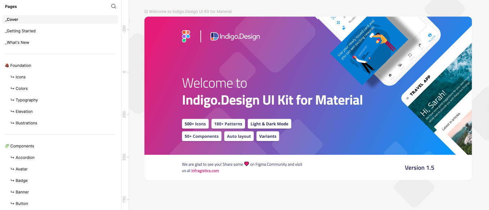
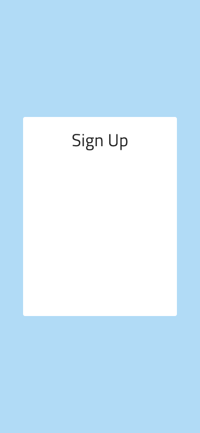

# Figma ではじめてのフレームを作成

このトピックの最後に、**Indigo.Design システム**を使用した登録画面用の Figma フレームがあります。

## 前提条件
[Titillium Web Font](https://fonts.google.com/specimen/Titillium+Web) がコンピューターにインストールされていない場合は、開始する前にインストールしてください。Indigo.Design UI Kit for Material のすべてのテキストがそのフォントを使用します。

## 詳細手順

### 1. Figma で Indigo.Design システムを使用します。

- 検索を使用して Figma コミュニティから Indigo.Design UI Kit for Material を取得し、「Open in Figma」 青いボタンをクリックしてファイルを複製します。UI キットは[こちらから](https://www.figma.com/@infragistics)ダウンロードすることもできます。

Indigo.Design UI キットは、次の 4 つのセクションに編成されたページで構成されています。

**紹介セクション:** このセクションには、Indigo.Design UI キットの表紙、コンポーネントの機能と構成をより深く理解するための「はじめに」ページ、および Indigo.Design UI キットのすべてのリリースの変更ログとして機能する「新機能」ページが含まれています。

**基礎セクション:** このセクションには、マテリアル アイコン、カラー、タイポグラフィ、エレベーション、イラストレーションなど、5 つの専用ページにまとめられたすべての重要なスタイル アセットが含まれています。

**コンポーネント セクション:** このセクションには、デザイン アイデアをレイアウトするためのコンポーネントの広範なコレクションが含まれています。これらは、アセット パネル ([以下の 3. を参照](./creating-a-frame-in-figma.md#3-コンポーネントを追加してカスタマイズします)) から簡単にアクセスするか、このセクションから直接コピーすることができます。各コンポーネントには、特定のユース ケース シナリオに合わせてカスタマイズできるさまざまなプロパティが付属しています。これらのコンポーネントと Indigo.Design Figma プラグインを利用することで、App Builder を使用して、Angular、Blazor、React、または Web コンポーネントのプロダクション対応のコードにすばやく変換できるデザインを作成できます。

**パターン セクション:** このセクションでは、コンポーネントからレイアウトされた数百のパターンを取り上げて、アプリのデザイン プロセスを効率化します。

- Indigo.Design UI キットを 「Drafts」 からプロジェクトに移動します。ファイル名の横にある矢印をクリックし、オプションから 「Publish library」 を選択します。「Publish」 ボタンをクリックすると、特定のチーム プロジェクト スペース内のチーム メンバーとライブラリを共有できます。

### 2. フレームを作成します。
Figma でプロジェクトに移動し、新しいファイルを作成します。フレーム ツールバー ボタンをクリックして (または F キーを押して) フレーム サイズを選択し、右側のパネルから iPhone 13 および 14 を選択します。これにより、縦向き (390x844) の中央にフレームが表示されます。

### 3. コンポーネントを追加してカスタマイズします。
Indigo Design ライブラリからコンポーネントを組み込んでカスタマイズするには、左側の 「Assets 」 パネルと右側の 「Properties」 パネルを使用します。まず、「Assets」 タブをクリックし、続いて 「Team Library」 ボタン アイコンをクリックします。「Your teams」 の下の新しく開いたダイアログで、「Add to file」 ボタンをクリックして、Indigo.Design UI キットを追加します。

これは例の画面を作成する手順です。

#### 1. 背景を追加します。
Figma で背景を作成する最良の方法は、フレームの Fill に直接適用することです。これを行うには、iPhone 13 & 14 フレームを選択し、右側のパネルの 「Fill」 に移動します。「Apply styles and variables」 アイコン ボタンをクリックし、Primary/primary.100 を選択します。

#### 2. フォームの背景を追加します。
1. F キーを押して、作成したばかりのフレーム内にサイズ 300x388px のフレームをドラッグします。
2. フレームの 「Fill」 に 「Special/surface light」 を選択します。
3. フレームの Corner の半径を 4px に設定します。
4. iPhone 13 & 14 フレームの中央に配置します。

#### 3. フォームのタイトルを追加します。
1. T キーを押して白いフレームの中にテキスト要素を挿入し、「Sign Up」 と入力します。
2. 右側のパネルの 「Text」 セクションから 「Heading/H4 Headline」 タイポグラフィ スタイルを適用します。配置を 「Center」 に設定し、テキストをフレームの上部に配置します。上部から 24 ピクセルの間隔で、左右に等間隔で配置します。テキストの Fill のカラーには、「Grays/Light/grays.900」 スタイルを選択します。

#### 4. 姓名の入力を追加します。
1. Shift + I を押して、ツールバーの Resources を開き、「Input」 を検索します。作成したばかりのフォーム タイトルの下にドラッグします。
2. 右側のパネルの 「Properties」 セクションで、コンポーネントの名前の下にある 「State」 に 「Filled」 を選択します。
3. Prefix Container、Suffix Container、および Hint オプションを無効にします。
4. Label を 「First Name」 に設定し、Placeholder を 「Eliza」 に設定します。
5. タイトルの下に配置します。左側に 16 ピクセル、上部に 24 ピクセルの間隔を設定します 
6. 幅を 126px に設定します。
7. この入力を複製します。
8. 新しい入力を元の入力に配置し、その間に 16px を設定します。
9. Label を 「Last Name」 に設定し、Placeholder を 「Morales」 に設定します。

#### 5. ユーザー名およびパスワードの入力を追加します。
1. Name 入力の 1 つを 2 回複製して、Username と Password の入力を作成します。
2. 前の手順で作成したものと、お互いに 16px の垂直間隔になるように下に配置します。
3. 幅全体に引き伸ばし、両方の側に 16px 間隔を設定します。
4. Label を 「Username」 および 「Password」 に設定し、Placeholder を 「Leaellynasaura」 および 「**************」 に設定します。
5. Layers パネルから、作成したばかりのパスワード入力の Content Type コンポーネント インスタンスを選択し、右側のパネルのコンポーネント プロパティに移動します。「Type」 プロパティから 「Password」 を選択します。

#### 6. サインアップ ボタンを追加します。
1. Shift + I を押して、ツールバーの Resources を開き、Button を検索します。
2. それを入力の下にドラッグし、右側のパネルの 「Type」 プロパティから 「Contained」 を選択し、左、右、および上の入力から 16px を残して全幅に伸ばします。
3. ボタンのプロパティから Left Icon と Right Icon を無効にします。
4. ラベルを 「SIGN UP」 に設定し、テキストの塗りつぶしを 「Special/white」 のスタイルに変更します。
5. 背景を Special/Info/info.500 スタイルに設定します。

#### 7. 同意テキストを追加します。
1. T キーを押してボタンの下に別のテキスト要素を追加し、「By clicking on the "SIGN UP" button above, you accept our Terms of Use」 と入力します。
2. 「Other/Caption」 スタイルを割り当て、カラー スタイルを 「Grays/Light/grays.700」 に設定します。
3. 配置を 「Center」 に設定します。
4. テキスト要素の幅を変更して、左、右、上に 16px 間隔を設定します。

#### 8. フレームをレスポンシブに設定します。
1. 「First Name」 と 「Last Name」 の入力フィールドを選択し、Shift + A を押します。右側のパネルに、「Auto Layout」 という新しいセクションが表示されます。まだ設定されていない場合は、項目間の Horizontal Space を 16px に設定します。次に、2 つの入力フィールドを再度選択し、Horizontal Resizing を 「Fill container」 に変更します。
2. フォームをレスポンシブにするには、すべてのフォーム要素を含むフレームをクリックし、Shift + A をもう一度押します。前の手順が正しく実行された場合、Auto Layout パネルの Horizontal padding はすでに 16 ピクセルに設定され、Vertical padding とオブジェクト間の Vertical gap  は 24 ピクセルに設定されているはずです。項目を中央に揃え、フォーム フレームの縦横のサイズ変更を 「Center」 に変更します。また、内部のすべての要素の水平方向のサイズ変更を 「Fill container」 に変更します。
3. iPhone 13 & 14 フレームを選択し、もう一度 Shift + A を押します。Fixed 幅と高さを選択します。
4. フォーム フレームを再度選択し、水平方向のサイズ変更を 「Fill container」 に変更します。

## その他のリソース

関連トピック:

- [スタイル設定](style/styling-overview.md)
- [コンポーネント](components/components-overview.md)
- [パターン](patterns/patterns-overview.md)
  

コミュニティに参加して新しいアイデアをご提案ください。
