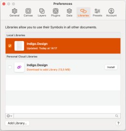

## はじめてのアートボードを作成

このトピックは、Indigo Design ライブラリを使用して登録画面の Sketch アートボードを作成する方法を紹介します。

## 前提条件

[Titillium Web フォント](https://fonts.google.com/specimen/Titillium+Web)をコンピューター上でインストールしてください。Indigo Design ライブラリのテキストはそのフォントを使用します。

## 詳細手順

### 1. Indigo Design ライブラリを Sketch に追加

1.  [Indigo Design ライブラリ](https://cloud.indigo.design/home)をダウンロードします。

    以下の 3 つの Sketch ファイルを含みます:

    - **Indigo-Styling**  
      Colors、Elevation、Material Icons、および Typography などのすべてのスタイル アセット。

    - **Indigo-Components**  
      デザインを構築するコンポーネントのセット。 
      Overrides セクションで Ignite UI for Angular およびコード生成エンジンと互換性のあるプリセットを選択できます。

    - **Indigo-Patterns**  
      アプリケーション レイアウトをガイドするコンポーネントに含まれるパターンのライブラリ。

2.  Mac で Sketch アプリケーションを開き、Apple メニューから Sketch 項目をクリックし、Preferences を選択します。

  

  

3.  次のダイアログで **Libraries** タブを選択して **Add Library...** ボタンをクリックします。

4.  ライブラリに含まれるフォルダーへ移動します。

5.  ライブラリを 3 つ選択して **Open** をクリックします。

6.  **Preferences** ダイアログのリストで表示され、すべてチェックされることを確認します。

ライブラリが正しく追加された場合、Sketch の **Insert** メニューの **Symbols** セクションに表示されます。

### 2. アートボードの作成

1.  Mac で Sketch アプリケーションで新しいファイルを作成します。
2.  アートボードのサイズを選択します。
    A キーを押して、右パネルからアートボードのサイズを選択します。 
    この例は縦長の向き (375x667) の iPhone 8 に対象します。このプリセット アートボードが表示されない場合、パネルの上のドロップダウンから Apple Devices を選択します。

  

  

### 3. コンポーネントを追加してカスタマイズします。

Insert メニューを使用して Indigo Design ライブラリからコンポーネントを追加して、右パネルでカスタマイズできます。

以下は例の画面を作成する手順です。

1.  **Navbar を追加します。**

    1.  Insert メニューから Indigo-Components > Navigation > Navbar を選択します。
    2.  アートボードの上側に配置し、すべての利用可能な幅に合わせるために引き伸ばします。
    3.  右側のパネルの Resizing セクションで幅および上境界線をアートボードに固定します。
    4.  Overrides セクションで Type を ~Title に設定し、Text を "Sign Up" に設定します。

    

    

2.  **背景色を追加します。**  
     Styling から primary.100 色をアートボードに追加します。左側のレイヤー パネルで Navbar の下に配置し、サイズ変更します。

    

    

3.  **フォームの背景を追加します。**

    1.  Insert メニューから Colors/white を選択して長方形を追加します。シャドウと同じサイズに設定し、配置します。
    2.  両方のレイヤーを選択します。サイズを 280 x 400 に設定します。
    3.  アートボードの中心に配置します。

    

    

4.  **フォームのタイトルを追加します。**

    1.  Insert メニューから Indigo-Components > Text > Title を選択します。
    2.  白長方形の上側に配置します。左、上、右に 16px スペースを設定します。
    3.  Overrides セクションで Size を H4 に設定し、Style を ~34/left/Primary に設定します。
    4.  Text を "Start Budgeting" に設定します。
    5.  高さを 56px に設定します。

    

    

5.  **姓名の入力を追加します。**

    1.  Insert メニューから Indigo-Components > Inputs > Input > Line を選択します。
    2.  タイトルの下に配置します。左に 16px を設定し、Title から 0px を設定します。
    3.  幅を 116px に設定します。
    4.  この入力を複製します。
    5.  新しい入力を元の入力に配置し、その間に 16px を設定します。
    6.  両方の入力の State を ~Dark/Filled に設定します。
    7.  Label を "First Name" および "Last Name" に設定し、Input Text を "Eliza" および "Morales" に設定します。

    

    

6.  **ユーザー名およびパスワードの入力を追加します。**

    1.  2 つの Line Input を挿入します。
    2.  以前の手順の入力の下に配置します。
    3.  幅全体に引き伸ばし、両方の側に 16px スペースを設定します。
    4.  State を ~Dark/Filled に設定します。
    5.  Label を "Username" および "Password" に設定し、Input Text を "Leaellynasaura" および "\*\*\*\*\*\*\*\*\*\*\*\*" に設定します。

    

    

7.  **サインアップ ボタンを追加します。**

    1.  Insert メニューから Indigo-Components > Buttons > Raised を選択します。
    2.  入力の下に配置し、左右に 16px を設定し、上に 0px に設定します。
    3.  Background を Colors/info に設定します。
    4.  Text を "SIGN UP" に設定します。

    

    

8.  **同意テキストを追加します。**

    1.  Insert メニューから Indigo-Components > Text > Paragraph を選択します。
    2.  ボタンの下に配置します。
    3.  サイズ変更してすべての側面に 16px スペースをつくります。
    4.  Size を Body 2 に設定し、Style を ~14/left/grays.700 に設定します。
    5.  Text を "By clicking on the "SIGN UP" button above, you accept our Terms of Use" に設定します。

    

    

9.  **アートボードをレスポンシブに設定します。**
    1.  すべてのレイヤーを選択してグループ化します。
    2.  グループを選択して幅および高さを固定します。パネルの Resizing オプションで上に固定します。

## その他のリソース

関連トピック:
- [Button](../components/button.md)
- [Input](../components/input.md)
- [Navbar](../components/navbar.md)
- [Text](../components/text.md)
- [Styling](../style/styling-overview.md)
  

コミュニティに参加して新しいアイデアをご提案ください。

- [Indigo Design **GitHub** (英語)](https://github.com/IgniteUI/design-system-docfx)
