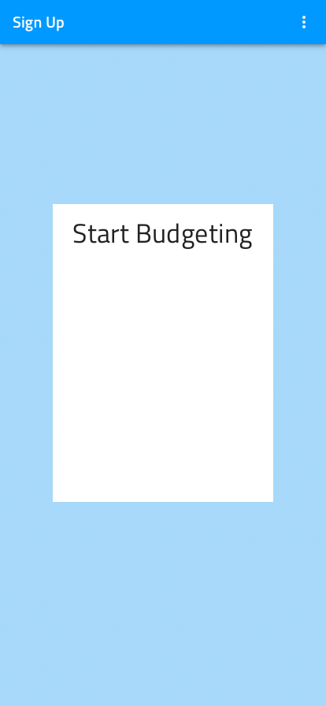

# はじめてのアートボード作成

このトピックは、**Indigo.Design システム**を使用して登録画面の Sketch アートボードを作成する方法を紹介します。

## 前提条件

[Titillium Web Font][1] をコンピューターにインストールしてください。**Indigo.Design システム**のテキストはそのフォントを使用します。

## 詳細手順

### 1.**Indigo.Design System** を Sketch に追加

1.  [**Indigo.Design System**](https://cloud.indigo.design/home) をダウンロードします。

    Pages セクションに 26 ページの Sketch ファイルが 1 つあり、3 つのアイコン タイプで区別されます:

    - **🎨 ~** スタイリング ページ: Material Icons、Colors、Typography、Elevation、Illustrations などのすべてのスタイリング アセットは、上部の 5 ページにあります。

    - **🧩 Components** ページ: デザインを構築するコンポーネントのセット。
      Sketch の [Insert] メニューで利用できるさまざまなプリセットと、Sketch UI の右側のパネルで構成する状態とレイアウトのオーバーライドを通じて、Ignite UI for Angular およびコード生成エンジンと互換性のあるレイアウトを作成できます。

    - **🌆 ~** パターン ページ: コンポーネントには、残りのページに展開するアプリケーション レイアウトをガイドするパターンが含まれます。

2.  Mac で Sketch アプリケーションを開き、[Apple] メニューから Sketch 項目をクリックして [Preferences] を選択します。

3.  次のダイアログで **[Libraries]** タブを選択して **[Add Library...]** ボタンをクリックします。

4.  ライブラリをダウンロードしたフォルダーへ移動します。

5.  ライブラリを選択して **[Open]** をクリックします。

6.  **[Preferences]** ダイアログのリストで表示され、チェックされていることを確認します。

  

  
  

  

  

  

  

上記の画像ではライブラリが Sketch クラウドに表示されており、バージョン 57 以降を実行している場合は Sketch でこの方法を代替手段として使用できます。設定するには Indigo.Design Sketch ファイルを開き、Sketch クラウドに保存します。Indigo.Design をクラウド ライブラリとして設定する方法についての詳細は、[この Medium 記事 (英語)](https://medium.com/ignite-ui/using-indigo-design-with-sketch-cloud-libraries-70533bca00f8) を参照してください。ライブラリが正しく追加されると、Sketch の **[Insert]** メニューの **[Symbols]** セクションに表示されます。

> [!Note]
> If you already have the **Indigo.Design System** set up in Sketch and want upgrade to a newer version, open your Sketch preferences, delete the current library and install the new one following the steps above. Make sure to reapply any themes and customizations via the [Indigo.Design plugin](sync-themes-plugin.md) and note that you may have to link some components or overrides in your design files manually to the symbols in the new library if Sketch does not do that automatically for you.

### 2.アートボードの作成

1.  Mac で Sketch アプリケーションで新しいファイルを作成します。
2.  アートボードのサイズを選択します。  
    `A` キーを押して、右パネルからアートボードのサイズを選択します。  
    この例は縦長の向き (414x896) の iPhone 11 に対象します。このプリセット アートボードが表示されない場合、パネルの上のドロップダウンから [Apple Devices] を選択します。

  

  
  

  

  

  

  

### 3.コンポーネントを追加してカスタマイズ

**[Insert]** メニューを使用して Indigo Design ライブラリからコンポーネントを追加して、右パネルでカスタマイズできます。

以下は例の画面を作成する手順です。

1.  **Navbar を追加します。**

    1.  **[Insert]** メニューから Symbols / Indigo.Design / Navigation / Navbar / Elevated を選択します。
    2.  アートボードの上側に配置し、すべての利用可能な幅に合わせるために引き伸ばします。
    3.  右側のパネルの [Resizing] セクションで、アートボードの上部にピン固定し、高さを固定します。
    4.  [Overrides] セクションで、[Left Action] を ~No Symbol に設定し、Title を「Sign Up」に設定します。その後、1 | Icon、2 | Icon、および 3 | Icon を ~No Symbol に設定します。

    

    
    

    

    

    

    

2.  **背景色を追加します。**  
     `R` キーを押して長方形をドラッグします。ナビゲーション バーの下の利用可能な領域を塗りつぶすようにサイズ変更され、その下にレイヤーとして配置されます。長方形が選択されると、[Appearance] の下の右パネルに [Layer Style] ドロップダウンが表示されます。Indigo.Design / Color / Fill / primary.100 を選択します。

    

    
    

    

    

    

    

3.  **フォームの背景を追加します。**

    1.  もう一度 `R` キーを押して、サイズ 280x378 の長方形をドラッグします。
    2.  以下のスタイルを割り当てます: Indigo.Design / Color / Fill / white。
    3.  アートボードの中央に配置します。

    

    
    

    

    

    

    

4.  **フォームのタイトルを追加します。**

    1.  `T` キーを押して白い長方形の上にテキスト要素を追加し、「Start Budgeting」と入力します。
    2.  以下のタイポグラフィ スタイルを上記の長方形に割り当てた方法と同様に割り当てますが、[Appearance] の下に [Text Style] ドロップダウンがあります。それを開いて Indigo.Design / H4 Headline / Centeр / Active を選択します。それを開いて Indigo.Design / H4 Headline / Center / Active を選択します。 
    3.  白い長方形の上に配置します。上に 16px スペースを設定します。

    

    
    

    

    

    

    

5.  **姓名の入力を追加します。**

    1.  **[Insert]** メニューから、Symbols / Indigo.Design / Input / Simple / Line / Enabled を選択します。
    2.  [Overrides] セクションで [State] を ~Filled に設定します。
    3.  [Prefix Container] および [Suffix Container] を ~No Symbol に設定します。
    4.  [Label] を「First Name」に設定し、[Value] を「Eliza」に設定します。
    5.  タイトルの下に配置します。左上に 16px を設定します。
    6.  幅を 116px に設定します。
    7.  この入力を複製します。
    8.  新しい入力を元の入力に配置し、その間に 16px を設定します。
    9.  [Overrides] セクションで、[Label] を「Last Name」に設定し、Value を「Morales」に設定します。

    

    
    

    

    

    

    

6.  **ユーザー名およびパスワードの入力を追加します。**

    1.  [Name] 入力の 1 つを 2 回複製して、[Username] と [Password] の入力を作成します。
    2.  前の手順で作成したものと、お互いに 16px の垂直間隔になるように下に配置します。
    3.  幅全体に引き伸ばし、両方の側に 16px スペースを設定します。
    4.  [Overrides] セクションで、[Label] を「Username」および「Password」に設定し、Input Text を「Leaellynasaura」および \*\*\*\*\*\*\*\*\*\*\*\* に設定します。

    

    
    

    

    

    

    

7.  **サインアップ ボタンを追加します。**

    1.  **[Insert]** メニューから Symbols / Indigo.Design / Button / Raised / Enabled を選択します。
    2.  入力の下に配置し、上の入力から左右に 16px スペースを設定して全幅に引き伸ばします。
    3.  [Overrides] セクションで [Before Icon] と [After Icon] を ~No Symbol に設定します。
    4.  [Text] を「SIGN UP」に設定し、[Style] を ~White に更新します。
    5.  [Background] を ~info に更新します。

    

    
    

    

    

    

    

8.  **同意テキストを追加します。**

    1.  `T` キーを押してボタンの下に別のテキスト要素を追加し、「By clicking on the "SIGN UP" button above, you accept our Terms of Use」と入力します。
    2.  次のスタイルを Indigo.Design / Caption / Center / Inactive に割り当てます。
    3.  サイズを変更して、左、右、上に 16px スペースを設定します。

    

    
    

    

    

    

    

9.  **アートボードをレスポンシブに設定します。**
    1.  テキスト レイヤー、入力、ボタンおよび白い長方形ーを選択してグループ化します。
    2.  グループの幅と高さを固定し、右のパネルの [Resizing] オプションから上にピン固定します。

## その他のリソース

関連トピック:

- [Button](components/button.md)
- [Input](components/input.md)
- [Navbar](components/navbar.md)
- [Text](components/text.md)
- [スタイル設定](style/styling-overview.md)
  

コミュニティに参加して新しいアイデアをご提案ください。

[a-1]: #1-add-the-indigo-design-libraries-in-sketch
[a-2]: #2-create-an-artboard
[a-3]: #3-add-and-customize-components
[1]: https://fonts.google.com/specimen/Titillium+Web
