# Adobe XD で最初のアートボードを作成する

このトピックの最後に、**Indigo.Design システム**を使用した登録画面用の Adobe XD アートボードがあります。デザインに Sketch を使用する場合は、[このトピック](creating-artboard-sketch.md)をご覧ください。

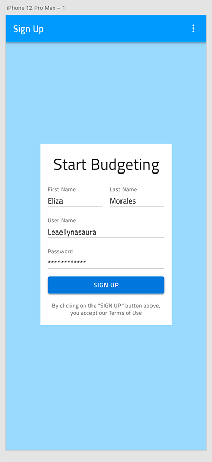

## 前提条件

[Titillium Web Font][1] がコンピューターにインストールされていない場合は、開始する前にインストールしてください。**Indigo.Design システム**のすべてのテキストがそのフォントを使用します。

## 詳細手順

### 1. Adobe XD に **Indigo.Design システム**を追加します。

1.  [**Indigo.Design システム**](https://cloud.indigo.design/home)をダウンロードします。

    これには、63 個のアートボードが 3 列に編成された Adobe XD ファイルが含まれています。

    - 左側には、スタイリングに関連する 🎨 絵文字が前に付いた 5 つのアートボードがあります。アイコン、色、カラー パレット、タイポグラフィ、エレベーション、イラストレーションなどのアセットが含まれています。

    - その中には、絵文字が前に付いた 39 のアートボードがあり、デザインのアイデアをレイアウトするための 50 を超えるコンポーネントがあります。Adobe XD の `Components` として利用可能なさまざまなプリセットと、キャンバス内のレイヤー上にドラッグアンドドロップできるオーバーライドを使用して、たとえば、コンポーネントのバリアントを暗い色から明るい色に変更することで、Ignite UI for Angular と互換性のあるレイアウトを作成できます。さらに、Adobe XD でネイティブにサポートされている `Component States` と `Stacks` を使用することで、インタラクションの感覚を追加し、Ignite UI for Angular でも利用できるテンプレートの程度を実現できます。

    - 右側には、🌆 絵文字が前に付いた 19 個のアートボードがあり、アプリのデザイン プロセスを効率化するために、コンポーネントから数百のパターンがレイアウトされています。

2.  [Libraries] パネルを切り替えると、上記で概説したすべてのスタイルとコンポーネントが `Document Assets` として表示されます。

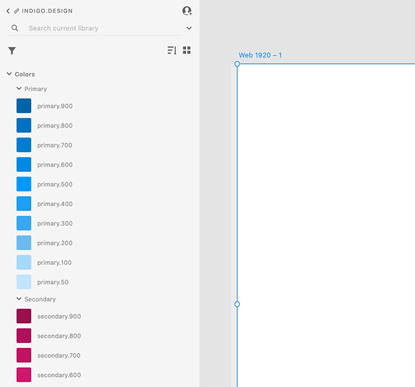

Adobe XD でスタイルとコンポーネントを初めて使用する場合は、アプリケーションの左下にあるアイコン メニューから `Libraries` と `Layers` を切り替えることができます。

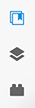

3.  `Document Assets` のタイトルの右側に、`Publish as a Library` ダイアログに移動するアップロードのようなアイコンが表示されます。

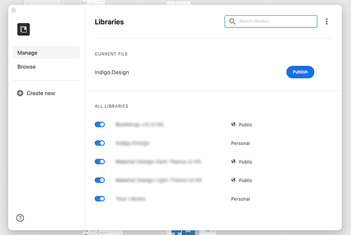

4.  `Current File` の下に Indigo.Design が表示され、右側の **[Publish]** ボタンをクリックするだけです。準備したすべての良いもののためにこのプロセスが完了するまでにはしばらく時間がかかりますが、待つことには価値があります。

### 2．アートボードの作成

Adobe XD を開き、iPhone 12 ProMax を選択します。これにより、縦向き (428x926) の中央に 1 つのアートボードがある新しいファイルが作成されます。最後に、右側のパネルから、`Responsive Resize` オプションをオンにして、アートボードのコンテンツがサイズ変更された場合の動作を表示することができます。

  

  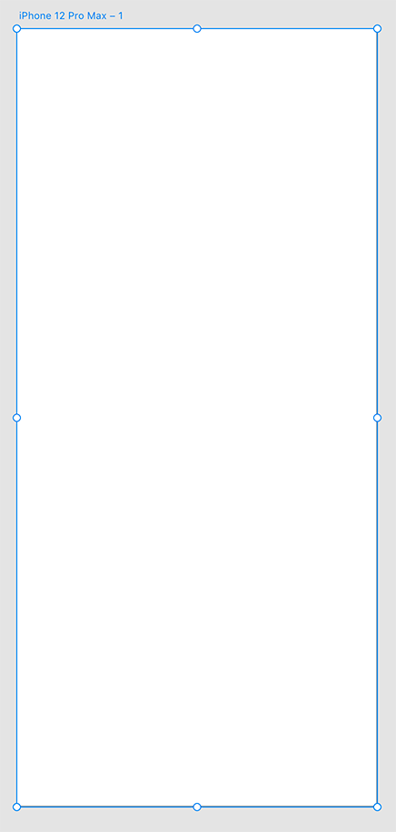
  

  

  

  

  

### 3．コンポーネントを追加してカスタマイズします。

`Libraries` パネルを使用して、Indigo Design ライブラリからコンポーネントを追加します。それらのいくつかについては、右側のパネルから適切な States を設定し、`Libraries` パネルから `Colors` と `Character Styles` を適用して外観をカスタマイズします。新しいファイルを作成するたびに、`Libraries` パネルを開き、`Document Assets` の横にある戻るアイコンをクリックして、Indigo.Design を選択し、ライブラリとして使用できるようにする必要があります。

これは例の画面を作成する手順です。

1.  **Navbar を追加します。**

    1.  `Libraries` パネルの検索ボックスを使用して、Navbar の Elevated バリアントを見つけます。
    2.  アートボードの上側に配置し、すべての利用可能な幅に合わせるために引き伸ばします。
    3.  次に、左側のパネルを切り替えて `Layers` を表示し、レイヤー名の左側にあるリンク アイコンをクリックしてコンポーネントを展開します。
    4.  Left Group の下に、削除する Left Action と呼ばれる別のグループがあり、Right Group の下の 1 | Icon、2 | Icon、および 3 | Icon に対して同じことを行います。
    5.  Title を選択し、Enter キーを押して、「Sign Up」と入力します。

    

    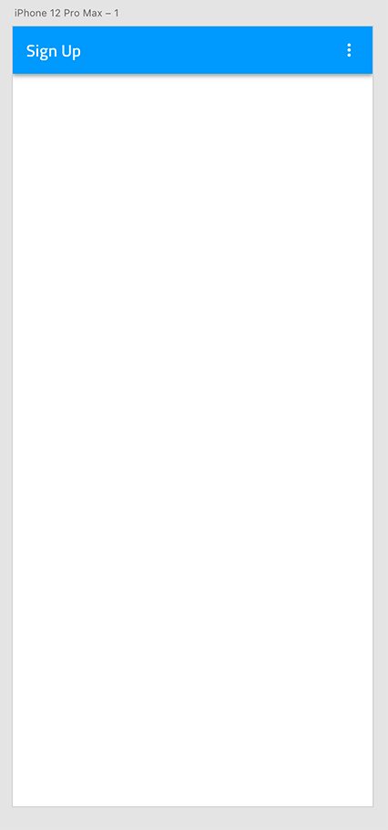
    

    

    

    

    

2.  **背景色を追加します。** 
     `R` キーを押して長方形をドラッグします。ナビゲーション バーの下の利用可能な領域を塗りつぶすようにサイズ変更され、その下にレイヤーとして配置されます。長方形を選択した状態で、左側のパネルを変更して `Libraries` を表示し、primary.100 の色をクリックします。デフォルトのアウトラインがまだ残っているので、右側のパネルの `Appearance` の下にある `Border` のチェックを外す必要があります。

    

    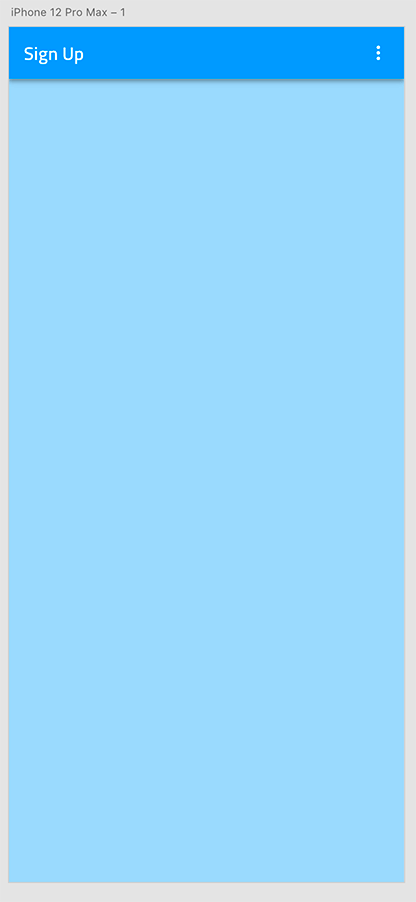
    

    

    

    

    

3.  **フォームの背景を追加します。**

    1.  もう一度 `R` キーを押して、サイズ 280x385 の長方形をドラッグします。
    2.  以前と同じように境界線の色を削除し、アートボードの中央に配置します。

    

    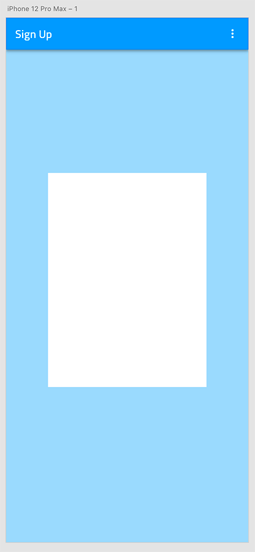
    

    

    

    

    

4.  **フォームのタイトルを追加します。**

    1.  `T` キーを押して白い長方形の上にテキスト要素を追加し、「Start Budgeting」と入力します。
    2.  テキス トレイヤーを選択した状態で、`Libraries` パネルを下にスクロールして `Character Styles` を表示し、Heading H4 - 34pt をクリックします。
    3.  白い長方形の上に配置します。上に 16px スペースを設定します。

    

    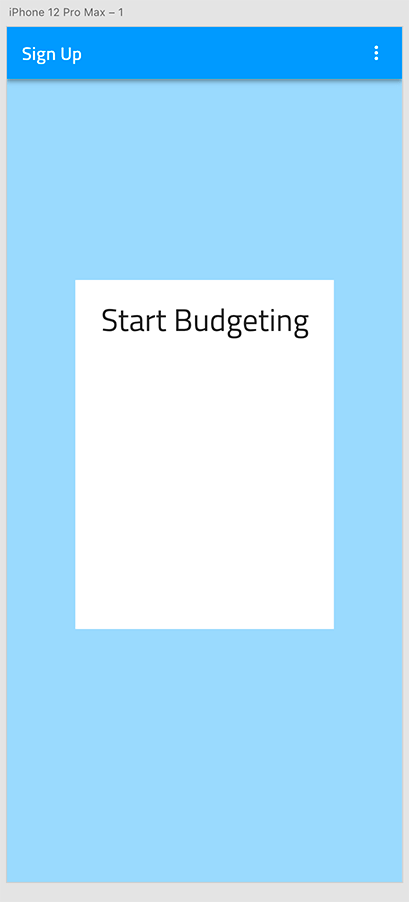
    

    

    

    

    

5.  **姓名の入力を追加します。**

    1.  検索ボックスを使用して、入力の Simple / Line / Enabled バリアントを見つけます。作成したフォームのタイトルの下にドラッグします。接頭辞が _Overrides のコンポーネントではなく、適切なコンポーネントを選択してください。
    2.  右側のパネルの `Component (Instance)` セクションから、Filled State を選択します。
    3.  Navbar の場合と同じようにレイヤーを展開し、Prefix Container と Suffix Container を削除します。
    4.  Label を「First Name」に設定し、Value を「Eliza」に設定します。
    5.  タイトルの下に配置します。左上に 16px を設定します。
    6.  幅を 116px に設定します。
    7.  この入力を複製します。
    8.  新しい入力を元の入力に配置し、その間に 16px を設定します。
    9.  Label を「Last Name」に設定し、Value を「Morales」に設定します。

    

    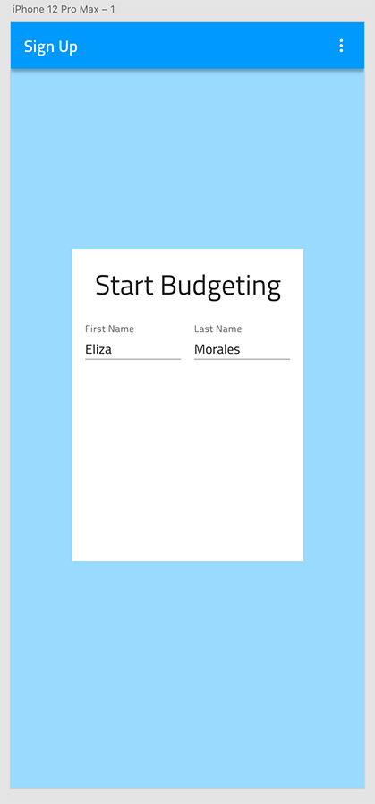
    

    

    

    

    

6.  **ユーザー名およびパスワードの入力を追加します。**

    1.  Name 入力の 1 つを 2 回複製して、Username と Password の入力を作成します。
    2.  前の手順で作成したものと、お互いに 16px の垂直間隔になるように下に配置します。
    3.  幅全体に引き伸ばし、両方の側に 16px スペースを設定します。
    4.  ラベルを「Username」と「Password」に設定し、値を「Leaellynasaura」と「\*\*\*\*\*\*\*\*\*\*\*\*」に設定します。
    5.  Password 入力の非表示の ContentType レイヤーを選択し、その状態を Password に変更します。

    

    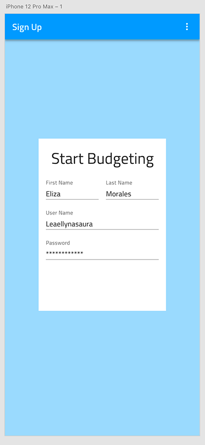
    

    

    

    

    

7.  **サインアップ ボタンを追加します。**

    1.  左側のパネルを `Libraries` に変更し、Raised Button を探します。
    2.  入力の下にドラッグし、接頭辞が _Overrides のコンポーネントではなく、正しいコンポーネントを選択していることを確認し、それを全幅に伸ばして、左、右、および上の入力から 16px を残します。
    3.  `Layers` に戻り、コンポーネントを展開し、アイコンを削除して、ラベルを「SIGN UP」に設定します。
    4.  Label をラップしている Group を選択し、Button の中央に配置します。
    5.  再度 `Libraries` に切り替えて、ラベルに表面の色を付け、Background を info の色に設定します。

    

    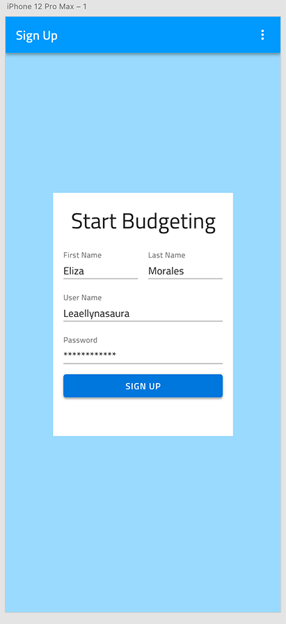
    

    

    

    

    

8.  **同意テキストを追加します。**

    1.  `T` キーを押してボタンの下に別のテキスト要素を追加し、「By clicking on the "SIGN UP" button above, you accept our Terms of Use」と入力します。
    2.  キャプション 12pt の文字スタイルを割り当て、grays.700 の色を付けます。
    3.  右側のパネルで、Text を Auto Height に設定し、レイヤー サイズを変更して、左右と上部から 16px を残します。

    

    
    

    

    

    

    

9.  **アートボードをレスポンシブに設定します。**

テキスト レイヤー、入力、ボタンおよび白い長方形ーを選択してグループ化します。このグループの自動 Responsive Layout は、期待されるレスポンシブ デザインの動作を保証するのに十分です。

## その他のリソース

関連トピック:

- [Sketch ではじめてのアートボードを作成](creating-artboard-sketch.md)
- [Button](components/button.md)
- [Input](components/input.md)
- [Navbar](components/navbar.md)
- [Text](components/text.md)
- [スタイル設定](style/styling-overview.md)
  

コミュニティに参加して新しいアイデアをご提案ください。

[1]: https://fonts.google.com/specimen/Titillium+Web
