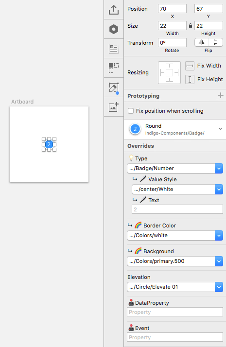

---
title: はじめに - デザイン システム
_description: Indigo Design ライブラリの設定方法、Sketch を使用したデジタル エクスペリエンスを作成する方法。
_keywords: デザイン システム, Sketch, Ignite UI for Angular, UI ライブラリ, はじめに, チュートリアル
_language: ja
---

## はじめに

このトピックは、Indigo Design ライブラリをダウンロードして Sketch に追加する方法の処理を説明します。登録画面の作成でコンポーネントでカスタマイズして最初のデザインを作成する方法についても説明します。

### 書体の前提条件

> [!Note]
> Indigo Design Libraries のすべてのテキストは、[Ignite UI for Angular](https://jp.infragistics.com/products/ignite-ui-angular) の書体と一致させるために [Titillium Web Font](https://fonts.google.com/specimen/Titillium+Web) を使用します。Indigo.Design を使用する前に Titillium Web をデバイス上でインストールする必要があります。上記のリンクからインストールできます。ライブラリで `ExtraLight`、`Regular`、および `SemiBold` フォントの太さを使用しています。

### ライブラリのダウンロードおよび Sketch への追加

最初に [Indigo Design Sketch ライブラリ](https://cloud.indigo.design/resources)をコンピューターにダウンロードします。Sketch の 3 ファイルがダウンロードされます。

- Indigo-Styling - [Colors](style/colors.md)、[Elevation](style/elevation.md)、[Material Icons](style/material-icons.md)、および [Typography](style/typography.md) などのすべてのスタイル アセットを含むライブラリ。このライブラリを使用してカスタム テーマを作成し、デザインをブランディングに合わせてカスタマイズできます。
- Indigo-Components - デザインに含むコンポーネントのライブラリ。デザインの完了後、このコンポーネントからコードを生成できます。Overrides セクションで [Ignite UI for Angular](https://jp.infragistics.com/products/ignite-ui-angular) およびコード生成エンジンと互換性のあるプリセットを選択できます。
- Indigo-Patterns - アプリケーション レイアウトをガイドするコンポーネントに含まれるパターンのライブラリ。複数のレイアウトを選択してデザインをカスタマイズします。

> [!Note]
> 大規模な組織で他のデザイナーと作業する場合や業務ガイドラインがある場合、クラウドの共有フォルダーにライブラリを保存することが推薦されすが、アプリケーションと同期するローカル ドライブにも保存してください。ライブラリの変更はフォルダーにアクセスできるユーザーと共有されます。たとえば、デジタル製品全体で使用されるカスタムなコーポレートブランディングを実装した場合、ライブラリを使用するその他の従業員は同じブランディングをライブラリに表示できます。

ライブラリを Sketch に追加するには、以下の手順を実行します。

1.  Mac で Sketch アプリケーションを開き、Apple メニューから `Sketch` 項目をクリックし、`Preferences` を選択します。
2.  次のダイアログで `Libraries` タブを選択して下部にある `Add Library...` ボタンを押します。
3.  次のダイアログでライブラリを保存するローカル ドライブのフォルダーに移動します。
4.  ライブラリを 3 つ選択して `Open` をクリックします。これにより 2 番目のダイアログ ウィンドウを閉じます。
5.  Preferences ダイアログのリストで表示されることを確認し、すべてチェックしてダイアログを閉じます。
6.  ライブラリが正しく追加された場合、Sketch の `Insert` メニューの `Symbols` セクションに表示されます。

### オーバーライドを使用してカスタマイズ化

Indigo.Design UI Kit は定義済みのカスタマイズ化を提供します。ライブラリでネストされた `Symbol` があり、Sketch ライブラリを使用するプロジェクトで `Overrides` として公開されます。プロジェクトに Indigo.Design コンポーネントを挿入した後、右側の Sketch パネルで `Overrides` セクションが `Prototyping` オプションの下に表示されます。以下の画像は [Badge](components/badge.md) の利用可能なオーバーライドを表示します。このオーバーライドで型を数値からアイコンに変更するか、数値色および値を構成できます。有効な値のみを含む境界線色および背景色を選択するドロップダウンもあります。下側にコード生成で使用される特別なプロパティがあります。このプロパティは生成された Angular アプリケーションの必要なデータ バインディングを作成します。各コンポーネントは `Overrides` パネルに一意のプロパティがあります。このヘルプ セクションのトピックはそのプロパティの利用可能な値を説明し、使用ガイダンスを提供します。

### Indigo Design はじめてのアートボードを作成

Indigo Design ライブラリを追加後、デザインを開始できます。最初のデザインはシンプルな登録画面です。この画面で Navbar、背景の画像、Text、複数の Inputs、ユーザー詳細を送信するための Button を含むフォームを作成します。このフォームを作成すると Indigo デザイン システムを使用した作業を開始しましょう。

1.  Mac で Sketch アプリケーションを開いて、新しいファイルを作成します。`A` キーを押して、右パネルからアートボードのサイズを選択します。この例で縦長の向きの `iPhone 8` を使用します。これは 375 x 667 アートボードを作成します。このプリセット アートボードが表示されない場合、パネルの上のドロップダウンから `Apple Devices` を選択します。

2.  `Insert` メニューで `Indigo-Components` > `Navigation` > `Navbar` を選択します。Navbar をアートボードの上側に配置し、利用可能な幅に引き伸ばします。Navbar が選択される状態で右パネルのサイズ変更セクションで高さを固定し、左、上、右に固定します。下のオーバーライド セクションで `Type` を `~Title` に変更し、`Text` オーバーライドに "Sign Up" を入力します。`Indigo-Styling/Colors` から `primary.100` 色のインスタンスを背景として挿入します。レイヤー パネルで Navbar の下に配置し、アートボードで Navbar の下の領域に全体のサイズに合わせてサイズ変更します。レイヤーは以下のようになります。

  | レイヤー                          | 説明                                  |
  | ------------------------------ | -------------------------------------------- |
  | iPhone 8                       | アートボード                                 |
  | &nbsp;&nbsp; Navigation/Navbar | 挿入した Navbar             |
  | &nbsp;&nbsp; Colors/primary.100 | 背景色 |

  

  
  

3.  `Insert` メニューから `Indigo-Styling` > `Colors/white` を選択し、白い長方形を背景の上に配置します。サイズを 280 x 398 に設定し、フォームのサーフェイスになるためにアートボードの中央に配置します。

  

  

4.  `Insert` メニューから `Indigo-Components` > `Text` > `Title` を選択します。このサーフェイス上に配置し、左、上、右に 16px スペースを設定します。新しく挿入したレイヤーがサーフェイス上で NavBar の下に表示されます。`Size` オーバーライドを `H4` に設定し、`Style` を `~34/left/Primary` に設定し、`Text` を "Start Budgeting" に設定します。最後に、このレイヤーの高さを 56px に設定します。

    | レイヤー | 説明 |
    | ------------------------------ | -------------------------------------------- |
    | iPhone 8 | アートボード |
    | &nbsp;&nbsp; Navigation/Navbar | 挿入した Navbar |
    | &nbsp;&nbsp; Text/Title | フォームのタイトル |
    | &nbsp;&nbsp; Colors/white | フォームの背景 |
    | &nbsp;&nbsp; Colors/primary.100 | 背景色 |

  

  

5.  `Insert` メニューから `Indigo-Components` > `Inputs/Input` > `Line` を選択します。キャンバスおよびレイヤー パネルでタイトルの下に配置します。左に 16px を設定し、上の Title から 0px を設定し、幅を 116px に設定します。この入力を複製し、既存の入力の右に配置します。左側および右側に 16px スペースを設定します。両方の Input を選択し、`State` オーバーライドを `~Dark/Filled` に設定します。次に左の Input のラベルを "First Name" に設定し、`Input Text` を "Eliza" に設定します。右の Input のラベルを "Last Name" に設定し、`Input Text` を "Morales" に設定します。以下のようになります。

  

  

6.  2 つの `Line` 入力を挿入し、上下に配置し、16px 垂直スペースを設定します。`State` オーバーライドを `~Dark/Filled` に設定し、幅全体に引き伸ばし、左右のスペースを 16px に設定します。`Label` を "Username" および "Password" に設定し、`Input Text` を "Leaellynasaura" および "\*\*\*\*\*\*\*\*\*\*\*\*" に設定します。

    | レイヤー | 説明 |
    | ------------------------------ | -------------------------------------------- |
    | iPhone 8 | アートボード |
    | &nbsp;&nbsp; Navigation/Navbar | 挿入した Navbar |
    | &nbsp;&nbsp; Text/Title | フォームのタイトル |
    | &nbsp;&nbsp; Inputs/Input/Line | 名の入力フィールド |
    | &nbsp;&nbsp; Inputs/Input/Line Copy | 姓の入力フィールド |
    | &nbsp;&nbsp; Inputs/Input/Line | ユーザー名の入力フィールド |
    | &nbsp;&nbsp; Inputs/Input/Line Copy | パスワードの入力フィールド |
    | &nbsp;&nbsp; Colors/white | フォームの背景 |
    | &nbsp;&nbsp; Colors/primary.100 | 背景色 |

  

  

7.  `Insert` メニューから `Indigo-Components` > `Buttons` > `Raised` を選択し、作成したフォームの下に配置します。左に 16px を設定し、上の Inputs から 16px を設定し、右に 16px に設定します。`Text` を "SIGN UP" に設定し、`Background` を `Colors/info` に設定します。

  

  

8.  `Insert` メニューから `Indigo-Components` > `Text` > `Paragraph` を選択し、ボタンの下に配置し、すべての側に 16px スペースを設定するためにサイズ変更します。`Size` オーバーライドを `Body 2` に設定し、`Style` を `~14/left/grays.700` に設定します。`Text` を「By clicking on the "SIGN UP" button above, you accept our Terms of Use」に設定します。

    | レイヤー | 説明 |
    | ------------------------------ | -------------------------------------------- |
    | iPhone 8 | アートボード |
    | &nbsp;&nbsp; Navigation/Navbar | 挿入した Navbar |
    | &nbsp;&nbsp; Text/Title | フォームのタイトル |
    | &nbsp;&nbsp; Inputs/Input/Line | 名の入力フィールド |
    | &nbsp;&nbsp; Inputs/Input/Line Copy | 姓の入力フィールド |
    | &nbsp;&nbsp; Inputs/Input/Line | ユーザー名の入力フィールド |
    | &nbsp;&nbsp; Inputs/Input/Line Copy | パスワードの入力フィールド |
    | &nbsp;&nbsp; Buttons/Raised |[サインアップ] ボタン |
    | &nbsp;&nbsp; Text/Paragraph | 利用規約の段落 |
    | &nbsp;&nbsp; Colors/white | フォームの背景 |
    | &nbsp;&nbsp; Colors/primary.100 | 背景色 |

  

  

最後に白い背景を含んでフォームのすべてのレイヤーを選択して、グループ化します。新しく作成した Group を選択し、幅および高さを固定し、中央に配置します。これはデザインの外観を変更しませんが、アートボードがサイズ変更される場合にレスポンシブに表示します。

> [!WARNING]
> 上記のタスクを実行するときに、さまざまなコンポーネントおよびパターンの上にある Insert メニューに `_Overrides` カテゴリが表示されます。このカテゴリは内部シンボルを含みます。このシンボルを使用してプリセット状態およびレイアウトを実装しました。これによって Indigo.Design のカスタマイズ化を許可します。`_Overrides` カテゴリに表示される項目は相対するコンポーネントで利用できます。このカテゴリはデザインの操作で使用しないでください。

## その他のリソース

関連トピック:

- [Button](components/button.md)
- [Input](components/input.md)
- [Navbar](components/navbar.md)
- [Text](components/text.md)
- [Styling](style/styling-overview.md)
  

コミュニティに参加して新しいアイデアをご提案ください。

