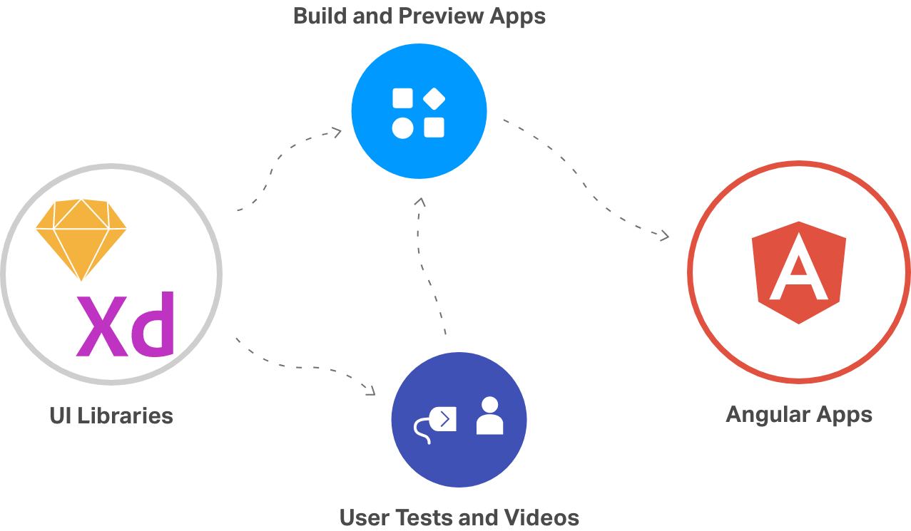
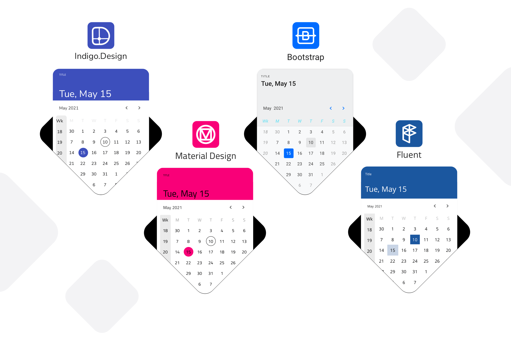

---
title: はじめに Indigo.Design
_description: デザインからコードまでシームレスに Indigo.Design の概要 
_keywords: デザイン システム, デザイン システム UX, UI キット, Sketch, Ignite UI for Angular, Sketch to Angular, Angular, Angular デザイン システム, Sketch からコードをエクスポート, Angular 用のデザイン キット, Sketch HTML, Sketch to HTML, Sketch UI キット, プロトタイプ, ユーザー ビデオ, コード生成
_language: ja
---

# はじめに

Indigo.Design は、ビジュアル デザイン、UX プロトタイプ、コード生成、アプリケーション開発のためのプラットフォームです。UX にフォーカスしてアプリケーションをすばやく公開したいデザインチームと開発チームに最適な製品です。

> [!NOTE]
><b>Indigo.Design プラットフォームは、プロトタイプ、ユーサビリティ テスト、App Builder の 3 つの主要モジュールで構成されています。プロトタイプとユーサビリティ テストは、製品または機能のユーザー エクスペリエンスの測定と改善に役立ちますが、App Builder を使用すると、ユーザーは Web 環境で独自のシングル ページ アプリケーションを構築し、そこから Angular コードを生成できます。

## 手順

Indigo.Design はデザインから開発までのワークフローをサポートする 3 つの機能を提供します。

1.  Sketch または Adobe XD で `Indigo.Design システム` を使用してデザインを作成
2.  プロトタイプを共有し、`cloud.indigo.design` でユーザーとテストしてコラボレーション
3. Sketch または Adobe XD ファイルを使用するか、ビジュアル アプリケーション ビルダーを直接使用して、`Indigo.Design AppBuilder` でアプリをデザインします。
4. `Code Generation` サービスを使用して、Indigo.Design App Builder でアプリケーションを実行します。 

### 1. Indigo.Design システム

デザイン システムは Sketch および Adobe XD のライブラリ セットで、さまざまなアセット、スタイル、コンポーネント、パターンが含まれています。UI コンポーネントを使用すると、複雑なユーザー インターフェイスを作成して、さまざまな状態やテンプレートを柔軟に使用できます。それらの外観をカスタマイズするには、事前に作成されたパレット、タイポグラフィ、シャドウ、アイコン、およびイラストを活用できます。そして最後に、製品の詳細レイアウト、さまざまなフォーム、価格表などの提供されたパターンのコレクションを使用して、アプリのデザインを効率化し、UI とインタラクション デザインのベスト プラクティスの適用を保証できます。
Indigo.Design for Sketch は、サポートするデザイン言語 (Material、Bootstrap、Fluent UI、および Indigo) ごとのライブラリ ファイルを提供するようになりました。4つ のライブラリはすべて、[Indigo.Design プラグイン](sync-themes-plugin.md)を介してライトとダーク モードのシームレスな切り替えをサポートし、定義済みまたはカスタムのカラー パレットで動作します。この改善により、Sketch ユーザーはコンポーネントおよびパターンのネイティブなルックアンドフィールを選択したデザイン言語で使用できます。

Indigo.Design を初めて使用する場合は、最初のアートボードを作成する方法を参照してください。
* [はじめての Sketch アートボードの作成](creating-artboard-sketch.md)
* [はじめての Adobe XD アートボードの作成](creating-artboard-adobexd.md)

### 2. プロトタイプおよびユーザビリティ テスト

デザインのフィードバックは、cloud.indigo.design で Sketch ドキュメントをインポートし、インタラクティブなプロトタイプとして共有します。関係者が任意のデバイスでプロトタイプを表示し、コメントによってフィードバックを送信できます。

関連トピック:

[クラウドでプロトタイプの作成](prototyping/creating-a-prototype.md)

公開したプロトタイプを使用してユーザビリティ テストを作成します。ユーザーがプロトタイプを使用して特定のタスクを実行する方法を表示し、タスクの時間および完了比率などのメトリックを取得できます。

関連トピック:
[ユーザー テストの作成](prototyping/set-up-a-user-test.md)

### 3. Indigo.Design App Builder でアプリケーションからコードをデザインおよび生成します。

App Builder モジュールを使用すると、デザイン ファイル (Sketch または Adobe XD) を使用してシングル ページ アプリケーションをデザインしたり、最初から作成したりできます。App Builder には一連の主要な機能が含まれており、ユーザーは実際の UI コンポーネント、グローバル テーマ、外部データ ソースを使用できます。

関連トピック:
[App Builder でアプリケーションを作成](https://jp.infragistics.com/products/appbuilder/help/app-builder-overview)

### 4. Angular アプリケーションのコードを生成

Indigo.Design App Builder でアプリケーションのデザインの準備ができたら、そこから Angular コードを簡単に生成できます。生成されたコードは、GitHub のリポジトリに直接アップロードすることも、ファイル パッケージとしてローカルにダウンロードすることもできます。生成されたアプリケーションで使用されるコンポーネントは、[Ignite UI for Angular UI フレームワーク](https://jp.infragistics.com/products/ignite-ui-angular)を利用しています。

Indigo.Design クラウドで公開されたプロトタイプから直接 Angular アプリのコードを生成することもできます。これを行うには、プロトタイプの共有 URL が必要であり、Indigo.Design コード ジェネレーターを使用します。コード ジェネレーターは VS Code の拡張機能として利用でき、[Ignite UI for Angular UI フレームワーク](https://jp.infragistics.com/products/ignite-ui-angular)を使用してコードを生成します。

関連トピック:

- [Indigo.Design App Builder のアプリケーションからコードを生成](https://jp.infragistics.com/products/appbuilder/help/generate-app/generate-app-overview)
- [プロトタイプからコードを生成](codegen/installing-vs-code-extension.md)