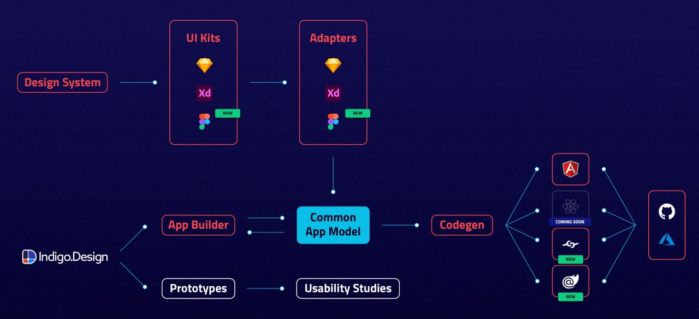
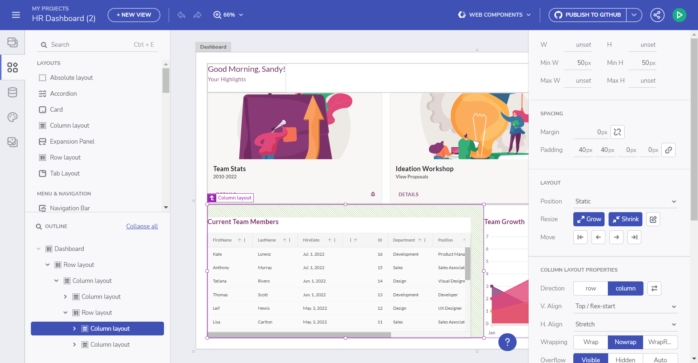
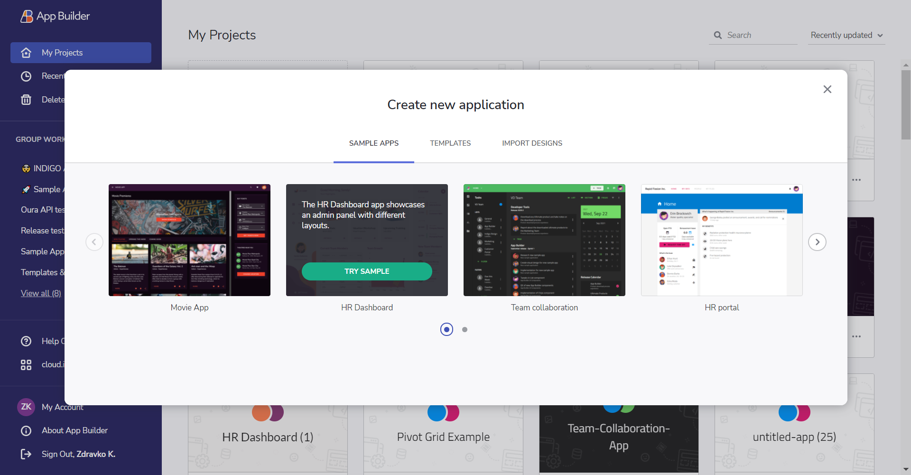

---
title: はじめに Indigo.Design
_description: デザインからコードまでシームレスに Indigo.Design の概要 
_keywords: デザイン システム, デザイン システム UX, UI キット, Sketch, Ignite UI for Angular, Sketch to Angular, Angular, Angular デザイン システム, Sketch からコードをエクスポート, Angular 用のデザイン キット, Sketch HTML, Sketch to HTML, Sketch UI キット, プロトタイプ, ユーザー ビデオ, コード生成
_language: ja
---

# はじめに

Indigo.Design は、ビジュアル デザイン、UX プロトタイプ、コード生成、アプリケーション開発のためのプラットフォームです。UX にフォーカスしてアプリケーションをすばやく公開したいデザインチームと開発チームに最適な製品です。

デザインから開発までのワークフロー

Indigo.Design プラットフォームは、**UI キット**、**プロトタイプ / ユーザビリティ テスト** および **App Builder** の 3 つの主要モジュールで構成されています。**UI キット (Sketch、Figma、XD)** は、生産性を高めるツールを使用して、実際の UI コントロールとコンポーネントにマッピングされます。各 **UI キット**は、色、タイポグラフィ、サイズなどを厳密に実装および準拠しています。一方、**プロトタイプとユーザビリティ テスト**は、製品または機能のユーザー エクスペリエンスを測定および改善するのに役立ちます。**App Builder** を使用すると、ユーザーは Web 環境で独自のアプリケーションを構築し、そこから **Angular、React、Blazor、または Web コンポーネント** コードを生成できます。

## 手順

Indigo.Design は、デザインから開発までのワークフローをサポートする主要な機能を提供します。

1. Figma、Sketch または Adobe XD で `Indigo.Design システム` を使用してデザインを作成します。
2. プロトタイプを共有し、`cloud.indigo.design` でユーザーとテストしてコラボレーションします。
3. Figma、Sketch、または Adobe XD ファイルを使用して Ignite UI App Builder でアプリをデザインし、プラグインを介してインポートするか、[Ignite UI App Builder](https://appbuilder.indigo.design/) を直接使用します。
4. `Code Generation` (コード生成) サービスを使用して、[Ignite UI App Builder](https://appbuilder.indigo.design/) でアプリケーションから Angular、Blazor、React、または Web コンポーネント コードを生成します。

## Indigo.Design システム

デザイン システムは Figma、Sketch および Adobe XD のライブラリ セットで、さまざまなアセット、スタイル、コンポーネント、パターンが含まれています。UI コンポーネントを使用すると、複雑なユーザー インターフェイスを作成して、さまざまな状態やテンプレートを柔軟に使用できます。それらの外観をカスタマイズするには、事前に作成されたパレット、タイポグラフィ、シャドウ、アイコン、およびイラストを活用できます。そして最後に、製品の詳細レイアウト、さまざまなフォーム、価格表などの提供されたパターンのコレクションを使用して、アプリのデザインを効率化し、UI とインタラクション デザインのベスト プラクティスの適用を保証できます。

Figma UI Kit for Material

### Figma UI キット
最新の Figma Indigo.Design UI Kit for Material は、Ignite UI for Angular、Blazor、および Web Components UI ツールセットにマッピングし、デザイン開発プロセスを完全に再定義します。コンポーネント、パターン、スタイリング、およびカスタマイズ オプションの強力なセットを利用できるようになり、プロトタイプまたは Figma で設計された任意のタイプの画面をインポートして、クリーンなコードに変換できるようになりました。最も素晴らしい点は、すべての静的なデザインが、シングル クリックで実際の UI コンポーネント、ブランディング、およびスタイリングを備えたインタラクティブでレスポンシブなアプリになることです。

Figma UI キット

Figma 用のプラグイン、UI キット、サンプル アプリは[アセットのダウンロード ページ](https://cloud.indigo.design/resources/figma)からダウンロードできます。

または、以下のダイレクト リンクから:
- [Figma UI キット](https://www.figma.com/@infragistics)
- [Figma 用のプラグイン](https://www.figma.com/community/plugin/1170035114372031474) 
- [サンプル アプリ](https://download.infragistics.com/products/Infragistics/Indigo.Design/Samples/Infragistics_IndigoDesign_Sample_Apps_Figma.zip)

> [!Note]
> キットを無料の Figma ユーザーまたは Pro ユーザーとして使用する場合の違いについては、この[トピック](https://jp.infragistics.com/products/appbuilder/help/ui-kits/figma#figma-スターター-ユーザーと-figma-プロフェッショナル-ユーザーとしてのキットの使用)をご覧ください。

### Sketch UI キット
Indigo.Design for Sketch は、サポートするデザイン言語 (Material、Bootstrap、Fluent UI、Indigo) ごとのライブラリ ファイルを提供します。4つのライブラリはすべて、[Indigo.Design プラグイン](sync-themes-plugin.md)を介してライトとダーク モードのシームレスな切り替えをサポートし、定義済みまたはカスタムのカラー パレットで動作します。この改善により、Sketch ユーザーは選択したデザイン言語でコンポーネントやパターンのネイティブなルックアンドフィールを使用できます。

Sketch UI キットの 4 つのテーマ

Sketch 用のプラグイン、UI キット、サンプル アプリは[アセットのダウンロード ページ](https://cloud.indigo.design/resources/sketch)からダウンロードできます。

または、以下の直接リンクから:
- [Sketch UI キット](https://dl.infragistics.com/products/Infragistics/Indigo.Design/ABECAC7231EE434C8CD3DC619BE6F75B/Infragistics_IndigoDesign_UI_Kit.zip)
- [Sketch 用のプラグイン](https://dl.infragistics.com/products/Infragistics/Indigo.Design/9EB45F5BB4B3442F8B4CECB3EB403063/Infragistics_IndigoDesign_Sketch_Plugin.zip)
- [サンプル アプリ](https://dl.infragistics.com/products/Infragistics/Indigo.Design/Samples/Infragistics_IndigoDesign_Sample_Apps.zip)

### Adobe XD UI キット

Adobe XD は、デザイナーがワイヤーフレームやアプリをデザインできる最新の使いやすいツールを提供するためにゼロから作成されたもので、今日の市場で人気のあるベクター グラフィック デザイン プラットフォームの 1 つです。ワイヤーフレーム機能に加えて、デザイナーは忠実度の高いプロトタイプを作成し、デザイン プロセスを通じてチーム間で協力し、アニメーションを構成し、フィードバックを収集することができます。

> [!NOTE]
> [Adobe XD UI キット](https://assets.adobe.com/public/c1a672c5-49e6-4df1-4d32-1c37fa234f1e)、[Adobe XD 用プラグイン](https://exchange.adobe.com/creativecloud/plugindetails.html/app/cc/92c7dec5)、および[サンプル アプリ](https://download.infragistics.com/products/Infragistics/Indigo.Design/Samples/Infragistics_IndigoDesign_Sample_Apps_XD.zip)をダウンロードします。

Adobe XD 用のプラグイン

## プロトタイプおよびユーザビリティ テスト

デザインのフィードバックは、cloud.indigo.design で Sketch ドキュメントをインポートし、インタラクティブなプロトタイプとして共有します。関係者が任意のデバイスでプロトタイプを表示し、コメントによってフィードバックを送信できます。

詳細についてはこのトピックをご覧ください:
[クラウドでプロトタイプの作成](prototyping/creating-a-prototype.md)

公開したプロトタイプを使用してユーザビリティ テストを作成します。ユーザーがプロトタイプを使用して特定のタスクを実行する方法を表示し、タスクの時間および完了比率などのメトリックを取得できます。

詳細についてはこのトピックをご覧ください:
[ユーザー テストの作成](prototyping/set-up-a-user-test.md)

## App Builder を使用してアプリをデザインする

App Builder モジュールを使用すると、デザイン ファイル (Figma、Sketch、または Adobe XD) を出発点として使用して単一ページのアプリケーションをデザインしたり、ゼロから作成したりできます。App Builder には一連の主要な機能が含まれており、ユーザーは実際の UI コンポーネント、グローバル テーマ、外部データ ソースを使用できます。

デザイン キャンバス

関連トピック:
- [App Builder でアプリケーションを構築する - はじめに](https://jp.infragistics.com/products/appbuilder/help/getting-started)
- [App Builder インターフェイスの概要](https://jp.infragistics.com/products/appbuilder/help/interface-overview)
- [Flex レイアウト](https://jp.infragistics.com/products/appbuilder/help/flex-layouts/flex-layouts)
- [コンポーネント](https://jp.infragistics.com/products/appbuilder/help/indigo-design-app-builder-components)
- [インタラクション](https://jp.infragistics.com/products/appbuilder/help/interactions)
- [SPA とナビゲーション](https://jp.infragistics.com/products/appbuilder/help/single-page-apps-and-navigation)
- [アプリの共有とプレビュー](https://jp.infragistics.com/products/appbuilder/help/share-preview-edit-app)

サンプル アプリケーションからアプリを作成します:

サンプル アプリ

## コードの生成

Ignite UI App Builder でアプリケーションのデザインの準備ができたら、そこから Angular、Blazor、または Web Components コードを簡単に生成できます。生成されたコードは、GitHub のリポジトリに直接アップロードすることも、ファイル パッケージとしてローカルにダウンロードすることもできます。生成されたアプリケーションで使用されるコンポーネントは、[Ignite UI for Angular UI フレームワーク](https://jp.infragistics.com/products/ignite-ui-angular)を利用しています。

関連トピック:

- [Ignite UI App Builder でアプリケーションからコードを生成する](https://jp.infragistics.com/products/appbuilder/help/generate-app/generate-app-overview)
- [Blazor コード生成](https://jp.infragistics.com/products/appbuilder/help/blazor-support)
- [Web コンポーネント コード生成](https://jp.infragistics.com/products/appbuilder/help/web-components-support)

Indigo.Design を初めて使用する場合は、最初のアートボードを作成する方法を参照してください。
* [Sketch ではじめてのアートボードを作成](creating-artboard-sketch.md)
* [Adobe XD で最初のアートボードを作成](creating-artboard-adobexd.md)
