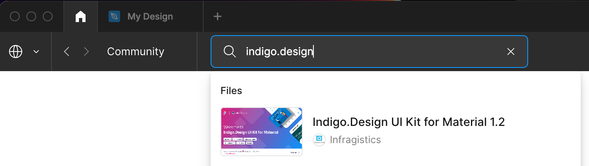
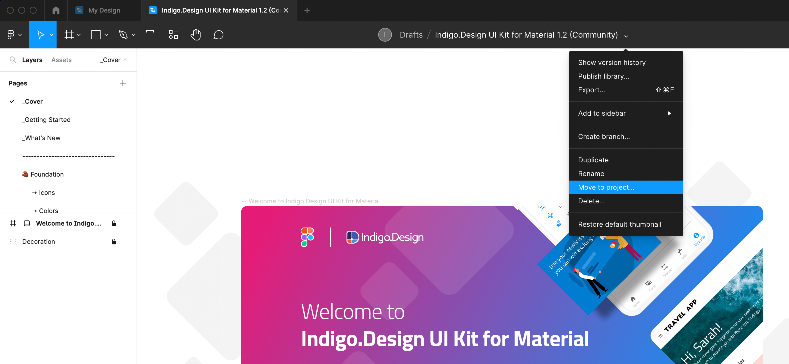
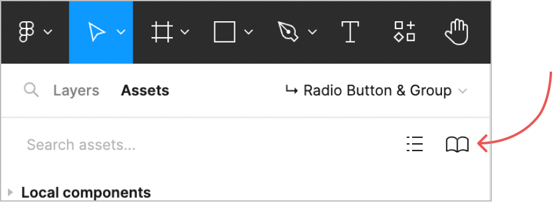
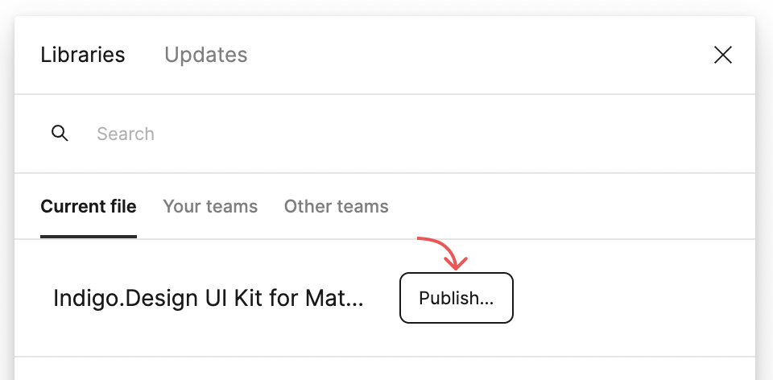
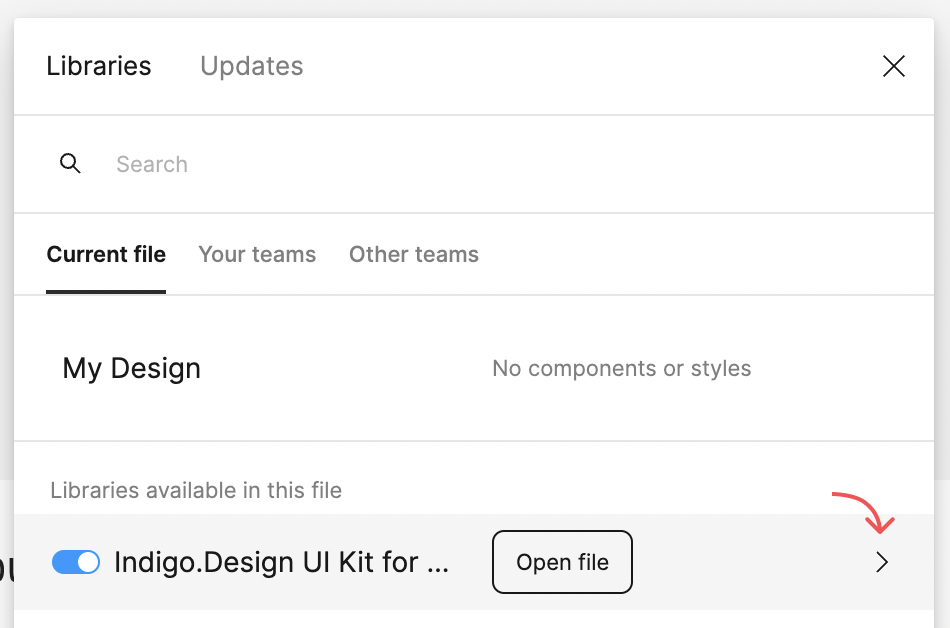
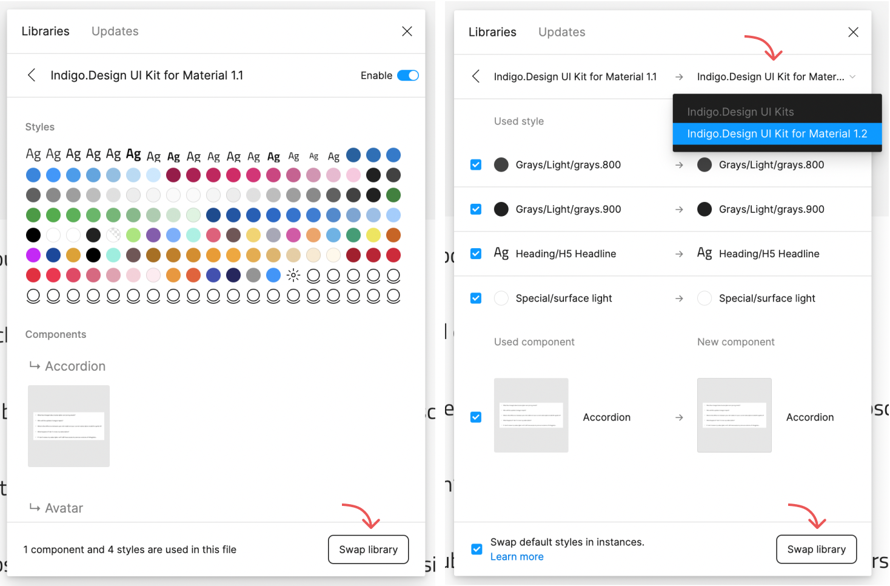
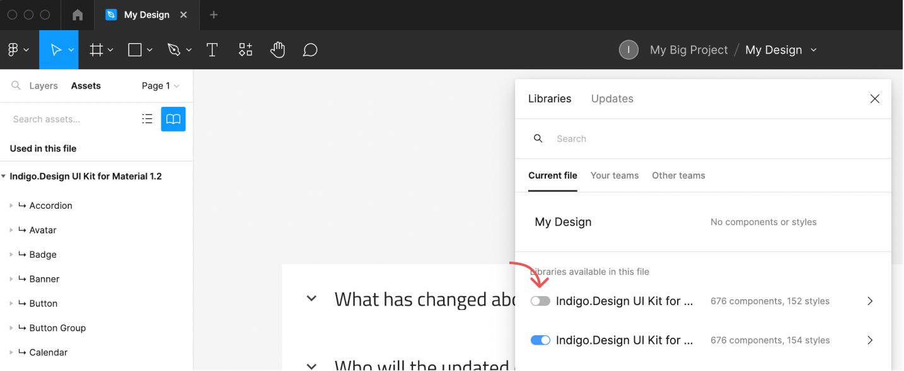

# 現在使用している Figma ライブラリを新しいバージョンに入れ替える方法

## 既存のライブラリを置き換える
既存のライブラリを新しいバージョンに置き換えるには、まず Figma Community を開き、今後使用する UI キット ファイルの目的のバージョンを複製します。たとえば、チームが現在 Indigo.Design UI Kit for Material バージョン 1.1 を使用しており、キットのバージョン 1.2 にアップグレードする場合は、次の手順に従います。

1. Figma Community スペースにアクセスし、Infragistics の 「Indigo.Design UI Kit for Material」 を検索します。
2. バージョン 1.2 が最新のリリースであることに注意して、それをクリックします。

Indigo.Design UI Kit for Material

3. [Open in Figma] 青いボタンをクリックして、ファイルを複製します。
4. キャンバスの上にあるツールバーを検索し、UI キット名の横にあるドロップダウン メニューを検索します。
5. メニューから [Move to project...] オプションを選択します。(UI Kit ライブラリをチームと共有する予定がある場合は、「Drafts」 から、それが使用される特定のプロジェクト スペースに移動する必要があることに注意してください。)

## [Assets] タブにアクセスする

プロジェクトに移動

UI Kit の新しい 1.2 バージョンを目的のプロジェクト スペースに正常に移動したら、[Assets] タブにアクセスする必要があります。画面の左側、ツールバーのすぐ下にある [Assets] タブをクリックすると、右側にチーム ライブラリ ボタン アイコンが表示されます。

アセットの読み込み

## ライブラリを公開する
このアイコン ボタンをクリックすると、モーダル ウィンドウが表示されます。[Current file] タブの下に、最近複製した Indigo.Design UI Kit for Material バージョン 1.2 ライブラリが表示されます。[Publish] ボタンをクリックすると、特定のチーム プロジェクト スペース内のチーム メンバーとライブラリを共有できます。

ライブラリを公開する

ライブラリが公開されたら、以前の 1.1 バージョンの UI Kit で作成されたデザイン ファイルに移動します。アセットを開き、チーム ライブラリ ボタン アイコンをもう一度クリックします。古いライブラリ バージョンを新しいものと入れ替えるには、ライブラリ名の横にある矢印アイコンをクリックします。

ファイルを開く

## ライブラリを入れ替える
次の画面の右下に、次のボタン [Swap library] が表示されます。それをクリックすると、ドロップダウンから [Indigo.Design UI Kit for Material 1.2] を選択できます。

ライブラリを入れ替える

完了したら、[Swap library] ボタンをもう一度クリックすると、デザイン ファイル内のすべてのコンポーネントとスタイルが自動的に新しいバージョンの UI Kit に更新されます。これで、以前のバージョンの UI キットをオフにして、代わりに新しいバージョンでデザインを続けることができます。

以前のライブラリ バージョンを無効にする

> [!Note]
> 更新する前に、以前のライブラリ バージョンのコンポーネントまたはスタイル名に変更を加えていないことを確認してください。変更が加えられた場合、Figma はコンポーネントまたはスタイルを認識できず、ライブラリのスワップが成功しない可能性があります。

*Figma ライブラリの交換に関する一般的な情報は、次のリンクにあります。 
help.figma.com/hc/en-us/articles*