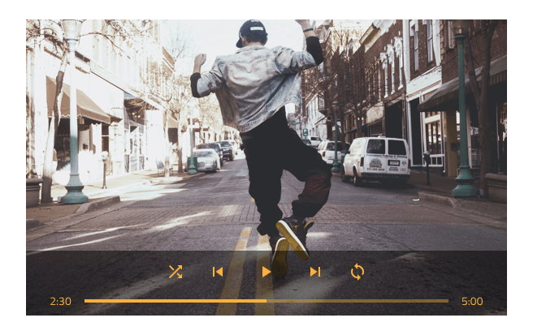
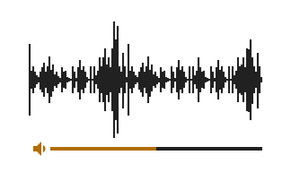
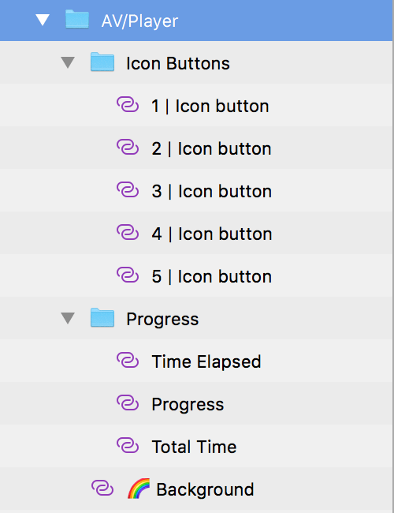
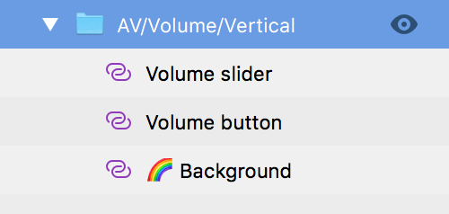

---
title: Audio / Video - デザイン システム パターン
_description: Audio / Video パターン シンボルはオーディオおよびビデオ再生を制御するインターフェイスを提供します。
_keywords: デザイン システム, デザイン システム UX, UI キット, Sketch, Ignite UI for Angular, Sketch to Angular, Angular, Angular デザイン システム, Sketch からコードをエクスポート, Angular 用のデザイン キット, Sketch HTML, Sketch to HTML, Sketch UI キット
_language: ja
---

# Audio/Video (オーディオ / ビデオ)

Audio/Video パターンは再生コントロールを持つオーディオまたはビデオ トラック表示と共に使用されます。

Audio/Video パターンのレイアウトに含まれる Icon Button および Linear Progress Bar のスタイル設定を使用できます。

> [!WARNING]
> Audio/Video パターンを挿入した後、Angular コードとして生成するには、レイアウトを作成したコンポーネントに分割するために `Detach from Symbol` をトリガーします。ただし、各コンポーネントをデタッチしないでください。

## その他のリソース

関連トピック:

- [Button](../components/button.md)
- [Progress](../components/progress.md)
  

コミュニティに参加して新しいアイデアをご提案ください。

