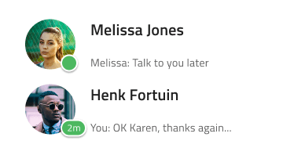
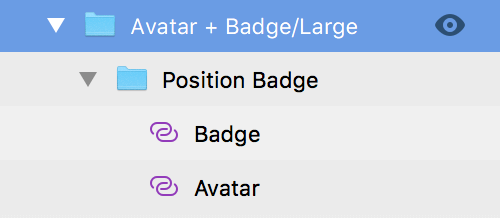

---
title: Avatar + Badge - デザイン システム パターン
_description: Avatar + Badge パターン シンボルは通知およびアラートを表示するために Avatar およびその前に Badge を使用します。
_keywords: デザイン システム, Sketch, Ignite UI for Angular, パターン, UI ライブラリ, ウィジェット
_language: ja
---

## Avatar + Badge

Avatar + Badge パターンは、Avatar にアラートまたは通知のメッセージやインジケーターを追加します。

Avatar + Badge パターンは、レイアウトに含まれる Avatar および Badge のスタイル設定をカスタマイズできます。

### サイズ

Avatar + Badge パターンは Avatar と同じサイズをサポートします:

- ラージ - プロフィール ページに適しています。
- ミディアム - カスタム メニューや可視化に適しています。
- スモール - コンタクト リストや繰り返しのシナリオに簡単に組み込めます。

### 位置

Badge は Avatar の 4 つ角のいずれかに配置できます。

- 左下
- 右下
- 左上
- 右上

> [!WARNING]
> Avatar + Badge パターンを挿入した後、`Detach from Symbol` をトリガーします。Angular コードとして生成するには、パターンを作成したコンポーネントに分割します。ただし、Badge および Avatar をデタッチしないでください。

## その他のリソース

関連トピック:

- [Avatar](../components/avatar.md)
- [Badge](../components/badge.md)
  

コミュニティに参加して新しいアイデアをご提案ください。

