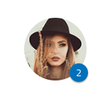
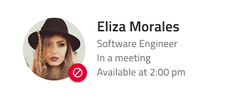
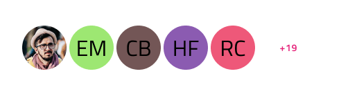
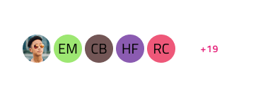

---
title: Avatar + Badge - デザイン システム パターン
_description: Avatar + Badge パターン コンポーネントは通知およびアラートを表示するために Avatar およびその前に Badge を使用します。
_keywords: デザイン システム, デザイン システム UX, UI キット, Figma, Ignite UI for Angular, Angular, Angular デザイン システム, Figma からコードをエクスポート, Angular 用のデザイン キット, Figma HTML, Figma to HTML, Figma UI キット
_language: ja
---

# Avatar + Badge (アバター + バッジ)

Avatar + Badge パターンは、ユーザーとその業績や役割を表すために多くのデジタル プラットフォームで一般的に使用されています。Avatar は、ユーザーの小さなグラフィック表現であり、多くの場合、プロフィール写真やアイコンですが、Badge は、達成、警告、または状態を表す短い微妙なメッセージまたは表示とともに使用される小さな視覚要素です。

Avatar + Badge パターンは、レイアウトに含まれる Avatar および Badge のスタイル設定をカスタマイズできます。

## サイズ

Avatar + Badge パターンは Avatar と同じサイズをサポートします:

- Large - プロフィール ページに適しています。
- Medium - カスタム メニューや可視化に適しています。
- Small - コンタクト リストや繰り返しのシナリオに簡単に組み込めます。

## 位置

Badge は Avatar の 4 つ角のいずれかに配置できます。

- Bottom Left (左下)
- Bottom Right (右下)
- Top Left (左上)
- Top Right (右上)

## 詳細

Avatar + Badge パターンでは、使用されている Avatar のサイズに基づいて、さまざまなレベルの詳細が提供されます。

## Facepile (フェイスパイル)

Facepile は、ユーザーまたは人々のグループを視覚的に表す、デジタル プラットフォームで広く使用されているデザイン要素です。通常、Avatar コンポーネントのセットがコンパクトで美しい形式で表示されます。特に、Facepile は Avatar と同じサイズ Large (大)、Medium (中)、Small (小) をサポートしています。

## その他のリソース

関連トピック:

- [Avatar](../components/avatar.md)
- [Badge](../components/badge.md)

コミュニティに参加して新しいアイデアをご提案ください。
