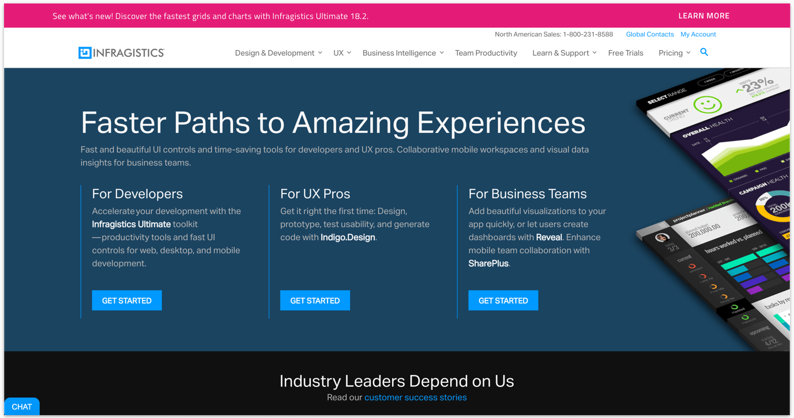

# Bar (バー)

Bar パターンを使用して、製品バージョンの更新、新しいリリースなどの新しく、重要な情報をユーザーに表示し、Web サイトで利用可能な cookie をユーザーに通知します。Bar は、ユーザーのニーズ、棒の重要度、および一般的なデザインに応じて、ヘッダーの上またはページの下部に配置できます。

Bar パターンには、ページの上部と下部に配置するための 2 つのバージョンがあります。

## その他のリソース

関連トピック:

- [Button](../components/button.md)
  

コミュニティに参加して新しいアイデアをご提案ください。

