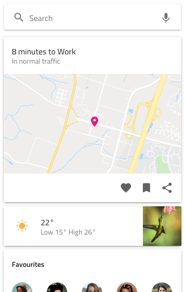

---
title: Card Collection - デザイン システム パターン
_description: Card Collection パターン シンボルは Card の全般的な使用シナリオを提供します。
_keywords: デザイン システム, Sketch, Ignite UI for Angular, パターン, UI ライブラリ, ウィジェット
_language: ja
---

## Card Collection

Card Collection パターンを使用すると、アシスタントまたはニュース フィード、タイムライン、または複数列ボードを表示できます。

Card Collection パターンは Card の様々なタイプおよび (ある場合) Searchbar Input のスタイル設定をカスタマイズできます。

## その他のリソース

関連トピック:

- [Cards](cards.md)
- [Input](input.md)
  

コミュニティに参加して新しいアイデアをご提案ください。

- [Indigo Design **GitHub** (英語)](https://github.com/IgniteUI/design-system-docfx)
