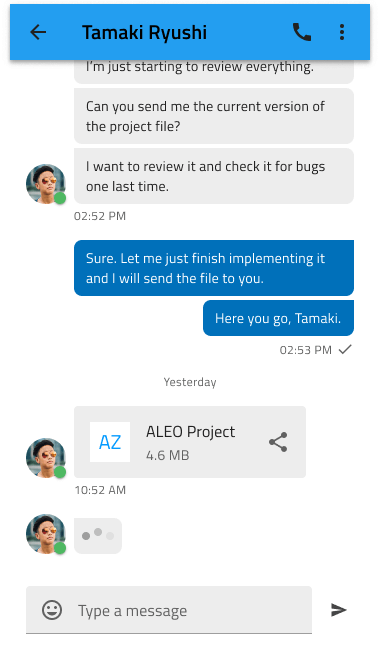

# Chat (チャット)

Chat パターンを使用して、ソーシャル ネットワーク、eコマース アプリ、ビジネス アプリなど、さまざまなシナリオでアプリケーション内の 2 人以上のユーザー間のリアル タイム メッセージを表示します。モバイル、デスクトップ、および Web アプリケーションに適した Chat パターンが提供されます。

## その他のリソース

関連トピック:

- [Avatar](../components/avatar.md)
- [Badge](../components/badge.md)
- [Button](../components/button.md)
- [Icon](../components/icon.md)
- [Input](../components/input.md)
- [List](../components/list.md)
- [Navbar](../components/navbar.md)
  

コミュニティに参加して新しいアイデアをご提案ください。
