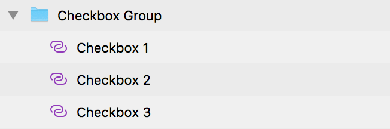

---
title: Checkbox Group - デザイン システム パターン
_description: Checkbox Group パターン シンボルは Checkbox 要素のコレクションをグループとして配置します。
_keywords: デザイン システム, Sketch, Ignite UI for Angular, パターン, UI ライブラリ, ウィジェット
_language: ja
---

## Checkbox Group

Checkbox Group パターンを使用すると、Checkbox 要素のコレクションをグループとして配置します。たとえば、複数選択質問の答えを含むグループを作成できます。

> [!Note]
> 提供される項目より多い項目を作成する場合のみに Checkbox Group パターンのインスタンスで `Detach From Symbol` をトリガーします。

Checkbox Group パターンは、含まれる Checkbox 要素のスタイル設定をカスタマイズできます。

> [!WARNING]
> ...

## その他のリソース

関連トピック:

- [Checkbox](checkbox.md)
  

コミュニティに参加して新しいアイデアをご提案ください。

- [Indigo Design **GitHub** (英語)](https://github.com/IgniteUI/design-system-docfx)
