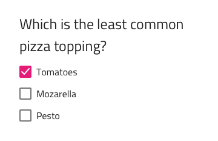

---
title: Checkbox Group - デザイン システム パターン
_description: Checkbox Group パターン コンポーネントは Checkbox 要素のコレクションをグループとして配置します。
_keywords: デザイン システム, デザイン システム UX, UI キット, Ignite UI for Angular, Angular, Angular デザイン システム, Angular 用のデザイン キット, Figma, Figma to Angular, Figma からコードをエクスポート, Figma HTML, Figma to HTML, Figma UI キット
_language: ja
---

# Checkbox Group (チェックボックス グループ)

Checkbox Group パターンを使用すると、Checkbox 要素のコレクションをグループとして配置します。たとえば、複数選択質問の答えを含むグループを作成できます。

Checkbox Group パターンは、含まれる Checkbox 要素のスタイル設定をカスタマイズできます。

> [!WARNING]
> Figma では、提供されているよりも多くの Checkbox 項目を追加するには、Checkbox Group パターンのインスタンスを右クリックし、`Detach instance` を選択する必要があります。さらに項目を追加するには、既存の項目の 1 つを複製するだけです。適用された自動レイアウトによって、ネストされた Checkbox コンポーネントがそれに応じて調整されます。

## その他のリソース

関連トピック:

- [Checkbox](../components/checkbox.md)
  

コミュニティに参加して新しいアイデアをご提案ください。

