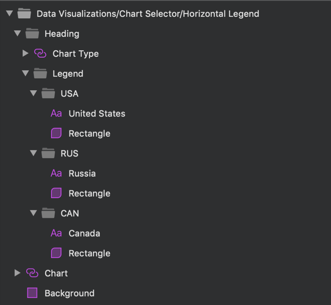

# Data Visualizations (データ ビジュアライゼーション)

Data Visualizations パターンを使用して、領域、列、線、ポイント、スプライン チャートなどのさまざまな視覚的方法で情報とデータを表示します。このパターンにより、ユーザーはドロップ ダウン コンポーネントなどを介して、さまざまな種類のデータ表現からレイアウトを選択できます。

Data Visualizations パターンは、含まれるチャート コンポーネント、Input および Text 要素により、スタイル設定に柔軟性があります。

> [!WARNING]
> Data Visualizations パターンを挿入した後、Angular コードとして生成できるには、レイアウトを作成した個別コンポーネントに分割するために `Detach from Symbol` をトリガーします。ただし、カテゴリー チャートをデタッチしないでください。

## その他のリソース

関連トピック:

- [Chart-Category](../components/chart-category.md)
  

コミュニティに参加して新しいアイデアをご提案ください。

