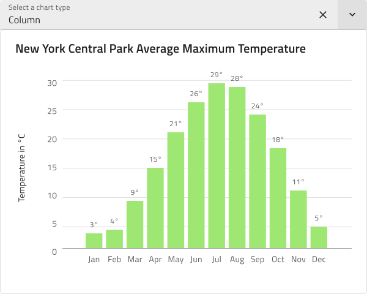

# Data Visualizations (データ ビジュアライゼーション)

Data Visualizations パターンを使用して、Area、Column、Line、Spline Chart などのさまざまな視覚的方法で情報とデータを表示します。このパターンにより、ユーザーはドロップ ダウン コンポーネントなどを介して、さまざまな種類のデータ表現からレイアウトを選択できます。

Data Visualizations パターンは、含まれる Chart コンポーネント、Input および Text 要素により、スタイル設定に柔軟性があります。

## その他のリソース

関連トピック:

- [Column Chart](../components/column-chart.md)
- [Line Chart](../components/line-chart.md)
- [Spline Chart](../components/spline-chart.md)
  

コミュニティに参加して新しいアイデアをご提案ください。

