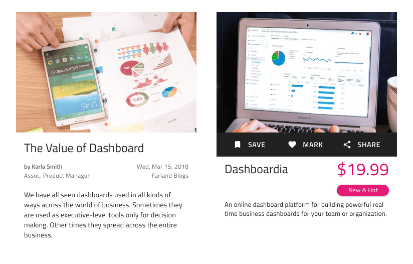
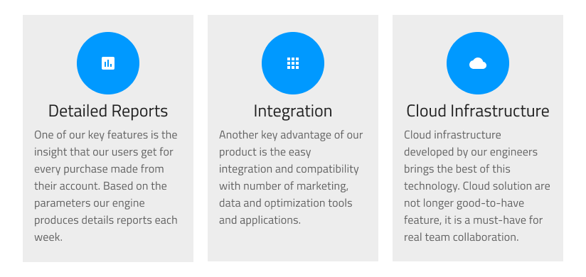
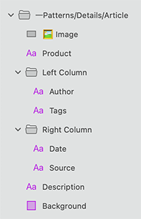
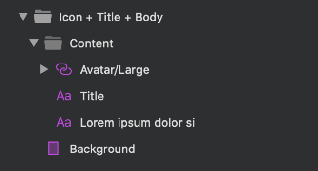

---
title: Details - デザイン システム パターン
_description: Details パターン シンボルはアプリケーション シナリオ オブジェクトについての詳細情報を表示するために様々なコンポーネントを組み合わせます。
_keywords: デザイン システム, Sketch, Ignite UI for Angular, パターン, UI ライブラリ, ウィジェット
_language: ja
---

# Details (ディテール)

Details パターンを使用すると、記事、製品、レシピなどを全画面表示ページで詳細情報を表示します。

Details パターンは、含まれる Badge、Button、Tab、および Text 要素のスタイル設定をカスタマイズできます。

## Icon + Title 

Icon + Title パターンを使用して、お勧めのアイコンまたは画像、タイトルおよびリッチ テキストの説明を含むアバターで要素のセットから単一の要素を表示します。製品の機能説明やウィザード シーケンスのシングル ステップなど、さまざまなシナリオに使用できます。

Details: Icon + Title パターンは、レイアウトに含まれるアイコン/画像、Title および Text コンポーネントを含む Avatar により、スタイル設定に柔軟性があります。

> [!WARNING]
> Details パターンを挿入した後、Angular コードとして生成するには、パターン レイアウトを作成したコンポーネントに分割するために `Detach from Symbol` をトリガーします。ただし、各コンポーネントをデタッチしないでください。

## その他のリソース

関連トピック:

- [Badge](../components/badge.md)
- [Button](../components/button.md)
- [Tabs](../components/tabs.md)
- [Text](../components/text.md)
  

コミュニティに参加して新しいアイデアをご提案ください。

